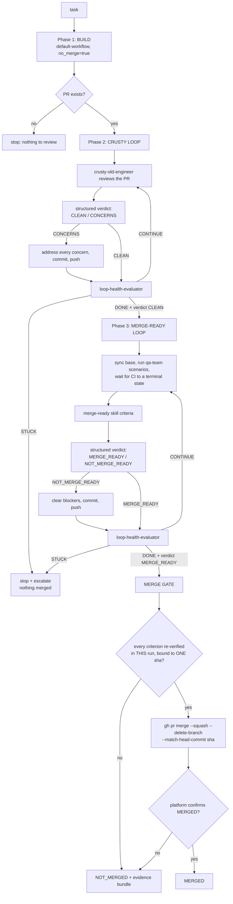

# Auto Drive To Merge

Build the thing, satisfy the maintainer's proxy, satisfy every merge-ready
criterion, then merge. Three phases, two loops, one gate.



## Invoking it

```bash
# From a task description — builds the PR, then drives it.
amplihack recipe run auto-drive-to-merge \
  -c task_description="Add rate limiting to the public API" \
  -c repo_path=/home/user/src/myproject

# Against a PR that already exists — phase 1 becomes a no-op.
amplihack recipe run auto-drive-to-merge -c pr_number=1234 -c repo_path=.

# Verify everything, report what it WOULD merge, merge nothing.
amplihack recipe run auto-drive-to-merge -c pr_number=1234 -c autodrive_dry_run=true
```

| Context var | Default | Meaning |
| --- | --- | --- |
| `task_description` | `""` | What to build. Passed to `default-workflow`. |
| `requirements` | `""` | Extra requirements, passed through. |
| `repo_path` | `.` | Repository to work in. |
| `existing_branch` / `pr_number` | `""` | Point the workflow at work that already exists. |
| `autodrive_state_dir` | derived | Durable state root for resumability. |
| `autodrive_dry_run` | `"false"` | Verify everything, merge nothing. |

## Why there is no iteration cap

Neither loop has a `max_rounds`, a backstop integer, or a wall-clock budget.
An integer cap fails in both directions: it cuts off the round that was about
to converge, and it lets a genuinely stuck loop burn the whole budget before
the counter fires. The signal worth acting on is **absence of progress**, not
number of attempts — a loop on round 2 that produced nothing twice is stuck; a
loop on round 12 that is still resolving findings is fine.

So each round ends with the `loop-health-evaluator` contract (issue #1337),
which stops and looks at the measured data — what the round actually produced,
which findings are new / recurring / resolved, whether test and CI signals
moved — and answers `CONTINUE`, `DONE`, or `STUCK`.

Host safety was never this workflow's job and still is not. It is enforced
structurally one layer down by **#1327** (sealed recursion ceiling) and
**#1332** (width cap + free-memory floor), both refusing with exit code `79`
before a child runs. Rounds here run **sequentially at constant session
depth** — each child inherits the same `AMPLIHACK_SESSION_DEPTH` — so a long
loop never walks toward that ceiling. `AMPLIHACK_MAX_DEPTH` is propagated
untouched and is **never** raised; the loop driver aborts if it changes.

## Structured verdicts only

No phase advances on a model's prose impression. Every gate reads a structured
field through the repo's canonical pipeline
(`extract-json --require-field … | extract-field --default …`, see
[Structured Verdict & Intent Parsing](../../../docs/reference/structured-verdict-parsing.md)),
matched against an exact-token allow-list:

| Signal | Field | Clean token | Fail-safe default |
| --- | --- | --- | --- |
| Crusty review | `crusty_verdict` | `CLEAN` | `CONCERNS` |
| Merge-ready assessment | `merge_ready_verdict` | `MERGE_READY` | `NOT_MERGE_READY` |
| Loop health | `loop_verdict` | `DONE` | `STUCK` |

**A missing or unparseable verdict is never the permissive one.** A verdict
that cannot be read means "we do not know", and "we do not know" does not
advance a phase and does not merge.
`--require-field` selects the **last** JSON object carrying the field rather
than the first parseable object of any shape. Without it a reviewer that quotes
its own output contract — a ` ```json ` example of a `CLEAN` verdict — hands
that example to the parser instead of its real verdict, and nothing downstream
re-measures crusty's judgement the way phase 3 re-measures CI.


A `MERGE_READY` verdict is additionally **downgraded by measurement**: if the
recorded `qa_status` is not `PASS`, `ci_status` is not `GREEN`, a conflict is
present, or review threads are unresolved, the verdict becomes
`NOT_MERGE_READY` regardless of what the assessment said.

## Two absolute prohibitions

1. **Never skip hooks on a commit.** No `--no-verify`, no `-n` shorthand, on
   any commit this workflow makes. If a hook fails, fix what it is complaining
   about.
2. **Never bypass branch protection.** No `--admin` on `gh pr merge`, and no
   other bypass of required checks, required reviews, or the strict
   up-to-date policy. If a check fails, fix the cause.

These are not advice. The merge gate builds its `gh` argv as a fixed literal
list and accepts **no** flags from any caller, so there is no argument through
which a bypass could be threaded. A guard test
(`forbidden_flags_never_appear_in_an_executable_position`) fails the build if
either string ever shows up in an executable position anywhere in this
workflow's recipes, tools, or skill.

## No silent merge

The merge gate does not trust the loop that preceded it. In the run that
merges, it re-verifies — and writes down, before merging — the head SHA, draft
state, mergeability and merge-state, review decision, unresolved review
threads, the full CI rollup, the `qa-team` evidence, and the merge-ready round
record. Everything is bound to **one** head SHA, and the merge itself passes
`--match-head-commit`, so GitHub refuses the merge if the head moved after the
evidence was captured.

**An unreadable criterion is a failure, never a pass.** Unreadable CI, zero
reported checks, unreadable review threads, missing `qa-team` evidence, an
absent round record — each is a blocker. After the merge, the platform must
confirm `MERGED`; a `gh` success that the platform does not confirm is
reported as not merged.

## Exit code 79 is terminal

Exit `79` (and `BLOCKED_TERMINAL`) is a final answer from a structural guard,
not an infrastructure hiccup. It is surfaced, it stops the run, and it is
**never** retried into — not at a deeper level, not with a raised ceiling. The
loop driver propagates `79` as its own exit code so a parent sees the refusal
rather than a generic failure.

## Resumability

A run that dies partway is re-runnable. Nothing merged is redone and no
resolved concern is reopened:

- The **platform** is the authority on whether the PR is merged. A merged PR
  short-circuits every phase.
- An open PR for the branch makes phase 1 a no-op — it is never rebuilt.
- Completed phases are recorded in
  `${AMPLIHACK_STATE_DIR:-~/.amplihack/state}/auto-drive/<key>/`, written only
  by the host that ran them. There is deliberately **no pull-request-comment
  ledger**: a PR comment is writable by anyone who can comment, and a forged
  one could mark the crusty loop complete or seed the resolved-concern list,
  skipping the review entirely on a fresh host. A fresh host redoes the phase
  instead — that is the cheaper mistake.
- Concern ids that a previous run resolved **and** had confirmed clean by a
  later round are handed back to crusty, which may still re-raise one — but
  only with new evidence.

Local state is a cache, never a claim. The merge gate re-verifies everything
regardless of what any state file says.

## No short timeouts

No step in this workflow declares a `timeout` or `timeout_seconds`, and no
recipe declares a `default_step_timeout`. CI polling waits on a 60-second
interval until CI reaches a terminal state or becomes unreadable — bounded by
the build finishing, not by a stopwatch. Test suites, builds, and model calls
run to their natural end. A false timeout costs more than a slow run.

## What it composes

| Piece | Role |
| --- | --- |
| [`default-workflow`](../default-workflow/SKILL.md) | Phase 1: builds and publishes the PR. |
| [`crusty-old-engineer`](../crusty-old-engineer/SKILL.md) | Phase 2 reviewer, standing in for the maintainer. Emits the opt-in structured verdict. |
| [`merge-ready`](../merge-ready/SKILL.md) | Phase 3 criteria and guardrails. |
| [`qa-team`](../qa-team/SKILL.md) | Outside-in scenarios that must actually run and pass. |
| `loop-health-evaluator` | The agentic terminator for both loops (issue #1337, PR #1347). |

## Recipes and tools

| File | Role |
| --- | --- |
| `amplifier-bundle/recipes/auto-drive-to-merge.yaml` | Thin composer over the three phases. |
| `amplifier-bundle/recipes/autodrive-build.yaml` | Phase 1. |
| `amplifier-bundle/recipes/autodrive-crusty-round.yaml` | One crusty round. |
| `amplifier-bundle/recipes/autodrive-crusty-loop.yaml` | Phase 2 loop. |
| `amplifier-bundle/recipes/autodrive-merge-evidence.yaml` | Measured evidence for one merge round. |
| `amplifier-bundle/recipes/autodrive-merge-round.yaml` | One merge-ready round. |
| `amplifier-bundle/recipes/autodrive-merge-loop.yaml` | Phase 3 loop + merge gate. |
| `amplifier-bundle/tools/autodrive_loop.sh` | The uncapped, agentically-terminated loop driver. |
| `amplifier-bundle/tools/autodrive_merge_gate.sh` | The evidence gate and the fixed merge argv. |
| `amplifier-bundle/tools/autodrive_state.sh` | Resumable local state; platform truth for merged-ness. |

Full reference: [Auto Drive To Merge](../../../docs/reference/auto-drive-to-merge.md).
