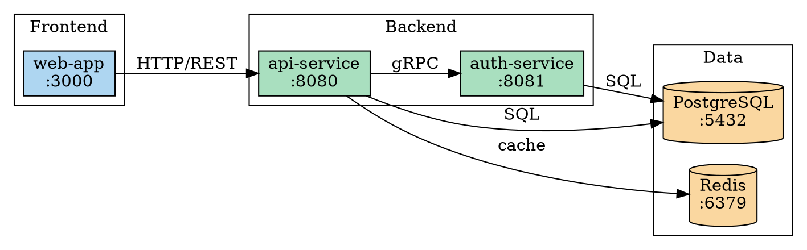
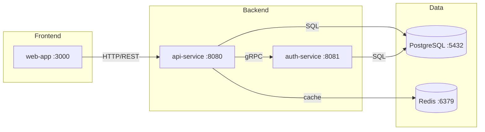
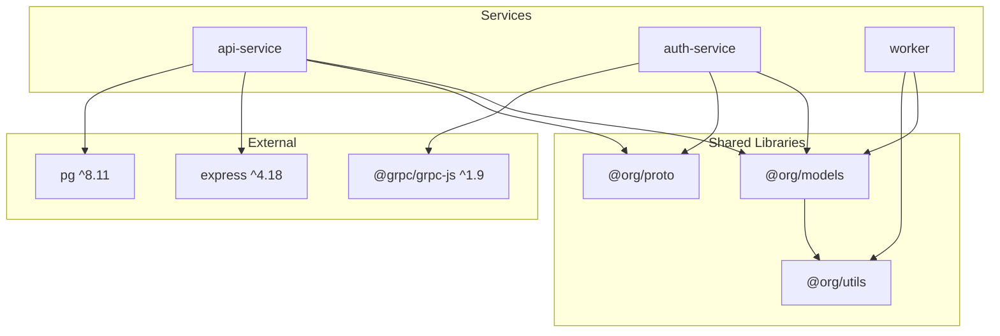
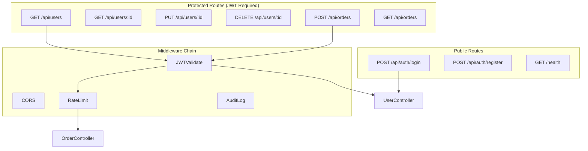
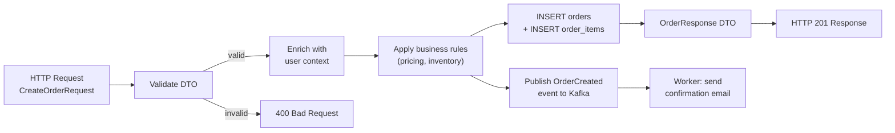
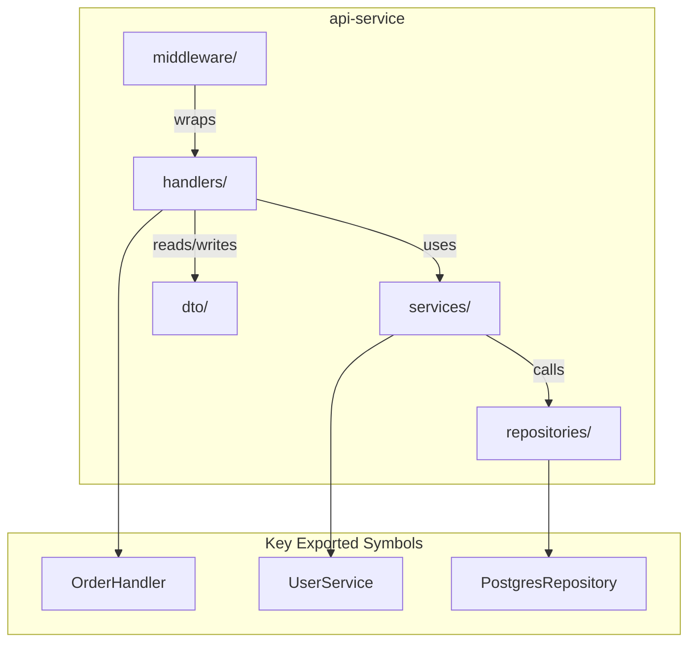
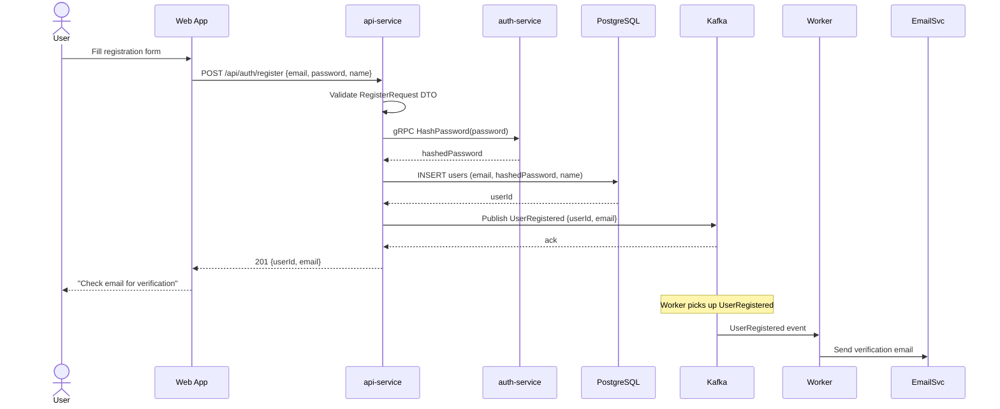

# Code Atlas Diagram Examples

Per-layer Mermaid and DOT examples with recommended diagram types.

## runtime-topology

**Recommended**: DOT digraph with subgraph clusters (handles complex multi-service layouts).

### Graphviz DOT



### Mermaid



---

## compile-deps

**Recommended**: DOT digraph (handles large dependency trees better than Mermaid).

### Mermaid



### Inventory Table (required companion)

| Package       | Version   | Consumers                         | Direct? | License    |
| ------------- | --------- | --------------------------------- | ------- | ---------- |
| express       | ^4.18     | api-service                       | Yes     | MIT        |
| @grpc/grpc-js | ^1.9      | auth-service                      | Yes     | Apache-2.0 |
| pg            | ^8.11     | api-service                       | Yes     | MIT        |
| @org/models   | workspace | api-service, auth-service, worker | Yes     | Internal   |

---

## api-contracts

**Recommended**: Mermaid `flowchart TD` (route hierarchies render cleanly).

### Mermaid



### Inventory Table (required companion)

| Method | Path            | Handler                | Auth | DTO In             | DTO Out          | Middleware           |
| ------ | --------------- | ---------------------- | ---- | ------------------ | ---------------- | -------------------- |
| POST   | /api/auth/login | AuthController.login   | None | LoginRequest       | TokenResponse    | cors                 |
| GET    | /api/users      | UserController.list    | JWT  | --                 | UserListResponse | cors, jwt, audit     |
| POST   | /api/orders     | OrderController.create | JWT  | CreateOrderRequest | OrderResponse    | cors, jwt, ratelimit |

---

## data-flow

**Recommended**: Mermaid `flowchart LR` (left-to-right matches request flow intuition).

### Mermaid



---

## service-components

**Recommended**: Mermaid `graph TD` (one diagram per service).

### Mermaid (per service)



---

## user-journeys

**Recommended**: Mermaid `sequenceDiagram` (natural fit for request flow tracing).

### Mermaid



---

## ast-lsp-bindings

**Recommended**: Mermaid `flowchart LR` or DOT digraph (for symbol reference graphs).

### Dead Code Report (table format)

```markdown
# Dead Code Report

**Mode:** static-approximation
**Date:** 2026-03-16

| Symbol                        | File                      | Line | Last Referenced         | Notes                        |
| ----------------------------- | ------------------------- | ---- | ----------------------- | ---------------------------- |
| `LegacyUserExporter.export()` | `src/exporters/legacy.ts` | 45   | Never (static analysis) | Candidate for removal        |
| `calculateTaxV1()`            | `src/billing/tax.go`      | 102  | Never (static analysis) | Superseded by calculateTaxV2 |
```

### Interface Mismatch Report (table format)

```markdown
# Interface Mismatch Report

**Mode:** lsp-assisted
**Date:** 2026-03-16

| Symbol                | Definition                                       | Call Site                      | Mismatch                        |
| --------------------- | ------------------------------------------------ | ------------------------------ | ------------------------------- |
| `OrderService.create` | `(ctx, dto: CreateOrderRequest): Promise<Order>` | `src/api/handlers/order.ts:67` | Called with 1 arg (missing ctx) |
```

---

## repo-surface

**Recommended**: Mermaid `flowchart TD` (directory tree overview).

Typically the simplest layer -- a top-level directory tree diagram showing project structure,
build entry points, and configuration files. Not every file is shown; group by directory.

---

## Graph Artifacts (Portable Cypher + Backend Adapters)

The atlas always emits a portable graph under `docs/atlas/cypher/` encoding all 8 layers and the
inter-layer links. Below are the same example nodes/links expressed for each backend. The
inter-layer link relationships (`EXPOSES`, `USES_DTO`, `USES_ENV`, `TRAVERSES`, ...) are mandatory
in every backend. Full model: [reference.md](./reference.md).

### Portable OpenCypher (always emitted — `atlas-relationships.cypher`)

```cypher
// Nodes across layers
CREATE (:Service {name: 'api-service', language: 'rust', port: 8080, path: 'services/api'});
CREATE (:Route   {method: 'POST', path: '/api/orders', handler: 'OrderController.create', auth: 'JWT'});
CREATE (:DTO     {name: 'CreateOrderRequest', file: 'services/api/src/dto.rs', line: 12});
CREATE (:EnvVar  {name: 'DATABASE_URL', required: true, default_value: ''});

// Inter-layer links (first-class)
MATCH (s:Service {name: 'api-service'}), (r:Route {path: '/api/orders'})   CREATE (s)-[:EXPOSES]->(r);
MATCH (r:Route {path: '/api/orders'}), (d:DTO {name: 'CreateOrderRequest'}) CREATE (r)-[:USES_DTO {direction: 'in'}]->(d);
MATCH (s:Service {name: 'api-service'}), (e:EnvVar {name: 'DATABASE_URL'})   CREATE (s)-[:USES_ENV]->(e);
```

### `kuzu` adapter (typed DDL)

```cypher
CREATE NODE TABLE Service(name STRING, language STRING, port INT64, path STRING, PRIMARY KEY(name));
CREATE REL TABLE EXPOSES(FROM Service, TO Route);
```

### `lbug` / ladybug adapter (embedded Rust store, OpenCypher-compatible)

```cypher
CREATE (:Service {name: 'api-service', language: 'rust', port: 8080, path: 'services/api'});
MATCH (s:Service {name: 'api-service'}), (r:Route {path: '/api/orders'}) CREATE (s)-[:EXPOSES]->(r);
```

### `neo4j` adapter (constraints + MERGE)

```cypher
CREATE CONSTRAINT service_name IF NOT EXISTS FOR (s:Service) REQUIRE s.name IS UNIQUE;
MERGE (s:Service {name: 'api-service'}) SET s.language = 'rust', s.port = 8080, s.path = 'services/api';
MATCH (s:Service {name: 'api-service'}), (r:Route {path: '/api/orders'}) MERGE (s)-[:EXPOSES]->(r);
```

### `portable-cypher-only` (no live engine)

No live ingestion runs. The portable artifacts above are still emitted in full and the atlas index
records `graph_backend: portable-cypher-only`. This is a recorded outcome, never a silent skip.

---

## Language-Agnostic Discovery Commands

These commands are used across layers to explore any codebase:

### Go

```bash
find . -name "main.go" | head -10
grep -r "\.Get\|\.Post\|\.Handle" --include="*.go" . | grep -v _test.go
grep -r "type.*struct {" --include="*.go" . | grep -i "request\|response\|dto"
```

### TypeScript / Node.js

```bash
cat package.json | jq '.main, .scripts.start'
grep -r "\.get\|\.post\|router\.\|@Controller" --include="*.ts" src/ | head -30
find . -name "*.dto.ts" -o -name "*.schema.ts" | grep -v node_modules
```

### Python (FastAPI, Django, Flask)

```bash
find . -name "app.py" -o -name "main.py" -o -name "wsgi.py" -o -name "asgi.py"
grep -r "@app\.\|@router\." --include="*.py" . | grep -v test
grep -r "class.*BaseModel\|class.*Serializer" --include="*.py" .
```

### .NET (ASP.NET Core)

```bash
find . -name "Program.cs" -o -name "Startup.cs"
find . -name "*Controller.cs" | xargs grep "\[Http\|MapGet\|MapPost"
find . -name "*Dto.cs" -o -name "*Request.cs" -o -name "*Response.cs"
```

### Rust (Axum, Actix-web)

```bash
find . -name "main.rs" | head -5
grep -r "Router::new\|\.route\|get!\|post!" --include="*.rs" src/
grep -r "#\[derive.*Deserialize\|#\[derive.*Serialize\]" --include="*.rs" src/
```
