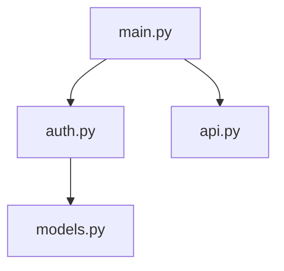

# Code Visualizer

Auto-generates and maintains visual code flow diagrams from **multi-language**
module analysis. Supports **Python, TypeScript/JavaScript, Rust, and Go** out
of the box, with a brick-style architecture that makes adding a new language
a single-file change.

## Quick Start

Use repository search tools to inventory source files, extract import edges, and
write Mermaid diagrams directly.

Or just describe what you want:

```
Generate code flow diagrams for this repo
```

```
Check if my architecture diagrams are up to date
```

## Features

### Multi-Language Auto-Detection

The dispatcher walks the target path, buckets files by extension, and routes
each language to its own analyzer:

| Language              | Extensions                                   |
| --------------------- | -------------------------------------------- |
| Python                | `.py`                                        |
| TypeScript/JavaScript | `.ts`, `.tsx`, `.js`, `.jsx`, `.mjs`, `.cjs` |
| Rust                  | `.rs`                                        |
| Go                    | `.go`                                        |

Mixed-language repos produce one diagram per detected language plus an
optional `--combined` mermaid view with one `subgraph` per language.

### Auto-Generated Diagrams



### Staleness Detection

Walks all source files matching detected languages' extensions and compares
max-mtime against the diagram mtime — works the same way for every supported
language.

```
STALE: docs/diagrams/architecture-python.mmd (sources newer than diagram)
FRESH: docs/diagrams/architecture-typescript.mmd
```

## How It Works

1. **Dispatch**: Detect languages by file extension, skipping generated
   directories such as `.git`, `node_modules`, `dist`, `build`, and `target`.
2. **Analyze**: Extract imports/usages for each detected language.
3. **Render**: A language-blind renderer turns each `Graph` into mermaid.
4. **Monitor**: A generalized staleness detector compares max-mtime across
   matching extensions.

## Architecture

The legacy helper implementation is not shipped in `amplihack-rs`; the skill is
implemented by the agent following the workflow in `SKILL.md`.

Outputs:

- `<basename>-python.mmd`
- `<basename>-typescript.mmd`
- `<basename>-rust.mmd`
- `<basename>-go.mmd`
- `<basename>-combined.mmd` (with `--combined`)

Files are only written for languages actually detected.

## Adding a New Language

Document the file extensions, import syntax, and rendering rules for the new
language in `SKILL.md`, then validate on a small fixture repository.

## Limitations

- **Static heuristics**: Regex-based extraction for TS/JS/Rust/Go covers
  common forms; some edge syntax is documented in source.
- **Import-centric**: Edges are imports/uses only. No call graphs.
- **External imports**: Rendered as ghost target nodes; not resolved.
- **Cross-language edges**: Out of MVP scope; combined view is per-subgraph.
- **Shell scripts**: Not first-class; ignored.

See `SKILL.md` for the full limitation list and security model.

## Testing

```bash
pytest amplifier-bundle/skills/code-visualizer/tests -q
```

The skill ships unit tests for each analyzer, the dispatcher, the renderer,
and the staleness detector, plus a smoke test that runs the dispatcher
against the repo root and asserts non-empty mermaid output for both Python
and TypeScript/JavaScript.

## Philosophy Alignment

| Principle               | How v2.0 follows it                                                                 |
| ----------------------- | ----------------------------------------------------------------------------------- |
| **Ruthless Simplicity** | Stdlib-only. Regex over tree-sitter. Max-mtime over semantic diff.                  |
| **Zero-BS**             | Real parsers; honest about regex edge cases.                                        |
| **Modular Design**      | Each analyzer is a brick with one `normalize()` stud.                               |
| **Brick Composition**   | Renderer / dispatcher / staleness are independent bricks sharing only the contract. |

## Integration

Works with:

- `mermaid-diagram-generator` skill for diagram syntax helpers
- `visualization-architect` agent for complex diagrams

## Dependencies

- **Required**: Python 3.11+ (stdlib only).
- **Optional**: `mermaid-diagram-generator` skill for advanced styling.
