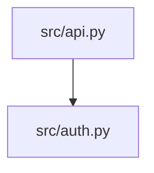
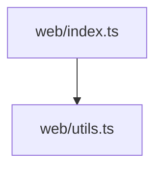
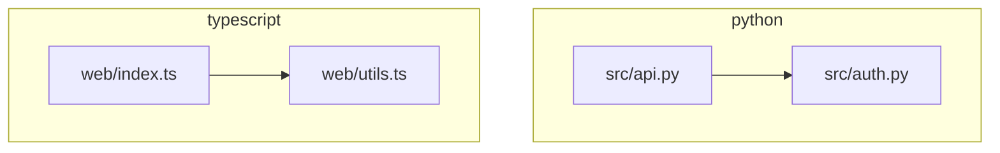

# Code Visualizer Skill

## Purpose

Automatically generate and maintain visual code flow diagrams across multiple
programming languages. The skill auto-detects which languages are present in a
target path, analyzes each one with a dedicated analyzer, and emits one
mermaid diagram per language plus an optional combined high-level view. It
also detects when committed diagrams are stale relative to the source they
describe.

## What's New in 2.0.0

- **Multi-language support**: Python, TypeScript/JavaScript, Rust, and Go.
- **Language dispatcher**: Detects languages by file extension and routes to
  per-language analyzers.
- **Language-blind renderer**: A single mermaid renderer consumes a normalized
  graph; the renderer never inspects language semantics.
- **One diagram per language** plus an optional `--combined` view that places
  each language in its own mermaid `subgraph`.
- **Generalized staleness**: Walks all source files matching detected
  languages' extensions and compares max-mtime against the diagram mtime.
- **Brick-style architecture**: Each language analyzer is a self-contained
  module that exposes a single `normalize()` function. No shared inheritance.

## Supported Languages

| Language              | Extensions                                   | Analyzer          | Parser | Notes                                                            |
| --------------------- | -------------------------------------------- | ----------------- | ------ | ---------------------------------------------------------------- |
| Python                | `.py`                                        | `python_analyzer` | `ast`  | Extracts `import` and `from … import …`.                         |
| TypeScript/JavaScript | `.ts`, `.tsx`, `.js`, `.jsx`, `.mjs`, `.cjs` | `ts_analyzer`     | regex  | Extracts `import … from`, `require(...)`, dynamic `import(...)`. |
| Rust                  | `.rs`                                        | `rust_analyzer`   | regex  | Extracts `use crate::…`, `use super::…`, `mod …`.                |
| Go                    | `.go`                                        | `go_analyzer`     | regex  | Extracts single and grouped `import` declarations.               |

Languages outside this table are skipped silently. See **Extending** below to
add new ones.

## Architecture

```
amplifier-bundle/skills/code-visualizer/
├── SKILL.md
├── README.md
└── SKILL.md
```

The legacy helper executable is not shipped in `amplihack-rs`. Perform the
workflow directly with repository search tools: inventory source files, extract
imports/usages, build the module graph, and write Mermaid diagrams.

### Data Contract (`graph.py`)

```python
@dataclass(frozen=True)
class Node:
    id: str           # mermaid-safe identifier
    label: str        # human-readable label (e.g. "src/auth/oauth.py")
    language: str     # "python" | "typescript" | "rust" | "go"
    file_path: str    # absolute path on disk

@dataclass(frozen=True)
class Edge:
    src: str          # Node.id of source
    dst: str          # Node.id of destination
    kind: str         # "import" | "require" | "use" | "mod" | "dynamic_import"

@dataclass(frozen=True)
class Graph:
    language: str
    nodes: tuple[Node, ...]
    edges: tuple[Edge, ...]
```

Analyzers may **import** these dataclasses but must not inherit from any
shared class. The data contract is the only coupling.

### Per-Language Analyzers

Each analyzer is a self-contained brick exposing exactly one entry point:

```python
def normalize(paths: Iterable[Path]) -> Graph: ...
```

The function:

1. Reads each file with `encoding="utf-8", errors="ignore"`.
2. Skips files larger than ~5 MB.
3. Wraps parsing in `try/except` and skips files that fail to parse.
4. Returns a `Graph` whose `language` field matches the analyzer.

### Dispatcher

The dispatcher uses a registry that maps language name → extensions + module
name (string). It loads analyzers lazily via `importlib.import_module` so
adding a new language never requires touching the dispatcher's import
statements.

```python
from scripts.dispatcher import analyze

graphs: dict[str, Graph] = analyze(target_path)
# {"python": Graph(...), "typescript": Graph(...)}
```

The dispatcher:

- Walks `target_path` with `os.walk(..., followlinks=False)`.
- Skips `IGNORE_DIRS` (`.git`, `node_modules`, `.venv`, `venv`, `__pycache__`,
  `dist`, `build`, `target`, `.mypy_cache`, `.pytest_cache`, `.tox`).
- Buckets files by extension into language groups.
- Calls each language's `normalize()` with its file list.
- Returns a `dict[language_name, Graph]` for languages that produced any
  files.

### Mermaid Renderer

The renderer is language-blind:

```python
from scripts.mermaid_renderer import render, render_combined

per_language: str = render(graph)            # one diagram for one language
combined: str = render_combined(graphs)      # one diagram, one subgraph/lang
```

Node IDs are sanitized (`[^A-Za-z0-9_] -> _`) and labels with quotes are
escaped to prevent diagram-syntax injection.

### Staleness Detection

```python
from scripts.staleness import is_stale

stale = is_stale(
    target_path=Path("src/"),
    diagram_path=Path("docs/architecture-python.mmd"),
    languages=["python"],
)
```

Returns `True` if any source file with a matching language extension has an
mtime newer than `diagram_path`. Generalizes the previous Python-only
behavior.

## Workflow

No bundled CLI helper is required. Use the available code-search tools to:

1. Find source files by language.
2. Extract import/use/include edges.
3. Normalize nodes and edges into a graph.
4. Render Mermaid diagrams under `docs/diagrams/` or the requested output path.
5. For freshness checks, compare source mtimes or git diffs against diagram files.

### Output Files

| File                                          | Contents                                               |
| --------------------------------------------- | ------------------------------------------------------ |
| `<basename>-python.mmd`                       | Mermaid diagram for Python modules and their imports.  |
| `<basename>-typescript.mmd`                   | Mermaid diagram for TS/JS files and their imports.     |
| `<basename>-rust.mmd`                         | Mermaid diagram for Rust modules and `use` edges.      |
| `<basename>-go.mmd`                           | Mermaid diagram for Go packages and `import` edges.    |
| `<basename>-combined.mmd` (with `--combined`) | One diagram with one `subgraph` per detected language. |

Files are only written for languages that were actually detected.

## Quick Start

### Generate diagrams for a polyglot repo

Inventory source files, extract import edges, then write a combined Mermaid
diagram to `docs/diagrams/architecture-combined.mmd`.

Output (for this repo, which contains Python and JS):

```
docs/diagrams/architecture-python.mmd
docs/diagrams/architecture-typescript.mmd
docs/diagrams/architecture-combined.mmd
```

### Check freshness in CI

Compare changed source files against diagram files in `docs/diagrams/`; report
any diagram that was not updated with the code change.

### Generate for a single language

Provide a path that only contains files of one language; the dispatcher will
detect a single language and emit a single `.mmd`:

Generate a single-language diagram when the target path contains one language.

## Auto-Detection Rules

1. The dispatcher walks `<path>`, skipping `IGNORE_DIRS` and symlinks.
2. Files are bucketed by extension into one of the supported languages.
3. A language is "detected" if at least one file matches.
4. Each detected language is analyzed independently.
5. With `--combined`, the renderer composes one mermaid diagram with one
   `subgraph` per detected language. Cross-language edges are not inferred in
   the MVP.

## Example Output

For a repo with:

- `src/api.py` importing `src/auth.py`
- `web/index.ts` importing `web/utils.ts`

`architecture-python.mmd`:



`architecture-typescript.mmd`:



`architecture-combined.mmd`:



> Note: the renderer emits the `subgraph <id> ["<label>"]` form (space
> between id and bracketed label), which is the Mermaid-documented syntax
> accepted across recent Mermaid versions. `test_mermaid_renderer.py` pins
> the exact emitted form.

## Extending: Adding a New Language

The skill follows the brick philosophy: a new language is a new self-contained
module. There is **no base class to subclass**.

1. Document the new language's file extensions and import syntax:

   ```python
   from module_a import service
   import module_b
       for p in paths:
           # parse file, append nodes/edges
           ...
       return Graph(language="<lang>", nodes=tuple(nodes), edges=tuple(edges))
   ```

2. Register the language in `the language-dispatch section`:

   ```python
   LANGUAGES = {
       "python":     {"exts": {".py"},                          "module": "python_analyzer"},
       "typescript": {"exts": {".ts", ".tsx", ".js", ".jsx",
                               ".mjs", ".cjs"},                 "module": "ts_analyzer"},
       "rust":       {"exts": {".rs"},                          "module": "rust_analyzer"},
       "go":         {"exts": {".go"},                          "module": "go_analyzer"},
       # add here:
       "<lang>":     {"exts": {".ext"},                         "module": "<lang>_analyzer"},
   }
   ```

3. Add `tests/test_<lang>_analyzer.py` with `tmp_path` fixtures asserting
   nodes and edges produced by representative source snippets.

4. Update the **Supported Languages** table above.

That's it. The renderer, dispatcher routing, staleness detector, and CLI all
work without further changes because they consume the language-blind `Graph`
data contract.

## Testing

Tests live under `amplifier-bundle/skills/code-visualizer/tests/` and run via
`pytest`. The skill registers its `tests/` directory in the repo's
`pytest.ini` `testpaths` so CI picks them up automatically.

Test files:

| File                       | Purpose                                                              |
| -------------------------- | -------------------------------------------------------------------- |
| `test_python_analyzer.py`  | AST-driven import extraction; verifies edges for `import`/`from`.    |
| `test_ts_analyzer.py`      | `import`/`require`/dynamic `import()`; type-only and relative paths. |
| `test_dispatcher.py`       | Mixed-language fixture; verifies correct routing per extension.      |
| `test_mermaid_renderer.py` | Empty graphs, non-empty graphs, ID/label sanitization.               |
| `test_staleness.py`        | Mtime comparison across multiple language extensions.                |
| `test_smoke_repo.py`       | Runs dispatcher against the repo root; asserts non-empty mermaid     |
|                            | for both Python and TypeScript/JavaScript.                           |

Run only the skill's tests:

```bash
pytest amplifier-bundle/skills/code-visualizer/tests -q
```

## Security Considerations

- **No code execution**: Analyzers only parse source. No `exec`/`eval`/
  subprocess on analyzed files.
- **Path validation**: `<path>` and `--output` are resolved with
  `Path.resolve()` and rejected if non-existent or non-directory.
- **Filename validation**: `--basename` must match `^[A-Za-z0-9._-]+$`.
- **Symlink safety**: `os.walk(..., followlinks=False)` plus `IGNORE_DIRS`
  prevents loops and escape.
- **Bounded reads**: Per-file size cap (~5 MB); UTF-8 decode with
  `errors="ignore"`.
- **Bounded regex**: Anchored, no nested quantifiers; protects against ReDoS.
- **Mermaid sanitization**: Node IDs strip non-`[A-Za-z0-9_]`; labels with
  embedded quotes are escaped.
- **Stdlib-only**: Zero third-party runtime dependencies; no supply-chain
  surface.
- **Output containment**: Writes are constrained to the resolved `--output`
  directory; source content is never logged.

## Limitations

- **Static heuristics**: Regex-based extraction for TS/JS/Rust/Go misses some
  edge syntax (TS type-only imports across multiple lines, Rust nested
  `use {a, b::c}`, Go cgo blocks). Documented per analyzer in source.
- **No call graphs**: Edges are import/use only. Runtime/dynamic imports
  beyond `import("...")`/`__import__` are not modeled.
- **External imports**: Rendered as ghost target nodes inline; not resolved to
  real files.
- **Combined view**: Cross-language edges are out of MVP scope.
- **Shell scripts**: Not first-class; `.sh` files are ignored.
- **Compiler-grade accuracy**: Not a goal. The skill optimizes for "useful
  diagram in seconds" over "perfect AST."

## Philosophy Alignment

| Principle               | How v2.0 follows it                                                                  |
| ----------------------- | ------------------------------------------------------------------------------------ |
| **Ruthless Simplicity** | Stdlib-only; regex over tree-sitter; max-mtime over semantic diff.                   |
| **Zero-BS**             | Real parsers (`ast` for Python, regex for others). Limitations documented honestly.  |
| **Modular Design**      | Each analyzer is a brick with a single `normalize()` stud. No inheritance.           |
| **Brick Composition**   | Renderer/dispatcher/staleness are independent bricks reusing only the data contract. |

## Migration from 1.x

The 1.x skill was Python-only. Forward-compatibility notes (verify against
your actual 1.x integration before relying on them):

1. Diagrams previously named `<basename>.mmd` are now
   `<basename>-python.mmd`. Update any references in `README.md` /
   `ARCHITECTURE.md`.
2. Staleness reports now include a per-language breakdown. CI scripts that
   parsed the old single-line output should be updated to handle multiple
   languages.
3. Any direct Python helper used in 1.x is superseded by
   `dispatcher.analyze(path)` returning a `dict[language, Graph]`. Callers
   that only want Python can use `dispatcher.analyze(path)["python"]`.

## Remember

The skill automates what developers forget across all four supported
languages: keeping diagrams in sync with code. It's not a compiler; it's a
fast, honest, multi-language snapshot.
