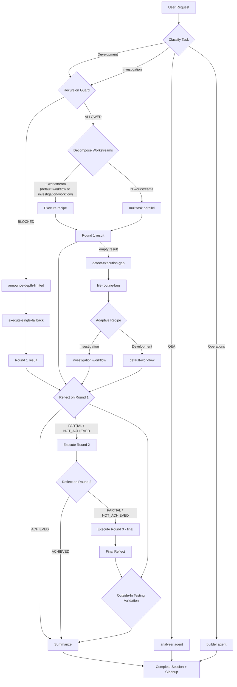

# Dev Orchestrator Skill

## Workflow Graph



## Purpose

This is the **default orchestrator** for all non-trivial development and investigation tasks
in amplihack. It replaces the `ultrathink-orchestrator` skill.

When a user asks you to build, implement, fix, investigate, or create anything non-trivial,
this skill ensures:

1. **Task is classified** — Q&A / Operations / Investigation / Development
2. **Goal is formulated** — clear success criteria identified
3. **Workstreams detected** — parallel tasks split automatically
4. **Recipe runner used** — code-enforced workflow execution
5. **Outcome verified** — reflection confirms goal achievement

## How It Works

```
User request
     │
     ▼
[Classify] ──→ Q&A ──────────────────→ analyzer agent (technical/code questions)
     │
     ├──────→ Ops ────────────────────→ builder agent
     │
     └──→ Development / Investigation
             │
         [Recursion guard] (AMPLIHACK_SESSION_DEPTH vs AMPLIHACK_MAX_DEPTH=3)
             │         │
           ALLOWED   BLOCKED → [announce-depth-limited banner]
                                    ↓
                           [execute-single-fallback-blocked]
                                    ↓
                           [Execute round 1 (single-session)]
             │
         [Decompose]
             │         │
             1 ws     N ws ──→ [multitask parallel] + tree context in env
             │
         [Execute round 1]
             │
         [Reflect] ──→ ACHIEVED ──→ [Summarize]
             │
           PARTIAL/NOT_ACHIEVED
             │
         [Execute round 2]
             │
         [Reflect] ──→ ACHIEVED ──→ [Summarize]
             │
           PARTIAL/NOT_ACHIEVED
             │
         [Execute round 3 (final)]
             │
         [Final reflect + Summarize]
```

**Session tree enforcement** (prevents infinite recursion):

- Each subprocess inherits `AMPLIHACK_TREE_ID`, `AMPLIHACK_SESSION_DEPTH`, `AMPLIHACK_MAX_DEPTH`
- Depth >= 3: recursion guard blocks sub-workstream spawning, adapts to single-session
- Max 10 concurrent sessions per tree; extras queue in FIFO order
- State tracked in `/tmp/amplihack-session-trees/{tree_id}.json`

## Activation

This skill auto-activates for development and investigation keywords. It is also the
**default behavior** per CLAUDE.md — invoke it for any non-trivial task.

The `UserPromptSubmit` hook reinforces this by injecting a classification prompt
that instructs Claude to invoke `Skill(skill="dev-orchestrator")` for dev/investigation tasks.

## Execution Instructions

**YOUR NEXT ACTION after reading this skill MUST include a Bash tool call that
executes the recipe runner.** If your runtime requires a `report_intent` call
(e.g. Copilot CLI), emit it **in parallel** with the Bash launch — both tool
calls in the same response. The constraint is that no
_other_ substantive action (reading files, calling TodoWrite, invoking Agent,
or typing a response) may precede or replace the Bash launch.

If you find yourself doing anything else instead of launching the recipe
runner, you are bypassing the workflow. Stop. Go back. Run the recipe runner.

Development and Investigation tasks have exactly ONE execution path: the
recipe runner. There is no "Option B." There is no "I'll follow the steps
manually." There is no "Let me just quickly..." The recipe runner IS the
workflow. Skipping it means skipping the 23-step process, the recursion
guards, the goal verification, and the quality gates that exist for a reason.

A PostToolUse hook monitors every tool call after this skill activates. If
it detects 3 tool calls without recipe runner evidence, it will fire a hard
WARNING. Do not wait for the warning — run the recipe runner immediately.

When this skill is activated:

### REQUIRED: Execute via Recipe Runner — IMMEDIATELY

Your next tool call(s) must include the recipe runner launch (alongside
`report_intent` if your runtime requires it).

#### Default: Direct Execution (Rust CLI)

The recipe runner is the Rust `amplihack` binary — invoke it directly:

```bash
cd /path/to/repo && env -u CLAUDECODE \
  AMPLIHACK_HOME=/path/to/amplihack \
  amplihack recipe run amplifier-bundle/recipes/smart-orchestrator.yaml \
    -c task_description="TASK_DESCRIPTION_HERE" \
    -c repo_path="." \
    --verbose
```

**Key points:**

- `amplihack recipe run` — the native Rust binary; no Python wrapper needed
- `-c key=value` — passes context variables (equivalent to `user_context` dict)
- `--verbose` — streams recipe-runner stderr live so you see nested step activity
- The recipe runner manages its own child processes (agent sessions, bash steps) as direct subprocesses

This is the preferred execution mode for most scenarios. It is simpler, has
no external dependencies beyond the Rust binary, works on all platforms,
and makes output capture straightforward.


#### Durable Execution (tmux) — optional

Use tmux **only** when:

- The agent runtime may kill background processes after a timeout (e.g., some
  Claude Code hosted environments)
- You need to survive SSH disconnects or terminal closures
- You want to detach and monitor a long-running recipe interactively

```bash
LOG_FILE=$(mktemp /tmp/recipe-runner-output.XXXXXX.log)
chmod 600 "$LOG_FILE"
tmux new-session -d -s recipe-runner \
  "cd /path/to/repo && env -u CLAUDECODE \
   AMPLIHACK_HOME=/path/to/amplihack \
   amplihack recipe run amplifier-bundle/recipes/smart-orchestrator.yaml \
     -c task_description='TASK_DESCRIPTION_HERE' \
     -c repo_path='.' \
     --verbose 2>&1 | tee $LOG_FILE"
echo "Recipe runner log: $LOG_FILE"
```

- `chmod 600 "$LOG_FILE"` — keeps the log file private
- `tmux new-session -d` — detached session, no timeout, survives disconnects
- Monitor with: `tail -f "$LOG_FILE"` or `tmux attach -t recipe-runner`

**Restarting a stale tmux session**: Some runtimes (e.g. Copilot CLI) block
`tmux kill-session` because it does not target a numeric PID. Use one of these
shell-policy-safe alternatives instead:

```bash
# Option A (preferred): use a unique session name per run to avoid collisions
tmux new-session -d -s "recipe-$(date +%s)" "..."

# Option B: locate the tmux server PID and terminate with numeric kill
tmux list-sessions -F '#{pid}' 2>/dev/null | xargs -I{} kill {}

# Option C: let tmux itself handle it — send exit to all panes
tmux send-keys -t recipe-runner "exit" Enter 2>/dev/null; sleep 1
```

If using Option A, update the `tail -f` / `tmux attach` commands to use the
same session name.

**The recipe runner is the required execution path for Development and
Investigation tasks.** Always try `smart-orchestrator` first.

**Required environment variables** for the recipe runner:

- `AMPLIHACK_HOME` — Auto-detected from the current working directory by
  walking parent directories for an `amplifier-bundle/` folder, with fallback
  to `~/.amplihack`. If auto-detection fails, set manually to the directory
  containing `amplifier-bundle/`.
- Preserve `AMPLIHACK_AGENT_BINARY` — nested workflow agents read this env var
  to stay on the caller's active binary (for example, Copilot in Copilot CLI).
- Unset `CLAUDECODE` — required so nested Claude Code sessions can launch.

**Fallback: Direct recipe invocation when smart-orchestrator fails.**

Always try `smart-orchestrator` first — it handles classification, decomposition,
and routing automatically. However, if `smart-orchestrator` fails at the
**infrastructure level** (e.g., 0 workstreams from decomposition, missing env
vars, Rust binary version mismatch), you MAY invoke the specific workflow
recipe directly based on your classification:

| Classification | Direct Recipe            | When to Use                             |
| -------------- | ------------------------ | --------------------------------------- |
| Investigation  | `investigation-workflow` | smart-orchestrator decomposition failed |
| Development    | `default-workflow`       | smart-orchestrator decomposition failed |
| Q&A (complex)  | `qa-workflow`            | Q&A needing multi-step research         |
| Consensus      | `consensus-workflow`     | Critical decisions needing validation   |

Example:

```bash
amplihack recipe run amplifier-bundle/recipes/investigation-workflow.yaml \
  -c task_description="TASK_DESCRIPTION_HERE" \
  -c repo_path="."
```

This is NOT a license to bypass `smart-orchestrator`. Only use direct
invocation after `smart-orchestrator` has failed at an infrastructure level
(not because the task seems "too simple" or "too specific").

**Handling hollow success** (recipe completes but agents produce no findings):

If a recipe returns SUCCESS but the agent outputs indicate the agents could
not access the codebase or produced empty/generic results (e.g., "no codebase
exists", "cannot proceed without a target"), this is a **hollow success**.
In this case:

1. Check that `repo_path` and `AMPLIHACK_HOME` are correct
2. Verify the working directory is the repo root
3. Retry with explicit file paths in the `task_description`
4. If retries also produce hollow results, report the infrastructure
   failure to the user with specifics

**Common rationalizations that are NOT acceptable:**

- "Let me first understand the codebase" — the recipe does that in Step 0
- "I'll follow the workflow steps manually" — NO, the recipe enforces them
- "The recipe runner might not work" — try it first, report errors if it fails
- "This is a simple task" — simple or complex, the recipe runner handles both
- "The recipe succeeded but didn't do anything useful, so I'll do it myself"
  — this is hollow success; retry with better context first

**Q&A and Operations only** may bypass the recipe runner:

- Q&A: Respond directly (analyzer agent)
- Operations: Builder agent (direct execution, no workflow steps)

### Error Recovery: Adaptive Strategy (NOT Degradation)

When `smart-orchestrator` fails, **failures must be visible and surfaced** —
never swallowed or silently degraded. The recipe handles error recovery
automatically via its built-in adaptive strategy steps, but if you observe
a failure outside the recipe, follow this protocol:

**1. Surface the error with full context:**

Report the exact error, the step that failed, and the log output. Never say
"something went wrong" — always include the specific failure details.

**2. File a bug with reproduction details:**

For infrastructure failures (import errors, missing env vars, binary not found,
decomposition producing invalid output), file a GitHub issue:

```bash
gh issue create \
  --title "smart-orchestrator infrastructure failure: <one-line summary>" \
  --body "<full error context, reproduction command, env details>" \
  --label "bug"
```

**3. Evaluate alternative strategies:**

If `smart-orchestrator` fails at the infrastructure level (not because the task
is wrong), you MAY invoke the specific workflow recipe directly. This is an
**adaptive strategy** — it must be announced explicitly, not done silently:

| Classification | Direct Recipe            | When Permitted                                      |
| -------------- | ------------------------ | --------------------------------------------------- |
| Investigation  | `investigation-workflow` | smart-orchestrator failed at parse/decompose/launch |
| Development    | `default-workflow`       | smart-orchestrator failed at parse/decompose/launch |

Example:

```bash
# ANNOUNCE the strategy change first — never do this silently
echo "[ADAPTIVE] smart-orchestrator failed at parse-decomposition: <error>"
echo "[ADAPTIVE] Switching to direct investigation-workflow invocation"
amplihack recipe run amplifier-bundle/recipes/investigation-workflow.yaml \
  -c task_description="TASK_DESCRIPTION_HERE" \
  -c repo_path="."
```

**This is NOT a license to bypass smart-orchestrator.** Always try it first.
Direct invocation is only permitted when smart-orchestrator fails at the
infrastructure level. "The task seems simple" is NOT an infrastructure failure.

**4. Detect hollow success:**

A recipe can complete structurally (all steps exit 0) but produce empty or
meaningless results — agents reporting "no codebase found" or reflection
marking ACHIEVED when no work was done. After execution, check that:

- Round results contain actual findings or code changes (not "I could not access...")
- PR URLs or concrete outputs are present for Development tasks
- At least one success criterion was verifiably evaluated

If results are hollow, report this to the user with the specific empty outputs.
Do not declare success when agents produced no meaningful work.

### Required Environment Variables

The recipe runner requires these environment variables to function:

| Variable                   | Purpose                                           | Default         |
| -------------------------- | ------------------------------------------------- | --------------- |
| `AMPLIHACK_HOME`           | Root of amplihack installation (for asset lookup) | Auto-detected   |
| `AMPLIHACK_AGENT_BINARY`   | Which agent binary to use (claude, copilot, etc.) | Set by launcher |
| `AMPLIHACK_MAX_DEPTH`      | Max recursion depth for nested sessions           | `3`             |
| `AMPLIHACK_NONINTERACTIVE` | Set to `1` to skip interactive prompts            | Unset           |

If `AMPLIHACK_HOME` is not set and auto-detection fails, `parse-decomposition`
and `activate-workflow` will fail with asset lookup errors. Set it to
the directory containing `amplifier-bundle/`.

### After Execution: Reflect and verify

After execution completes, verify the goal was achieved. If not:

- For missing information: ask the user
- For fixable gaps: re-invoke with the remaining work description
- For infrastructure failures: file a bug and try adaptive strategy

### Enforcement: PostToolUse Workflow Guard

A PostToolUse hook (`workflow_enforcement_hook.py`) actively monitors every
tool call after this skill is invoked. It tracks:

- Whether `/dev` or `dev-orchestrator` was called (sets a flag)
- Whether the recipe runner was actually executed (clears the flag)
- How many tool calls have passed without workflow evidence

If 3+ tool calls pass without evidence of recipe runner execution, the hook
emits a hard WARNING. This is not a suggestion — it means you are violating
the mandatory workflow. State is stored in `/tmp/amplihack-workflow-state/`.

## Task Type Classification

| Type          | Keywords                                                       | Action                                              |
| ------------- | -------------------------------------------------------------- | --------------------------------------------------- |
| Q&A           | "what is", "explain", "how does", "how do I", "quick question" | Respond directly                                    |
| Operations    | "clean up", "delete", "git status", "run command"              | builder agent (direct execution, no workflow steps) |
| Investigation | "investigate", "analyze", "understand", "explore"              | investigation-workflow                              |
| Development   | "implement", "build", "create", "add", "fix", "refactor"       | smart-orchestrator                                  |
| Hybrid\*      | Both investigation + development keywords                      | Decomposed into investigation + dev workstreams     |

\* Hybrid is not a distinct task_type — the orchestrator classifies as Development and decomposes into multiple workstreams (one investigation, one development).

## Workstream Decomposition Examples

| Request                                  | Workstreams                             |
| ---------------------------------------- | --------------------------------------- |
| "implement JWT auth"                     | 1: auth (default-workflow)              |
| "build a webui and an api"               | 2: api + webui (parallel)               |
| "add logging and add metrics"            | 2: logging + metrics (parallel)         |
| "investigate auth system then add OAuth" | 2: investigate + implement (sequential) |
| "fix bug in payment flow"                | 1: bugfix (default-workflow)            |

## Override Options

**Single workstream override**: Pass `force_single_workstream: "true"` in the
recipe user_context to prevent automatic parallel decomposition regardless of
task structure. This is a programmatic option (not directly settable from `/dev`):

```bash
amplihack recipe run amplifier-bundle/recipes/smart-orchestrator.yaml \
  -c task_description="TASK_DESCRIPTION_HERE" \
  -c repo_path="." \
  -c force_single_workstream="true"
```

**To force single-workstream execution without modifying recipe context:**
Set `AMPLIHACK_MAX_DEPTH=0` before running `/dev`. This causes the recursion guard
to block parallel spawning and fall back to single-session mode for all tasks:

```bash
export AMPLIHACK_MAX_DEPTH=0  # set in your shell first
/dev build a webui and an api  # then invoke /dev in your agent session
```

Note: The env var must be set in your shell before starting the agent session — it
cannot be prefixed inline on the `/dev` command. This affects all depth checks, not
just parallel workstream spawning.

## Canonical Sources

- **Recipe**: `amplifier-bundle/recipes/smart-orchestrator.yaml`
- **Parallel execution**: native `amplihack orch` / `amplihack multitask` commands
- **Development workflow**: `amplifier-bundle/recipes/default-workflow.yaml`
- **Investigation workflow**: `amplifier-bundle/recipes/investigation-workflow.yaml`
- **CLAUDE.md**: Defines this as the default orchestrator

## Relationship to Other Skills

| Skill                     | Relationship                                         |
| ------------------------- | ---------------------------------------------------- |
| `ultrathink-orchestrator` | Deprecated — redirects here                          |
| `default-workflow`        | Called by this orchestrator for single dev tasks     |
| `investigation-workflow`  | Called by this orchestrator for research tasks       |
| `multitask`               | Called by this orchestrator for parallel workstreams |
| `work-delegator`          | Orthogonal — for backlog-driven delegation           |

## Entry Points

- **Primary**: `/dev <task description>`
- **Auto-activation**: Via CLAUDE.md default behavior + hook injection
- **Legacy**: `/ultrathink <task>` (deprecated alias → redirects to `/dev`)

## Status Signal Reference

The orchestrator uses two status signal formats:

### Execution status (from builder agents)

Appears at the end of round execution steps:

- `STATUS: COMPLETE` — the round's work is fully done
- `STATUS: CONTINUE` — more work remains after this round
- `STATUS: PARTIAL` — the final round (round 3) reached partial completion
- `STATUS: DEPTH_LIMITED` — (legacy, no longer emitted; use BLOCKED path instead)

### Goal status (from reviewer agents)

Appears at the end of reflection steps:

- `GOAL_STATUS: ACHIEVED` — all success criteria met, task is done
- `GOAL_STATUS: PARTIAL -- [description]` — some criteria met, more work needed
- `GOAL_STATUS: NOT_ACHIEVED -- [reason]` — goal not met, another round needed

The goal-seeking loop uses GOAL_STATUS signals to decide whether to run round 2 or 3.

**BLOCKED path (recursion guard)**: When multi-workstream spawning is blocked
by the depth limit, the orchestrator adapts to single-session execution:

1. `announce-depth-limited` — prints a warning banner with remediation info
2. `execute-single-fallback-blocked` — executes the full task as a single
   builder agent session (announced, not silent — the banner makes the
   strategy change visible)
