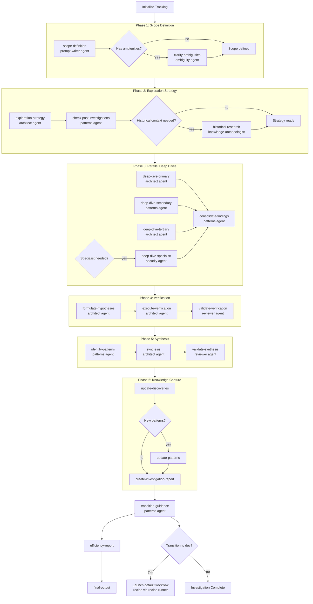

# Investigation Workflow Skill

## Relationship to Dev Orchestrator

**Normal execution path**: This workflow is invoked as a sub-recipe by the
`dev-orchestrator` skill via `smart-orchestrator`. You do NOT normally need
to activate this skill directly.

```
User request → dev-orchestrator → smart-orchestrator recipe
    → investigation-workflow recipe (this skill's recipe)
```

**Direct invocation** is supported as a compatibility path when the
dev-orchestrator is unavailable or when explicitly requested. In that case,
use the recipe runner (see Execution Instructions below).

## Workflow Graph



## Purpose

This skill provides a systematic 6-phase workflow for investigating and understanding
existing systems, codebases, and architectures. Unlike development workflows optimized
for implementation, this workflow is optimized for exploration, understanding, and
knowledge capture.

It is normally executed as a sub-recipe by the `dev-orchestrator` via `smart-orchestrator`,
but can also be invoked directly via the recipe runner.

## Canonical Sources

- **Executable source (recipe)**: `amplifier-bundle/recipes/investigation-workflow.yaml`
- **Reference documentation**: `.claude/workflow/INVESTIGATION_WORKFLOW.md`

The recipe YAML is the authoritative execution definition. The `.md` file serves as
human-readable reference documentation for the workflow phases.

## Execution Instructions

### Normal path (via dev-orchestrator)

If you reached this skill via `dev-orchestrator` / `smart-orchestrator`, the recipe
runner is already managing execution. **Do not re-invoke the recipe runner.** The
orchestrator handles the full lifecycle including goal-seeking reflection loops.

### Direct invocation (standalone)

If this skill is activated directly (not via dev-orchestrator), you MUST use the
recipe runner — **do NOT read the .md file and follow phases manually**:

```python
from amplihack.recipes import run_recipe_by_name

result = run_recipe_by_name(
    "investigation-workflow",
    user_context={
        "task_description": "TASK_DESCRIPTION_HERE",
        "repo_path": ".",
    },
    progress=True,
)
```

Or via shell:

```bash
cd /path/to/repo && env -u CLAUDECODE \
  AMPLIHACK_HOME=/path/to/amplihack PYTHONPATH=${AMPLIHACK_HOME:-~/.amplihack}/src python3 -c "
from amplihack.recipes import run_recipe_by_name
result = run_recipe_by_name('investigation-workflow', user_context={
    'task_description': '''TASK_DESCRIPTION_HERE''',
    'repo_path': '.',
}, progress=True)
print(f'Recipe result: {result}')
"
```

**Do NOT** read `INVESTIGATION_WORKFLOW.md` and follow phases manually. The recipe
runner enforces phase ordering, agent deployment, and quality gates that manual
execution cannot replicate.

### Preferred: Use dev-orchestrator instead

For most tasks, invoke `Skill(skill="dev-orchestrator")` or use `/dev <task>` rather
than activating this skill directly. The dev-orchestrator adds goal-seeking reflection,
workstream decomposition, and adaptive error recovery on top of this workflow.

## When to Use This Skill

**Investigation Tasks** (use this workflow):

- "Investigate how the authentication system works"
- "Explain the neo4j memory integration"
- "Understand why CI is failing consistently"
- "Analyze the reflection system architecture"
- "Research what hooks are triggered during session start"

**Development Tasks** (use default-workflow recipe instead):

- "Implement OAuth support"
- "Build a new API endpoint"
- "Add feature X"
- "Fix bug Y"

## Core Philosophy

**Exploration First**: Define scope and strategy before diving into code
**Parallel Deep Dives**: Deploy multiple agents simultaneously for efficient information gathering
**Verification Required**: Test understanding through practical application
**Knowledge Capture**: Document findings to prevent repeat investigations

## The 6-Phase Investigation Workflow

### Phase 1: Scope Definition

**Purpose**: Define investigation boundaries and success criteria before any exploration.

**Tasks**:

- **FIRST**: Identify explicit user requirements - What specific questions must be answered?
- **Use** prompt-writer agent to clarify investigation scope
- **Use** ambiguity agent if questions are unclear
- Define what counts as "understanding achieved"
- List specific questions that must be answered
- Set boundaries: What's in scope vs. out of scope
- Estimate investigation depth needed (surface-level vs. deep dive)

### Phase 2: Exploration Strategy

**Purpose**: Plan which agents to deploy and what to investigate, preventing inefficient random exploration.

**Tasks**:

- **Use** architect agent to design exploration strategy
- **Use** patterns agent to check for similar past investigations
- Identify key areas to explore (code paths, configurations, documentation)
- Select specialized agents for parallel deployment in Phase 3

### Phase 3: Parallel Deep Dives

**Purpose**: Deploy multiple exploration agents simultaneously to gather information efficiently.

**CRITICAL**: This phase uses PARALLEL EXECUTION by default.

### Phase 4: Verification & Testing

**Purpose**: Test and validate understanding through practical application.

### Phase 5: Synthesis

**Purpose**: Compile findings into coherent explanation that answers original questions.

### Phase 6: Knowledge Capture

**Purpose**: Create durable documentation so this investigation never needs to be repeated.

- **Store discoveries in memory** using `store_discovery()` from `amplihack.memory.discoveries`
- **Update .claude/context/PATTERNS.md** if reusable patterns found

## Transitioning to Development Workflow

**After investigation completes**, if the task requires implementation, the
`dev-orchestrator` handles the transition automatically via its goal-seeking
reflection loop. If running standalone, transition by launching the
`default-workflow` recipe:

```python
run_recipe_by_name("default-workflow", user_context={
    "task_description": "Implement findings from investigation...",
    "repo_path": ".",
}, progress=True)
```

## Integration with Dev Orchestrator

The `dev-orchestrator` automatically detects investigation tasks using keywords
and routes them to this workflow's recipe:

```
User: "/dev investigate how authentication works"

dev-orchestrator: Classified as Investigation → launching investigation-workflow recipe
→ Recipe runner executes 6-phase investigation workflow
→ Results feed into goal-seeking reflection loop
```

For hybrid tasks (investigate + implement), the dev-orchestrator decomposes into
parallel workstreams: one running `investigation-workflow`, another running
`default-workflow`.

## Key Principles

- **Scope first, explore second** - Define boundaries before diving in
- **Parallel exploration is key** - Deploy multiple agents simultaneously in Phase 3
- **Verify understanding** - Test your hypotheses in Phase 4
- **Capture knowledge** - Always store discoveries in memory in Phase 6
- **This workflow optimizes for understanding, not implementation**

## Related Resources

- **Recipe (executable)**: `amplifier-bundle/recipes/investigation-workflow.yaml`
- **Reference docs**: `.claude/workflow/INVESTIGATION_WORKFLOW.md`
- **Dev Orchestrator**: `.claude/skills/dev-orchestrator/`
- **Default Workflow**: `.claude/skills/default-workflow/`
- **Agent Catalog**: `.claude/agents/amplihack/` directory
- **Pattern Library**: `.claude/context/PATTERNS.md`
