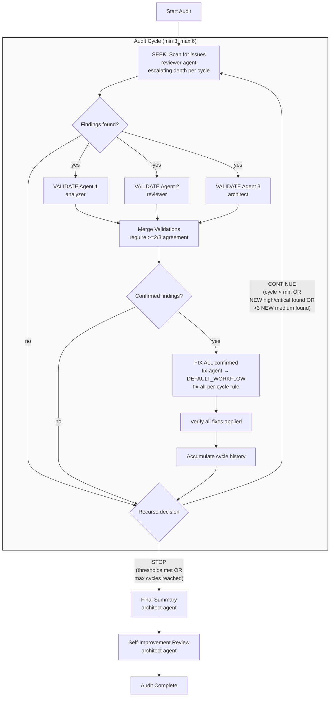

# Quality Audit Workflow

## Workflow Graph



## Purpose

Orchestrates a systematic, parallel quality audit of any codebase with automated remediation through PR generation and PM-prioritized recommendations.

## When I Activate

I automatically load when you mention:

- "quality audit" or "code audit"
- "codebase review" or "full code review"
- "refactoring opportunities" or "technical debt audit"
- "module quality check" or "architecture review"
- "parallel analysis" with multiple agents

## What I Do

Execute a 7-phase workflow that:

1. **Familiarizes** with the project (investigation phase)
2. **Audits** using parallel agents across codebase divisions
3. **Creates** GitHub issues for each discovered problem
   3.5. **Validates** against recent PRs (prevents false positives)
4. **Generates** PRs in parallel worktrees per remaining issues
5. **Reviews** PRs with PM architect for prioritization
6. **Reports** consolidated recommendations in master issue

## Quick Start

```
User: "Run a quality audit on this codebase"
Skill: *activates automatically*
       "Beginning quality audit workflow..."
```

## The 7 Phases

### Phase 1: Project Familiarization

- Run investigation workflow on project structure
- Map modules, dependencies, and entry points
- Understand existing patterns and architecture

### Phase 2: Parallel Quality Audit

- Divide codebase into logical sections
- Deploy multiple agent types per section (analyzer, reviewer, security, optimizer)
- Apply PHILOSOPHY.md standards ruthlessly
- Check module size, complexity, single responsibility

### Phase 3: Issue Assembly

- Create GitHub issue for each finding
- Include severity, location, recommendation
- Tag with appropriate labels
- Add unique IDs, keywords, and file metadata

### Phase 3.5: Post-Audit Validation [NEW]

- Scan merged PRs from last 30 days (configurable)
- Calculate confidence scores for PR-issue matches
- Auto-close high-confidence matches (≥90%)
- Tag medium-confidence matches (70-89%) for verification
- Add bidirectional cross-references between issues and PRs
- Target: <5% false positive rate

### Phase 4: Parallel PR Generation

- Create worktree per remaining open issue (`worktrees/fix-issue-XXX`)
- Run DEFAULT_WORKFLOW.md in each worktree
- Generate fix PR for each confirmed open issue

### Phase 5: PM Review

- Invoke pm-architect skill
- Group PRs by category and priority
- Identify dependencies between fixes

### Phase 6: Master Report

- Create master GitHub issue
- Link all related issues and PRs
- Prioritized action plan with recommendations

## Philosophy Enforcement

This workflow ruthlessly applies:

- **Ruthless Simplicity**: Flag over-engineered modules
- **Module Size Limits**: Target <300 LOC per module
- **Single Responsibility**: One purpose per brick
- **Zero-BS**: No stubs, no TODOs, no dead code
- **Anti-Fallback** (#2805, #2810): Detect silent degradation and error swallowing patterns
- **Structural Analysis** (#2809): Flag oversized files, deeply nested code, and tangled dependencies

## Detection Categories

### Standard Categories

| Category    | What It Detects                                                              |
| ----------- | ---------------------------------------------------------------------------- |
| Security    | Hardcoded secrets, missing input validation, string interpolation in queries |
| Reliability | Missing timeouts, bare except clauses, unhandled async                       |
| Dead Code   | Unused imports, unreachable branches, stale TODOs                            |
| Test Gaps   | Files without tests, tests without assertions                                |
| Doc Gaps    | Public functions without docstrings, outdated docs                           |

### Extended Categories

| Category               | What It Detects                                                                                                                                                                                                                                                |
| ---------------------- | -------------------------------------------------------------------------------------------------------------------------------------------------------------------------------------------------------------------------------------------------------------- | --- | -------------------------- |
| Silent Fallbacks       | `except: pass`, broad catches that return defaults silently, fallback chains that mask failures, `?? defaultValue` hiding missing config, `dict.get(key, default)` on required values, `                                                                       |     | fallback` in shell scripts |
| Error Swallowing       | Catch blocks with no re-raise/re-throw, error-to-None/null transforms, catch-all discarding exceptions, log-only catch blocks, empty catch blocks, `catch (Exception)` returning false/default/empty collection                                                |
| Result Dropping        | Fire-and-forget async (`_ = Task()`, `asyncio.create_task()` without error handling), unchecked HTTP response status, discarded return values, `Task.WhenAll`/`Promise.all`/`asyncio.gather` without individual failure checks, unchecked `subprocess.run()`   |
| Shell Anti-Patterns    | `\|\| true`, `>/dev/null 2>&1`, `2>/dev/null`, `set +e`, `\|\| fallback_command`, missing `set -euo pipefail`                                                                                                                                                  |
| Silent Truncation      | `Take(N)`/`[:N]`/`.slice(0,N)` without logging, `.Where()`/list comprehensions that silently drop items that should be processed, string substring without bounds logging                                                                                      |
| Async Anti-Patterns    | `async void` (C#), `.Result`/`.Wait()` sync-over-async, unawaited coroutines/promises, shared mutable state without synchronization, CancellationToken not propagated, Timer/CancellationTokenSource not disposed                                              |
| Config Divergence      | Env vars defined in deploy configs but read with silent fallbacks in code, `IsDevelopment()` guards that could leak to staging/prod, services expecting config that infrastructure doesn't provide                                                             |
| Validation Gaps        | API endpoints without input validation, string interpolation in SQL/GraphQL/Cypher, missing pagination limits, missing request size limits, enum parsing from user input without validation, trusting deserialized external data without null checks           |
| Health & Observability | Degraded reported when Unhealthy is appropriate, background worker failures not surfaced to /health, log-only error handling without metrics, permanent errors treated as transient (retried instead of dead-lettered), partial success marked as full success |
| Retry Anti-Patterns    | Retry loops that fall through silently after exhaustion, circuit breakers that open without alerting, retry logic that eventually gives up without raising the last error                                                                                      |
| Structural Issues      | Files >500 LOC, functions >50 lines, nesting >4 levels, >5 parameters, circular imports                                                                                                                                                                        |
| Documentation          | Point-in-time content, unprofessional tone (pirate speak, chatbot artifacts), quality/correctness gaps                                                                                                                                                         |
| Hardcoded Limits       | Non-configurable numeric caps (`[:N]`, `max_X = N`), silent truncation without logging, data loss from processing limits                                                                                                                                       |

## Multi-Agent Validation (v3.0)

Every finding is validated by **3 independent agents** (analyzer, reviewer, architect). A finding is confirmed only if ≥2 agents agree. This eliminates false positives before any fixes are attempted.

## Iterative Loop with Escalating Depth (v3.0)

```
Cycle 1: SEEK → VALIDATE (3 agents) → FIX → decision
Cycle 2: SEEK (deeper) → VALIDATE → FIX → decision
Cycle 3: SEEK (deepest) → VALIDATE → FIX → decision
...continues if thresholds not met
```

**Loop rules:**

- Minimum **3 cycles** always run
- Continue past 3 if: any high/critical NEW findings emerged, or >3 medium NEW findings
- Maximum **6 cycles** (safety valve)
- Each cycle: fresh eyes, dig deeper, challenge prior findings
- Fixes use the **fix-agent** which delegates to the full 22-step **DEFAULT_WORKFLOW** via Skill(skill="default-workflow")
- **Fix-all-per-cycle rule (#2842):** Every confirmed finding in a cycle MUST be
  fixed before the cycle is complete. No partial cycles. No deferring findings to
  "follow-up issues" or "next cycle". If SEEK finds issues, FIX must address ALL
  of them.
- **Loop decision based on NEW findings (#2842):** The decision to continue is
  based on whether the current cycle discovered NEW issues, not whether old issues
  remain unfixed (they shouldn't — the fix-all rule prevents that).
- **Fix verification step:** After fixes, a verification step compares confirmed
  findings against fix results to ensure nothing was skipped.

**Run via recipe:**

```python
from amplihack.recipes import run_recipe_by_name

result = run_recipe_by_name(
    "quality-audit-cycle",
    user_context={
        "target_path": "src/amplihack",
        "repo_path": ".",
        "min_cycles": "3",
        "max_cycles": "6",
    },
    progress=True,
)
```

## Configuration

Override defaults via recipe context or environment:

**Structured Inputs (recipe context, per #2843)**:

| Input                  | Default         | Description                                     |
| ---------------------- | --------------- | ----------------------------------------------- |
| `target_path`          | `src/amplihack` | Directory to audit                              |
| `repo_path`            | `.`             | Repository root; sets `working_dir` for agents  |
| `min_cycles`           | `3`             | Minimum audit cycles                            |
| `max_cycles`           | `6`             | Maximum cycles (safety valve)                   |
| `validation_threshold` | `2`             | Min validators that must agree (out of 3)       |
| `severity_threshold`   | `medium`        | Minimum severity to report                      |
| `module_loc_limit`     | `300`           | Flag modules exceeding this LOC                 |
| `fix_all_per_cycle`    | `true`          | Must fix ALL findings before next cycle (#2842) |
| `categories`           | (all)           | Comma-separated list of categories to check     |

**Available Categories**: `security`, `reliability`, `dead_code`, `silent_fallbacks`,
`error_swallowing`, `result_dropping`, `shell_anti_patterns`, `silent_truncation`,
`async_anti_patterns`, `config_divergence`, `validation_gaps`, `health_observability`,
`retry_anti_patterns`, `structural`, `hardcoded_limits`, `test_gaps`, `doc_gaps`, `documentation`

**Example invocation**:

```python
from amplihack.recipes import run_recipe_by_name

result = run_recipe_by_name(
    "quality-audit-cycle",
    user_context={
        "target_path": "src/amplihack/fleet",
        "repo_path": ".",
        "min_cycles": "3",
        "max_cycles": "6",
        "severity_threshold": "medium",
        "module_loc_limit": "300",
        "fix_all_per_cycle": "true",
        "categories": "security,reliability,dead_code,silent_fallbacks,error_swallowing",
    },
    progress=True,
)
```

**Core Settings (environment)**:

- `AUDIT_PARALLEL_LIMIT`: Max concurrent worktrees (default: 8)

**Phase 3.5 Validation Settings**:

- `AUDIT_PR_SCAN_DAYS`: Days to scan for recent PRs (default: 30)
- `AUDIT_AUTO_CLOSE_THRESHOLD`: Confidence % for auto-close (default: 90)
- `AUDIT_TAG_THRESHOLD`: Confidence % for tagging (default: 70)
- `AUDIT_ENABLE_VALIDATION`: Enable Phase 3.5 (default: true)
