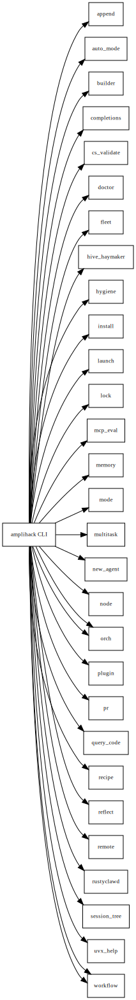

# Layer 5: API Contracts

CLI commands, hook protocol, recipe step types, memory API, and fleet API.

## Overview

### CLI Commands (clap-derived)

| Command | Description |
|---------|-------------|
| `amplihack install` | Stage amplifier-bundle and write hooks |
| `amplihack launch` | Start Claude Code with hooks |
| `amplihack recipe run` | Execute a YAML recipe |
| `amplihack memory index` | Index a project into the memory store |
| `amplihack query-code` | Query the code graph |
| `amplihack fleet` | Fleet operations (scout, advance, status, dashboard) |
| `amplihack doctor` | Health diagnostics |
| `amplihack completions` | Shell completion generation |
| `amplihack orch` | Orchestrator helper (native Rust) |
| `amplihack new-agent` | Generate a new agent |
| `amplihack hive` | Hive swarm operations |

### Hook Protocol (JSON over stdio)

All hooks receive `HookInput` (from `amplihack-types`) as JSON on stdin and
return JSON on stdout. Hook types: `session_start`, `pre_tool_use`,
`post_tool_use`, `stop`, `user_prompt`.

### Recipe Step Types

- `type: skill` -- invokes a named skill with a task
- `type: agent` -- spawns an agent with a description prompt
- `type: bash` -- runs a shell command

## Diagram (Graphviz)

## Diagram source

- [api-contracts.dot](api-contracts.dot) (Graphviz DOT)
- [api-contracts.mmd](api-contracts.mmd) (Mermaid)
