# Layer: compile-deps

Internal dependency graph of the 29 workspace crates
(3 binaries), derived from `cargo metadata`.
35 internal edges. Only workspace (`amplihack-*`) dependencies are shown; external
crates.io dependencies are omitted for readability.

See [inventory.md](inventory.md) for the full edge list.
