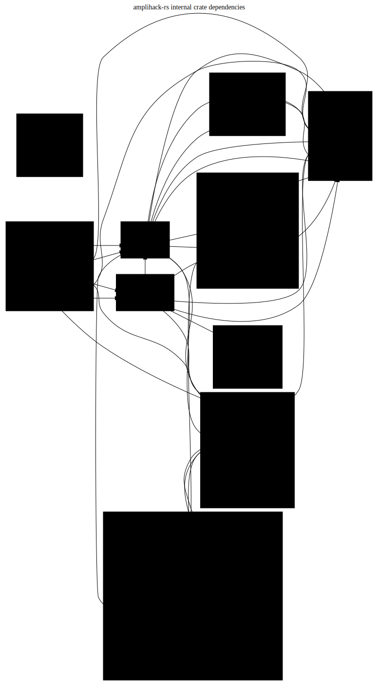

# Layer 3: Compile Dependencies

Package imports, dependency trees, and circular dependency detection.

## Overview

The workspace dependency graph is layered:

1. **Foundation**: `amplihack-types`, `amplihack-state`, `amplihack-utils`,
   `amplihack-security`, `amplihack-safety` — no internal deps (leaf crates)
2. **Core Infrastructure**: `amplihack-memory`, `amplihack-workflows`,
   `amplihack-recipe`, `amplihack-context`, `amplihack-delegation`,
   `amplihack-recovery` — standalone or foundation-only deps
3. **Agent Layer**: `amplihack-agent-core` (depends on memory),
   `amplihack-domain-agents` (depends on agent-core, memory, workflows)
4. **Orchestration**: `amplihack-hive` (depends on agent-core, memory),
   `amplihack-fleet`, `amplihack-remote`
5. **Integration**: `amplihack-cli` (depends on types, state, hive),
   `amplihack-hooks` (depends on types, state, cli, security, workflows)

**No circular dependencies detected.**

| Crate | Internal Deps |
|-------|--------------|
| amplihack-types | 0 |
| amplihack-state | 1 (types) |
| amplihack-agent-core | 1 (memory) |
| amplihack-domain-agents | 3 (agent-core, memory, workflows) |
| amplihack-hive | 2 (agent-core, memory) |
| amplihack-cli | 3 (types, state, hive) |
| amplihack-hooks | 5 (types, state, cli, security, workflows) |

## Diagram (Graphviz)

## Diagram source

- [compile-deps.dot](compile-deps.dot) (Graphviz DOT)
- [compile-deps.mmd](compile-deps.mmd) (Mermaid)
