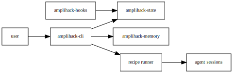

# Layer 6: Data Flow

DTO-to-storage chains and transformation steps.

## Overview

Data flows through the system in well-defined stages:

1. **Input** — User prompts (stdin), recipe YAML (files), hook events (JSON stdin)
2. **Parsing & Validation** — Clap CLI parser, `recipe::parser` (serde_yaml),
   `HookInput` (serde_json), `security::XpiaDefender` (XPIA pattern scan)
3. **Routing & Classification** — `commands::dispatch` (match on Command enum),
   `workflows::WorkflowClassifier` (Q&A / Investigation / Development),
   `recipe::condition_eval`
4. **Execution** — `agent_core::session` (conversation state),
   `agentic_loop::loop_core` (tool-use cycle), `recipe::executor` (step runner)
5. **State Persistence** — `state::AtomicJsonFile` (file lock + atomic write),
   `memory::backend` (store/retrieve), LadybugDB Kuzu (graph insert/query)
6. **Output** — stdout (user response), file output (generated code),
   GitHub issues (gh API)

Key transformation: user prompt string -> Clap `Command` enum ->
`WorkflowType` classification -> agent session -> tool-use cycle ->
memory store + stdout response.

## Diagram (Graphviz)

## Diagram source

- [data-flow.dot](data-flow.dot) (Graphviz DOT)
- [data-flow.mmd](data-flow.mmd) (Mermaid)
