# Layer: data-flow

Primary data paths: CLI/hook invocations read and write session state
(`amplihack-state`), the memory store (`amplihack-memory`), and drive recipe runs
that spawn agent subprocesses. This is a high-level map; see service-components for
per-crate detail.

