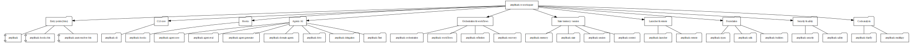

# Layer 1: Repo Surface

Source files, project structure, and build systems.

## Overview

The amplihack-rs repository is a Rust workspace with 23 library crates, 3 binary
targets, a Python-based amplifier-bundle for AI agent tooling, and MkDocs-based
documentation.

| Component | Count | Description |
|-----------|-------|-------------|
| Workspace crates | 23 | Under `crates/` |
| Binary targets | 3 | Under `bins/` |
| Rust source files | 811 | ~198k lines |
| Bundle directories | 5 | recipes, tools, agents, skills, behaviors |
| Doc sections | 3 | howto, reference, concepts |

## Diagram (Graphviz)

## Diagram source

- [repo-surface.dot](repo-surface.dot) (Graphviz DOT)
- [repo-surface.mmd](repo-surface.mmd) (Mermaid — render with `mmdc`)
