# Layer: repo-surface

The amplihack-rs Cargo workspace: **29 crates** grouped by role, with
**3 binary targets** (`amplihack`, `amplihack-asset-resolver-bin`, `amplihack-hooks-bin`). Build system: Cargo
(`Cargo.toml` workspace). Bundled assets under `amplifier-bundle/`.

