# Layer: runtime-topology

amplihack-rs is a **CLI toolchain**, not a networked service mesh. It ships
**3 executables**:

- `amplihack` — main CLI (install, recipe run, orchestration, hooks staging)
- `amplihack-asset-resolver-bin` — asset resolver helper
- `amplihack-hooks-bin` — hooks executable (PreToolUse/PostToolUse, etc.)

These are invoked by the Copilot/Claude launcher and by the recipe runner as
subprocesses. There are no long-lived listening services in the workspace.

