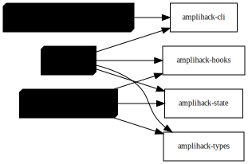

# Layer 4: Runtime Topology

Services, containers, ports, and connections at runtime.

## Overview

At runtime the system operates as a set of cooperating processes:

- **amplihack CLI** -- the Rust binary that parses commands and either launches
  Claude Code, runs recipes, or manages fleet VMs
- **Claude Code host** -- the AI coding assistant process, extended by hooks
  (session_start, pre_tool_use, post_tool_use, stop, user_prompt)
- **Recipe Runner** -- executes YAML recipe steps, spawning agent sub-processes
  with a recursion guard (session_tree.py, max depth 3)
- **Agent Runtime** -- the agentic loop that drives tool-use cycles via SDK
  adapters (Anthropic, GitHub Copilot, Microsoft)
- **Memory Store** -- LadybugDB (Kuzu graph) and JSON file store for persistent
  state
- **Remote Fleet** -- Azure VMs managed via tmux sessions with health monitoring

External services: GitHub API, Anthropic API, Azure API.

## Diagram (Graphviz)

## Diagram source

- [runtime-topology.dot](runtime-topology.dot) (Graphviz DOT)
- [runtime-topology.mmd](runtime-topology.mmd) (Mermaid)
