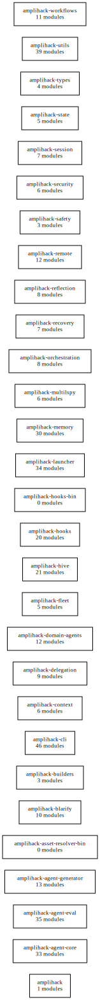

# Layer 7: Service Components

Per-crate internal module and package structure.

## Overview

The six largest crates and their internal module organisation:

### amplihack-cli (Integration hub)

`commands/` (install, launch, recipe, fleet, doctor, new_agent, orch, hive),
`auto_mode_*` (state, UI, completion, work summary), `update/`, `signals`,
`copilot_setup/`, `fleet_local/`

### amplihack-agent-core (Agent runtime)

`agent`, `agentic_loop/` (loop_core, reasoning, json_parse, traits, types),
`sdk_adapters/` (claude, copilot, microsoft, factory), `sub_agents/`
(coordinator, spawner, memory_agent), `answer_synth/`, `cognitive_adapter/`,
`session`, `memory_retrieval`, `temporal_reasoning/`

### amplihack-hooks (Claude Code extension)

`session_start`, `pre_tool_use`, `post_tool_use`, `stop`, `user_prompt`,
`workflow_classification`, `protocol`

### amplihack-memory (Persistent state)

`backend`, `database`, `discoveries`, `bloom`, `config`, `coordinator`,
`evaluation`

### amplihack-recipe (YAML execution)

`parser`, `executor`, `models`, `condition_eval`, `template`, `discovery`,
`agent_resolver`

### amplihack-hive (Distributed agents)

`controller`, `distributed/`, `crdt`, `dht`, `embeddings`, `event_bus`, `feed`

## Diagram (Graphviz)

## Diagram source

- [service-components.dot](service-components.dot) (Graphviz DOT)
- [service-components.mmd](service-components.mmd) (Mermaid)
