# Layer: service-components

Top-level module structure of each crate (derived from `src/` scan). The largest
crates by module count are the CLI and hooks crates. Full per-crate module lists in
[inventory.md](inventory.md).

