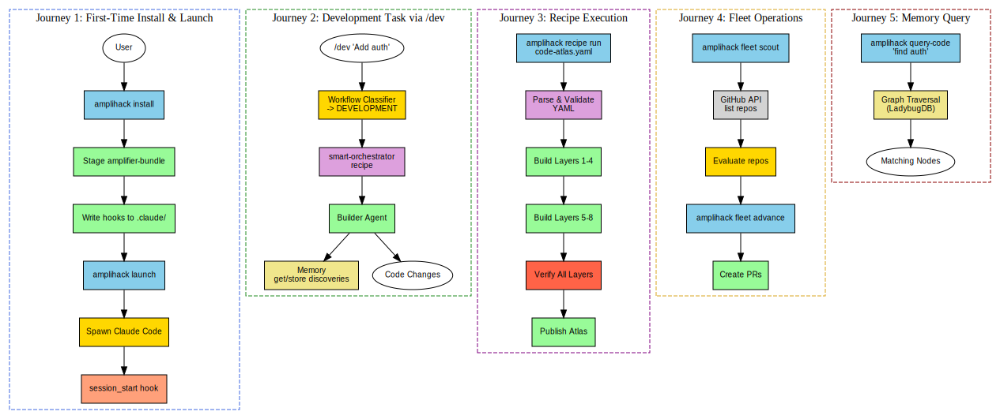

# Layer 8: User Journeys

End-to-end sequence diagrams for the five primary user journeys.

## Journeys

### Journey 1: First-Time Install & Launch

`amplihack install` stages the amplifier-bundle and writes hooks to `.claude/`,
then `amplihack launch` spawns Claude Code which triggers the `session_start`
hook and initialises the workflow classifier.

### Journey 2: Development Task via /dev

User types `/dev "Add auth to API"` in Claude Code. The `user_prompt` hook
fires, the workflow classifier identifies it as DEVELOPMENT, and the
smart-orchestrator recipe runs via the recipe runner, spawning builder agents
that store discoveries in memory and produce code changes.

### Journey 3: Recipe Execution

`amplihack recipe run code-atlas.yaml` triggers the recipe executor which
parses the YAML, validates prerequisites, builds layers 1-8 sequentially,
verifies completeness, optionally runs the dual-format bug hunt, and publishes
the atlas.

### Journey 4: Fleet Operations

`amplihack fleet scout` queries the GitHub API for repos, evaluates them, and
produces a scout report. `amplihack fleet advance` creates PRs for recommended
changes.

### Journey 5: Memory Query

`amplihack query-code "find auth"` queries the LadybugDB graph, traverses
matching nodes, and returns results.

## Diagram (Graphviz)

## Diagram source

- [user-journeys.dot](user-journeys.dot) (Graphviz DOT)
- [user-journeys.mmd](user-journeys.mmd) (Mermaid — sequence diagram)
