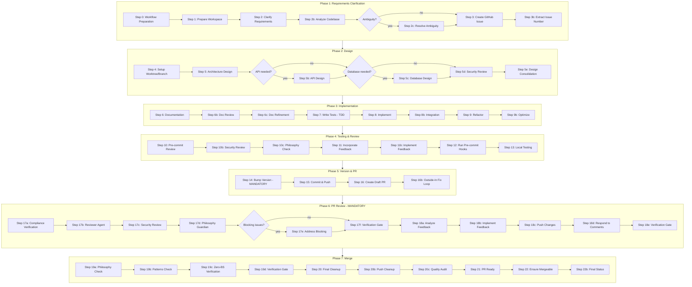

# Default Workflow Skill

## Relationship to Dev Orchestrator

**Normal execution path**: This workflow is invoked as a sub-recipe by the
`dev-orchestrator` skill via `smart-orchestrator`. You do NOT normally need
to activate this skill directly.

```
User request → dev-orchestrator → smart-orchestrator recipe
    → default-workflow recipe (this skill's recipe)
```

**Direct invocation** is supported as a compatibility path when the
dev-orchestrator is unavailable or when explicitly requested. In that case,
use the recipe runner (see Execution Instructions below).

## Workflow Graph



## Purpose

This skill provides the standard development workflow for all non-trivial code changes
in amplihack. It is normally executed as a sub-recipe by the `dev-orchestrator` via
`smart-orchestrator`, but can also be invoked directly via the recipe runner.

The workflow defines the canonical execution process: from requirements clarification
through design, implementation, testing, review, and merge. It ensures consistent
quality by orchestrating specialized agents at each step and enforcing philosophy
compliance throughout.

## Canonical Sources

- **Skill documentation**: `amplifier-bundle/skills/default-workflow/SKILL.md`
- **Executable source (recipe)**: `amplifier-bundle/recipes/default-workflow.yaml`

The skill and recipe are the authoritative representation. Legacy
`DEFAULT_WORKFLOW.md` files are deprecated compatibility references only.

## Execution Instructions

### Normal path (via dev-orchestrator)

If you reached this skill via `dev-orchestrator` / `smart-orchestrator`, the recipe
runner is already managing execution. **Do not re-invoke the recipe runner.** The
orchestrator handles the full lifecycle including goal-seeking reflection loops.

### Direct invocation (standalone)

If this skill is activated directly (not via dev-orchestrator), you MUST use the
recipe runner — **do NOT read a legacy markdown workflow file and follow steps
manually**:

The default workflow exposes one direct executable recipe interface:

```bash
amplihack recipe run default-workflow \
  -c task_description="TASK_DESCRIPTION_HERE" \
  -c repo_path="."
```

Or with verbose output:

```bash
cd /path/to/repo && amplihack recipe run default-workflow \
  -c task_description="TASK_DESCRIPTION_HERE" \
  -c repo_path="." \
  --verbose
```

**Do NOT** read legacy `DEFAULT_WORKFLOW.md` files and follow steps manually. The recipe runner
enforces step ordering, recursion guards, checkpoints, and quality gates that manual
execution cannot replicate.

### Preferred: Use dev-orchestrator instead

For most tasks, invoke `Skill(skill="dev-orchestrator")` or use `/dev <task>` rather
than activating this skill directly. The dev-orchestrator adds goal-seeking reflection,
workstream decomposition, and adaptive error recovery on top of this workflow.

## Command Interface

The default workflow exposes one direct executable recipe interface:

```bash
amplihack recipe run default-workflow \
  -c task_description="Add password reset support" \
  -c repo_path=.
```

| Context key | Required | Description |
| --- | --- | --- |
| `task_description` | Yes | Plain-language task to execute through the workflow. |
| `repo_path` | Yes | Repository root for workspace setup, checks, commits, and PR work. |

The normal orchestrated interface remains:

```bash
amplihack recipe run smart-orchestrator \
  -c task_description="Add password reset support" \
  -c repo_path=.
```

Agent runtimes that support skills should enter through
`Skill(skill="dev-orchestrator")` for DEV, INVESTIGATE, and HYBRID tasks. Direct
`Skill(skill="default-workflow")` activation is for explicit standalone use or
orchestrator-unavailable compatibility.

## Step 13 Local Validation Contract

Step 13 is a mandatory outside-in local validation gate. It is agentic and
toolchain-aware: the acting agent detects affected languages, manifests,
lockfiles, package managers, entry points, changed files, and documented project
commands before selecting validation commands.

The step must not require one global validation mechanism across all projects.
Rust/Cargo, Node/npm, Python/uv, Go, .NET, and other detected toolchains each use
their own local consumer-facing validation pattern. Python `uvx` is only a
Python/uv-specific option when that project shape warrants it.

For the full evidence contract and examples, see
[`docs/reference/default-workflow-step-13-validation.md`](../../../reference/default-workflow-step-13-validation.md).

## Configuration

Generated preferences and session context name the canonical skill/recipe, not a
legacy markdown path:

```markdown
## Workflow Configuration

**Selected**: `default-workflow` skill/recipe
**Consensus Depth**: balanced

Use the `consensus-workflow` skill/recipe for: ambiguous requirements,
architectural changes, critical/security code, public APIs.
```

Do not render `DEFAULT_WORKFLOW.md` paths as selected workflow configuration.
Those paths are compatibility references only.

## Auto-Activation Triggers

This skill auto-activates for:

- Features spanning multiple files (5+)
- Complex integrations across components
- Refactoring affecting 5+ files
- Any non-trivial code changes requiring structured workflow

**Note**: The `dev-orchestrator` skill has higher priority and broader triggers.
In most cases, it will activate first and invoke this workflow as a sub-recipe.

## Known Failure Points & Resilience Guidance

Steps that commonly fail during workflow execution. Agents executing this workflow
MUST apply the documented resilience patterns when encountering these steps.

### Step 1 — Git Fetch (credential failure)

**Failure**: `git fetch --all` fails with exit 128 when the remote requires credentials
that are not configured — most commonly Azure DevOps remotes where only the GitHub
credential helper (`gh auth git-credential`) is wired up.
**Resilience**: Fetch failure is caught and downgraded to a WARNING. The step continues
with local branch state. ADO remotes (`dev.azure.com`, `visualstudio.com`) receive
specific remediation guidance (`az login`, GCM install, PAT setup). The remote URL is
never echoed to avoid leaking embedded credentials. See
`docs/recipes/issue-655-656-skill-invocation-and-fetch-resilience.md` for details.

### Step 3 — Issue Creation (label missing)

**Failure**: `gh label create` fails silently when labels cannot be created (permission denied, API timeout).
**Resilience**: Label attachment is best-effort. If `gh issue create --label` fails, retry without `--label`. The issue itself is the critical artifact, not its labels.

### Step 4 — Worktree Setup (non-main default branch)

**Failure**: Worktree setup aborts when a repository does not have `origin/main`,
even though its remote default branch is `master` or `develop`.
**Resilience**: Remote base detection runs before worktree creation. Prefer
Git-verified `origin/HEAD`, then fall back to `origin/master`, then
`origin/develop`. `origin/HEAD` may target `origin/main`, `origin/master`,
`origin/develop`, or another remote default branch as long as Git verifies it as
a remote-tracking ref under `refs/remotes/origin/`. If no supported remote base
source exists, fail closed with a clear error; do not bootstrap from local
`HEAD` or silently skip push/upstream setup.

### Step 4 — Initial Push (network transient)

**Failure**: `git push origin <branch>` fails on fresh branch creation due to network issues.
**Resilience**: Push failure at step 4 emits a visible WARNING and defers to step 15/16. Push is retried with bounded retry (3 attempts, 2s backoff) at commit-and-push time. Step 16 also retries push before PR creation.

### Step 5b — Agent Output Artifact Missing

**Failure**: Agent output file not written or corrupted, causing downstream steps to fail with empty input.
**Resilience**: If an agent step produces empty output, the recipe runner should surface the error visibly. Checkpoints after design (step 5e) and after implementation (step 8b) preserve partial work so the workflow can resume from the nearest safe point.

### Step 15 — Push to Remote (upstream tracking)

**Failure**: `git rev-list --count @{u}..HEAD` fails when upstream is not set (first push scenario).
**Resilience**: Detect missing upstream explicitly. If `@{u}` fails, push unconditionally instead of silently skipping. Retry push with backoff on transient network errors.

### Step 16 — PR Creation (already exists / no commits)

**Failure**: `gh pr create` fails with "No commits between main and branch" or duplicate PR.
**Resilience**: Idempotency guard checks for existing PRs by branch name before creating. If PR already exists, reuse it. If no commits ahead, surface the error visibly rather than creating an empty PR.

### Step 21 — PR Ready (large template variables)

**Failure**: Shell `&&`-chain breaks when `philosophy_check`, `patterns_check`, or `quality_audit_results` template variables contain shell metacharacters or exceed ARG_MAX.
**Resilience**: Large template variables are captured via heredoc and truncated to 1KB before use in shell commands. Step 21 avoids echoing raw template content in bash; agent steps handle large text natively.

## Checkpoint Strategy

The workflow creates automatic checkpoints at these points to prevent work loss:

| Checkpoint                         | After Step                | Preserves                                     |
| ---------------------------------- | ------------------------- | --------------------------------------------- |
| `checkpoint-after-design`          | 5e (Design Consolidation) | Architecture decisions, API design, DB schema |
| `checkpoint-after-implementation`  | 8b (Integration)          | Tests, implementation code, integration work  |
| `checkpoint-after-review-feedback` | 11b (Implement Feedback)  | Review-addressed changes                      |

If a step fails after a checkpoint, the worktree branch retains all committed work. Agents can resume from the latest checkpoint by re-running the workflow with the existing worktree.

## Related Files

- **Skill docs**: `amplifier-bundle/skills/default-workflow/SKILL.md`
- **Recipe (executable)**: `amplifier-bundle/recipes/default-workflow.yaml`
- **Command Interface**: `.claude/commands/amplihack/dev.md`
- **Orchestrator Skill**: `.claude/skills/dev-orchestrator/`
- **Investigation Workflow**: `.claude/skills/investigation-workflow/`
