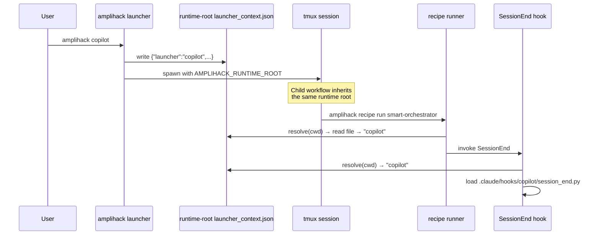

# Agent Binary Routing

`amplihack` supports four AI backends — `claude`, `copilot`, `codex`, and `amplifier` — each launched via the same `amplihack <tool>` pattern. This document explains how downstream components (recipe runner, hooks, sub-agents, Python skills) know which backend is active, why this matters, and how workflow runtime isolation keeps generated launcher state out of task worktrees.

## Contents

- [The problem](#the-problem)
- [The solution: a config-driven resolver](#the-solution-a-config-driven-resolver)
- [Resolution algorithm](#resolution-algorithm)
- [How it propagates across processes](#how-it-propagates-across-processes)
- [Default: copilot](#default-copilot)
- [Consumers](#consumers)
  - [Recipe runner](#recipe-runner)
  - [Hooks](#hooks)
  - [Sub-agents](#sub-agents)
  - [Python skills](#python-skills)
- [Hook resolution & missing-hook errors](#hook-resolution--missing-hook-errors)
- [Security](#security)
- [Related](#related)

## The problem

The recipe runner, hooks, and various Python skill helpers must spawn new AI sessions on behalf of the user. They cannot hardcode the binary — if a user invokes `amplihack copilot` and triggers a recipe that spawns a follow-up session, that session must use `copilot`, not `claude`.

Earlier iterations of `amplihack-rs` solved this by writing `AMPLIHACK_AGENT_BINARY` into the subprocess environment. This worked for direct child processes but degraded badly through:

- `tmux new-session -d` (which strips most env vars)
- detached background processes (`setsid`, daemonized hooks)
- sub-recipes that re-exec a fresh `amplihack` binary
- Python `subprocess.run` calls that inherit a partially stripped env

The result: a session started as `copilot` could end up running `claude` for late-arriving hooks or sub-recipes, and `SessionEnd` hooks would fail-silent looking for a `claude`-shaped file that did not exist.

## The solution: a runtime-root resolver

A single shared resolver (`amplihack_utils::agent_binary::resolve`) is now the only sanctioned way to determine the active binary. It consults four sources in order, falling through on missing or invalid input:

1. `AMPLIHACK_AGENT_BINARY` environment variable (explicit override)
2. `$AMPLIHACK_RUNTIME_ROOT/launcher_context.json` `launcher` field
3. `<repo>/.claude/runtime/launcher_context.json` `launcher` field (legacy fallback only)
4. Built-in default `"copilot"`

The runtime-root file is the **canonical workflow state**. It keeps generated
launcher state outside task worktrees while giving child workflows that inherit
`AMPLIHACK_RUNTIME_ROOT` the same active-binary value. The old
`.claude/runtime` location is read only as a migration fallback.

## Resolution algorithm

```mermaid
flowchart TD
    A[Caller invokes resolve&#40;cwd&#41;] --> B{AMPLIHACK_AGENT_BINARY set?}
    B -- yes --> V1[Validate against allowlist]
    V1 -- ok --> R1[Return env value]
    V1 -- reject --> W1[warn! and fall through]
    B -- no --> W1
    W1 --> C{AMPLIHACK_RUNTIME_ROOT set?}
    C -- yes --> F1[Read runtime-root<br/>launcher_context.json]
    C -- no --> L1[Check legacy fallback]
    F1 -- found, fresh, ≤64 KiB --> P[Parse launcher field]
    P --> V2[Validate against allowlist]
    V2 -- ok --> R2[Return file value]
    V2 -- reject --> W2[warn! and fall through]
    F1 -- not found / stale / too big --> L1[Check legacy fallback]
    L1 -- found, fresh, ≤64 KiB --> P2[Parse legacy launcher field]
    P2 --> V3[Validate against allowlist]
    V3 -- ok --> R3[Return legacy value]
    V3 -- reject --> W2[warn! and fall through]
    L1 -- not found / stale / too big --> W2
    W2 --> D[Return built-in default 'copilot']
```



Runtime-root rules:

- Use `AMPLIHACK_RUNTIME_ROOT` exactly as a filesystem path after validation.
- Read only `$AMPLIHACK_RUNTIME_ROOT/launcher_context.json` for canonical
  workflow state.
- Create runtime-root launcher context with owner-only permissions where the
  platform supports them.

Legacy fallback walk-up rules:

- Stop at the first `.claude/runtime/launcher_context.json` found.
- Stop at the first `.git` boundary; do not cross into a parent repo.
- Cap at 32 ancestors.
- Treat the file as migration compatibility only, never as the write target for
  new workflow code.

The **anchor** for symlink-escape checks is the directory containing the
discovered `launcher_context.json`. The discovered file is canonicalized; if the
canonical path does not start with the canonical anchor, the file is rejected.

If runtime-root lookup and legacy walk-up both fail, the resolver returns the
built-in default with no anchor check because there is nothing to escape from.

## How it propagates across processes

The launcher writes the resolved value into runtime-owned state and a
back-compat env cache at start time:

1. `$AMPLIHACK_RUNTIME_ROOT/launcher_context.json` — canonical generated
   launcher state outside the task worktree
2. `AMPLIHACK_AGENT_BINARY` in the subprocess `Command` env — read-through cache
   for back-compat with external consumers that have not migrated

Inside `amplihack-rs`, every read site calls `resolve(&cwd)` rather than reading
the env var directly. Child workflows inherit `AMPLIHACK_RUNTIME_ROOT`
unchanged; they must not compute separate runtime roots. The legacy
`.claude/runtime` file is read only when runtime-root state is absent.



## Default: copilot

The implicit default changed from `"claude"` to `"copilot"`. This affects only sessions where:

- `AMPLIHACK_AGENT_BINARY` is unset, AND
- No runtime-root `launcher_context.json` is available, AND
- No legacy `launcher_context.json` is found within the walk-up window, AND
- Nothing else in the precedence chain produced a valid value

For typical workflow use the default never matters — the top-level workflow
writes runtime-root launcher context. The default only governs cold-start cases
where no env override, runtime-root context, or legacy context exists.

To force `claude` for a single command, prefix with
`AMPLIHACK_AGENT_BINARY=claude`.

## Consumers

### Recipe runner

`recipe-runner-rs` reads the env-var cache today; PR follow-up will switch it to call `resolve(&cwd)` directly. Both paths produce the same value because the launcher writes the env var from the resolver.

### Hooks

Hooks are native `amplihack-hooks <subcommand>` commands registered in
settings. They do not resolve per-binary script files.

### Sub-agents

`amplihack-utils::llm_client::resolve_binary`, `claude_cli::get_claude_cli_path`, `knowledge_builder`, and `workflows::cascade` all call into the shared resolver. There is exactly one read implementation in Rust.

## Hook registration

Installed settings register native hook commands such as:

```json
{"type": "command", "command": "amplihack-hooks session-start"}
```

`amplihack-hooks` dispatches the subcommand to the native Rust implementation
for each hook event. Missing or stale settings are detected by the install
verifier and hook verification code, not by resolving script files.

The user must take an explicit action — install the hook, switch binaries, or set the override. The system never silently runs `claude/session_end.py` in place of the missing `copilot/session_end.py`, and stub `session_end.py` files created solely to suppress the error are an architectural smell that the resolver is designed to reject. (See [PHILOSOPHY.md — Forbidden Patterns / Silent Fallbacks].)

## Security

The resolver and hook paths are derived from values that may originate in user-controlled environment variables or files. To prevent injection and path-traversal:

| Concern               | Mitigation                                                                                          |
| --------------------- | --------------------------------------------------------------------------------------------------- |
| Path traversal        | Allowlist binary names *before* substituting into a path; canonicalize then `starts_with` the root  |
| Symlink escape        | Reject canonicalized paths that escape the discovered repo or `amplihack-home`                      |
| Oversized config      | Cap `launcher_context.json` reads at 64 KiB                                                         |
| JSON depth bombs      | Parse with `serde_json::from_str` into a typed struct; reject depth > 8 (current schema is depth 2; the cap is defense-in-depth against future additions) |
| Env injection         | Trim, lowercase, length ≤ 32; reject `/`, `\`, `..`, null, whitespace, control chars                |
| Shell-quoted values   | The resolved value is never passed through `sh -c`; only used as `Command::new(binary)` or path key |
| Stale state           | Files older than 24h are treated as unset                                                           |
| Diagnostic leakage    | Error messages use `Path::display()` and structured tracing fields; rejected values are never inlined into format strings |

## Related

- [Active Agent Binary](../reference/active-agent-binary.md) — Resolver API and full algorithm
- [Environment Variables](../reference/environment-variables.md#amplihack_agent_binary) — Env var reference
- [Agent Configuration](../reference/agent-configuration.md) — Where this fits into broader config precedence
- [Hook Specifications](../reference/hook-specifications.md) — Per-binary hook layout and event list
- [Bootstrap Parity](./bootstrap-parity.md) — How the Rust CLI matches the Python launcher's environment contract
