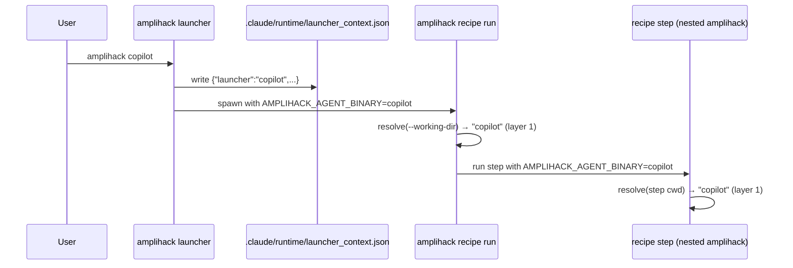

# Agent Binary Routing

`amplihack` supports four AI backends — `claude`, `copilot`, `codex`, and `amplifier` — each launched via the same `amplihack <tool>` pattern. This document explains how downstream components (recipe runner, hooks, sub-agents) know which backend is active, and why this matters.

## Contents

- [The problem](#the-problem)
- [The solution: a config-driven resolver](#the-solution-a-config-driven-resolver)
- [Resolution algorithm](#resolution-algorithm)
- [How it propagates across processes](#how-it-propagates-across-processes)
- [Default: copilot](#default-copilot)
- [Consumers](#consumers)
  - [Recipe runner](#recipe-runner)
  - [Hooks](#hooks)
  - [Sub-agents](#sub-agents)
- [Hook registration](#hook-registration)
- [Security](#security)
- [Related](#related)

## The problem

The recipe runner, hooks, and various Python skill helpers must spawn new AI sessions on behalf of the user. They cannot hardcode the binary — if a user invokes `amplihack copilot` and triggers a recipe that spawns a follow-up session, that session must use `copilot`, not `claude`.

Earlier iterations of `amplihack-rs` solved this by writing `AMPLIHACK_AGENT_BINARY` into the subprocess environment. This worked for direct child processes but degraded badly through:

- `tmux new-session -d` (which strips most env vars)
- detached background processes (`setsid`, daemonized hooks)
- sub-recipes that re-exec a fresh `amplihack` binary
- Python `subprocess.run` calls that inherit a partially stripped env

The result: a session started as `copilot` could end up running `claude` for late-arriving hooks or sub-recipes, and `SessionEnd` hooks would fail-silent looking for a `claude`-shaped file that did not exist.

## The solution: a config-driven resolver

A single shared resolver (`amplihack_utils::agent_binary::resolve`) is now the only sanctioned way to determine the active binary. It consults four sources in order, falling through on missing or invalid input:

1. `AMPLIHACK_AGENT_BINARY` environment variable (explicit override), unless it
   is tagged `AMPLIHACK_AGENT_BINARY_SOURCE=default:<same binary>` as a parent's
   guess (issue #1481)
2. A live session marker: an environment variable the hosting CLI exports,
   such as `CLAUDECODE`, `CLAUDE_CODE_ENTRYPOINT` or `COPILOT_CLI`
   (`agent_binary::SESSION_MARKERS`)
3. `<repo>/.claude/runtime/launcher_context.json` `launcher` field, found by
   walking up from the working directory
4. Built-in default `"copilot"`

There is no `$AMPLIHACK_RUNTIME_ROOT` layer. `amplihack recipe run` does set
`AMPLIHACK_RUNTIME_ROOT` for the runner, but the resolver never reads a
launcher context from it. [Active Agent Binary](../reference/active-agent-binary.md#resolution-precedence)
is the reference for this order; this page explains why it looks the way it does.

## Resolution algorithm


```mermaid
flowchart TD
    A[Caller invokes resolve&#40;cwd&#41;] --> B{AMPLIHACK_AGENT_BINARY set?}
    B -- yes --> T{Tagged default:&lt;same binary&gt;?}
    T -- yes --> M
    T -- no --> V1[Validate against allowlist]
    V1 -- ok --> R1[Return env value]
    V1 -- reject --> M
    B -- no --> M{Session marker set?}
    M -- yes --> R2[Return the marker's binary]
    M -- no --> L1[Walk up for .claude/runtime/launcher_context.json]
    L1 -- found, fresh, trusted, ≤64 KiB --> P[Parse launcher field]
    P --> V2[Validate against allowlist]
    V2 -- ok --> R3[Return file value]
    V2 -- reject --> D
    L1 -- not found / stale / untrusted / too big --> D[Return built-in default 'copilot']
```

Walk-up rules for the persisted launcher context:

- Stop at the first `.claude/runtime/launcher_context.json` found.
- Stop at the first `.git` boundary; do not cross into a parent repo.
- Stop at the first world-writable or foreign-owned directory (issue #1335).
- Cap at 32 ancestors.
- Treat files older than 24h as unset.

The **anchor** for symlink-escape checks is the directory containing the
discovered `launcher_context.json`. The discovered file is canonicalized; if the
canonical path does not start with the canonical anchor, the file is rejected.

If every layer above fails, the resolver returns the built-in default with no
anchor check because there is nothing to escape from.

## How it propagates across processes

The launcher (`amplihack claude`, `amplihack copilot`, ...) records its choice
in two places at start time:

1. `<repo>/.claude/runtime/launcher_context.json`, which later processes in
   the same checkout can read back (layer 3)
2. `AMPLIHACK_AGENT_BINARY` in the subprocess `Command` env, which direct
   children read first (layer 1)

A launcher started on an inherited `default:<binary>`-tagged value naming
itself does not write `launcher_context.json`: that launch was a guess, not a
session's choice, and persisting it would pin later runs in the checkout.

`amplihack recipe run` resolves once, at entry, while it can still see the
session markers of the CLI that invoked it, and exports the answer to
`recipe-runner-rs` as `AMPLIHACK_AGENT_BINARY`. Steps run under the runner's
curated environment, where those markers may be gone. When the answer came
from the default layer, recipe run also exports the `default:<binary>` tag and
prints a one-line notice on stderr (issue #1481).

Inside `amplihack-rs`, every read site calls `resolve(&cwd)` rather than reading
the env var directly.


```mermaid
sequenceDiagram
    participant U as User
    participant L as amplihack launcher
    participant F as .claude/runtime/launcher_context.json
    participant R as amplihack recipe run
    participant S as recipe step (nested amplihack)

    U->>L: amplihack copilot
    L->>F: write {"launcher":"copilot",...}
    L->>R: spawn with AMPLIHACK_AGENT_BINARY=copilot
    R->>R: resolve(--working-dir) → "copilot" (layer 1)
    R->>S: run step with AMPLIHACK_AGENT_BINARY=copilot
    S->>S: resolve(step cwd) → "copilot" (layer 1)
```

## Default: copilot

The implicit default changed from `"claude"` to `"copilot"`. This affects only sessions where:

- `AMPLIHACK_AGENT_BINARY` is unset (or is a tagged default guess), AND
- No session marker is set, AND
- No fresh, trusted `launcher_context.json` is found within the walk-up window

For typical use the default never matters: the launcher exports
`AMPLIHACK_AGENT_BINARY`, and a CLI session exports its own marker. The default
only governs cold-start cases where none of those exist, and `amplihack recipe
run` says so on stderr when it happens.

To force `claude` for a single command, prefix with
`AMPLIHACK_AGENT_BINARY=claude`.

## Consumers

### Recipe runner

`recipe-runner-rs` does not resolve on its own; it reads the
`AMPLIHACK_AGENT_BINARY` (and `AMPLIHACK_AGENT_BINARY_SOURCE`) that
`amplihack recipe run` resolved and exported, and passes them to every step.

### Hooks

Hooks are native `amplihack-hooks <subcommand>` commands registered in
settings. They do not resolve per-binary script files.

### Sub-agents

`amplihack-utils::llm_client::resolve_binary`, `claude_cli::get_claude_cli_path`, `knowledge_builder`, and `workflows::cascade` all call into the shared resolver. There is exactly one read implementation in Rust.

## Hook registration

Installed settings register native hook commands such as:

```json
{"type": "command", "command": "amplihack-hooks session-start"}
```

`amplihack-hooks` dispatches the subcommand to the native Rust implementation
for each hook event. Missing or stale settings are detected by the install
verifier and hook verification code, not by resolving script files.

The user must take an explicit action — install the hook, switch binaries, or set the override. The system never silently runs `claude/session_end.py` in place of the missing `copilot/session_end.py`, and stub `session_end.py` files created solely to suppress the error are an architectural smell that the resolver is designed to reject. (See [PHILOSOPHY.md — Forbidden Patterns / Silent Fallbacks].)

## Security

The resolver and hook paths are derived from values that may originate in user-controlled environment variables or files. To prevent injection and path-traversal:

| Concern               | Mitigation                                                                                          |
| --------------------- | --------------------------------------------------------------------------------------------------- |
| Path traversal        | Allowlist binary names *before* substituting into a path; canonicalize then `starts_with` the root  |
| Symlink escape        | Reject canonicalized paths that escape the discovered repo or `amplihack-home`                      |
| Oversized config      | Cap `launcher_context.json` reads at 64 KiB                                                         |
| JSON depth bombs      | Parse with `serde_json::from_str` into a typed struct; reject depth > 8 (current schema is depth 2; the cap is defense-in-depth against future additions) |
| Env injection         | Trim, lowercase, length ≤ 32; reject `/`, `\`, `..`, null, whitespace, control chars                |
| Shell-quoted values   | The resolved value is never passed through `sh -c`; only used as `Command::new(binary)` or path key |
| Stale state           | Files older than 24h are treated as unset                                                           |
| Diagnostic leakage    | Error messages use `Path::display()` and structured tracing fields; rejected values are never inlined into format strings |

## Related

- [Active Agent Binary](../reference/active-agent-binary.md) — Resolver API and full algorithm
- [Environment Variables](../reference/environment-variables.md#amplihack_agent_binary) — Env var reference
- [Agent Configuration](../reference/agent-configuration.md) — Where this fits into broader config precedence
- [Hook Specifications](../reference/hook-specifications.md) — Per-binary hook layout and event list
- [Bootstrap Parity](./bootstrap-parity.md) — How the Rust CLI matches the Python launcher's environment contract
