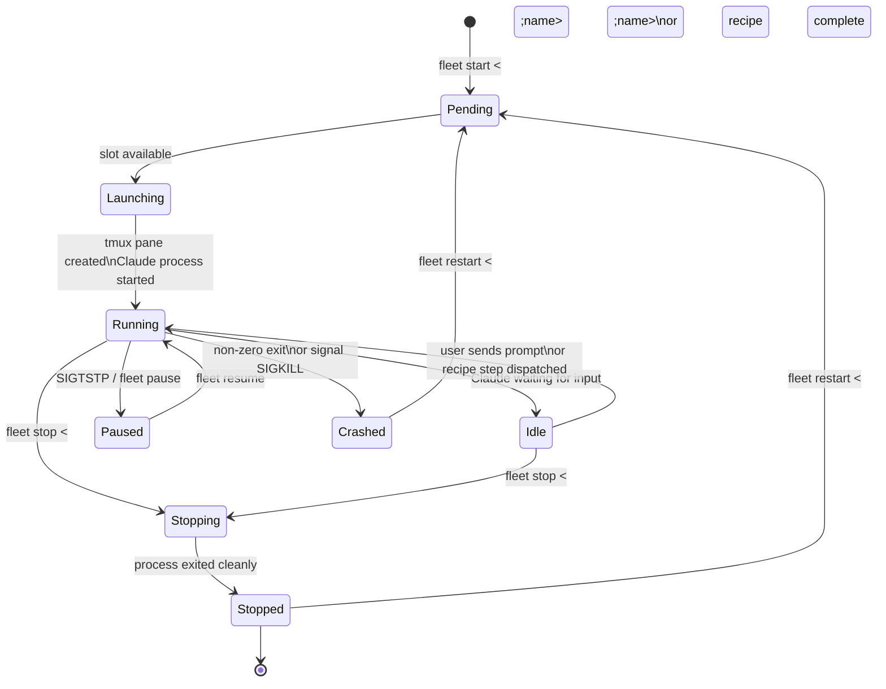
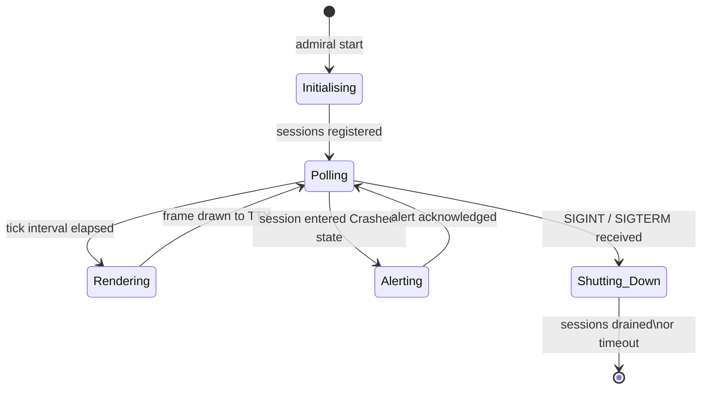

# Fleet State Machine

Documents the lifecycle of a *fleet* — a set of named Claude agent
sessions managed together by `amplihack fleet`.

## Session States

## Fleet Admiral State (Dashboard View)

## Key Transitions

| Transition | Trigger | Side-Effect |
|---|---|---|
| Pending → Launching | Concurrency slot freed | tmux window created |
| Running → Crashed | Non-zero exit code | Alert emitted; metrics recorded |
| Crashed → Pending | `fleet restart` | Previous pane cleaned up |
| Running → Paused | `SIGTSTP` forwarded | Tmux pane kept alive |
| Polling → Shutting_Down | `SIGINT` (Ctrl-C) | Exit code 0 (SIGINT parity) |

## Related Concepts

- [Signal Handling Lifecycle](signal-handling-lifecycle.md)
- [Fleet Admiral Reasoning](fleet-admiral-reasoning.md)
- [Fleet Dashboard Architecture](fleet-dashboard-architecture.md)
