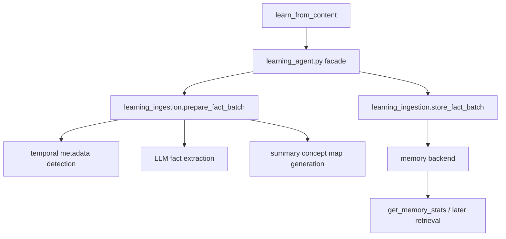
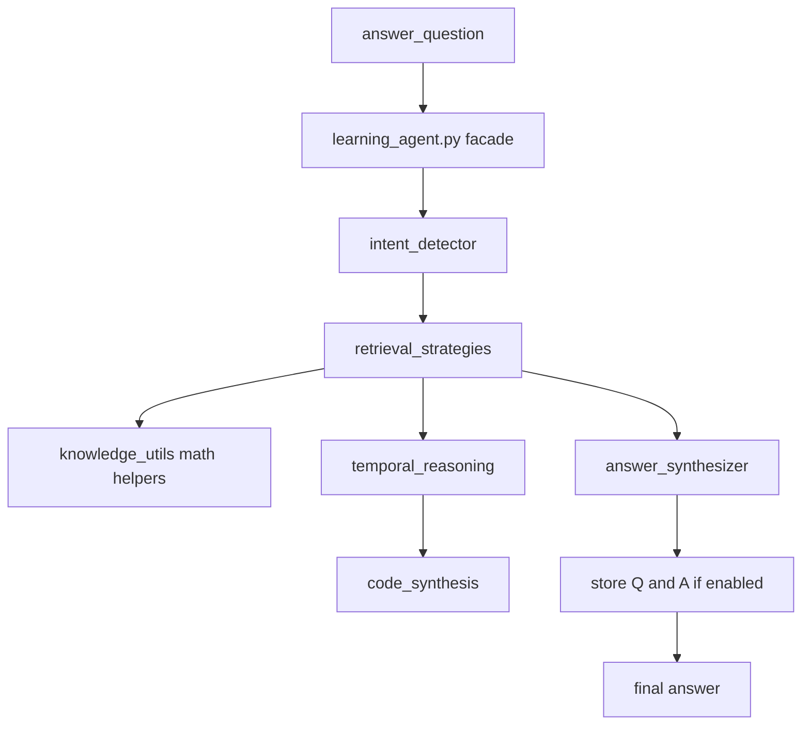

# Understanding the LearningAgent Module Architecture

The refactored `LearningAgent` keeps the same caller-facing behavior while replacing the old monolith with focused internal modules.

From the outside, generated agents, eval harnesses, and direct imports continue to use the same `LearningAgent` methods. Internally, the agent is now organized around stable ownership boundaries: ingestion, retrieval, intent detection, temporal reasoning, code synthesis, knowledge utilities, and answer synthesis.

## Why the split exists

The refactor solves four maintenance problems in the original single-file implementation:

- Too many responsibilities in one file made reviews noisy.
- Retrieval, temporal reasoning, and synthesis logic were tightly interleaved.
- Tests were forced into one large compatibility bucket.
- Small changes risked accidental regressions in unrelated paths.

The module split keeps the behavior intact while making it obvious where new logic belongs.

## Compatibility model

The compatibility rules are strict:

- `src/amplihack/agents/goal_seeking/learning_agent.py` remains the primary import path.
- `LearningAgent` remains directly importable for existing callers.
- `GoalSeekingAgent` continues to delegate learning and answering work to `LearningAgent`.
- The public methods stay unchanged:
  - `learn_from_content`
  - `answer_question`
  - `answer_question_agentic`
  - `get_memory_stats`
  - `flush_memory`
  - `close`
- `src/amplihack/agents/goal_seeking/__init__.py` continues to import `LearningAgent` for backward compatibility without promoting it into `__all__`.

## The eight-module layout

The refactor centers on eight named modules. These are the contributor-facing ownership boundaries.

| Module                    | Responsibility                                                           | Typical reasons to edit it                                      |
| ------------------------- | ------------------------------------------------------------------------ | --------------------------------------------------------------- |
| `learning_agent.py`       | Thin facade, construction, action registration, lifecycle, retry helpers | Constructor behavior, shared state, public method delegation    |
| `learning_ingestion.py`   | Content ingestion, fact extraction, batching, storage                    | Learning flow, source labels, summary concept maps              |
| `answer_synthesizer.py`   | LLM answer synthesis and completeness evaluation                         | Prompt assembly, final answer wording, gap-filling refinement   |
| `retrieval_strategies.py` | Retrieval planning and retrieval implementations                         | Entity lookup, concept lookup, aggregation retrieval, fallbacks |
| `intent_detector.py`      | Query intent classification                                              | Intent labels, routing metadata, math/temporal flags            |
| `temporal_reasoning.py`   | Temporal state tracking and transition chains                            | Change-over-time questions, direct temporal lookups             |
| `code_synthesis.py`       | LLM-driven code generation for hard temporal calculations                | Generated Python snippets and temporal index computation        |
| `knowledge_utils.py`      | Shared helpers for arithmetic, entity handling, fact validation          | Math precomputation, knowledge explanations, fact verification  |

Private helper files may exist when needed to keep the main ownership modules reviewable. Those helpers support the eight modules above; they do not replace them as contributor entry points.

## Implementation: mixin inheritance

The modules are implemented as **mixin classes** that `LearningAgent` inherits from:

```python
class LearningAgent(
    IntentDetectorMixin,
    TemporalReasoningMixin,
    CodeSynthesisMixin,
    KnowledgeUtilsMixin,
    RetrievalStrategiesMixin,
    LearningIngestionMixin,
    AnswerSynthesizerMixin,
):
```

This preserves all `self.*` references without changing method signatures. Every method still accesses `self.memory`, `self.model`, and other instance attributes directly through inheritance — no adapters, no parameter threading, no new state objects.

A shared `prompt_utils.py` helper provides `_get_llm_completion()` which resolves `_llm_completion` from the `learning_agent` module namespace at runtime. This ensures that test monkeypatching of `learning_agent._llm_completion` propagates to all mixin modules correctly.

## Shared state stays in the facade

`learning_agent.py` remains the one place that owns process-wide state and construction-time wiring.

The shared state that stays on `LearningAgent` includes:

- `self.memory`
- `self.model`
- `self.agent_name`
- `self.use_hierarchical`
- `self.loop`
- `self.executor`
- `self._thread_local`
- `self._pre_snapshot_facts`
- `self.prompt_variant`
- `self._variant_system_prompt`

This keeps the internal modules focused on behavior, not lifecycle.

## Dependency direction

With mixin inheritance, `learning_agent.py` imports all seven mixin modules. The mixin modules themselves import only from shared utilities (`prompt_utils`, `retrieval_constants`, `similarity`, `prompts`, `action_executor`) — never from each other or from `learning_agent.py`.

At runtime, all methods resolve `self.*` through the MRO, so behavior flows naturally without cross-module imports.

Lower layers do not import higher layers. The facade assembles everything.

## How learning flows through the modules

`learn_from_content()` still looks like one operation to callers, but the work is now easier to follow:



Key properties:

- content truncation and source-label derivation live with ingestion
- temporal metadata detection stays near storage preparation
- batch preparation and batch storage stay together so the data contract is obvious

## How answering flows through the modules

The read path is now explicitly staged:



That flow matters because each stage answers a different question:

- **Intent detector**: what kind of question is this?
- **Retrieval strategies**: what facts should we bring back?
- **Knowledge utilities**: do we need deterministic arithmetic first?
- **Temporal reasoning**: is there a chronological chain to compute?
- **Code synthesis**: do we need generated code for a hard temporal lookup?
- **Answer synthesizer**: how do we turn the facts into a final answer?

## Agentic answering still builds on single-shot answering

`answer_question_agentic()` remains additive rather than divergent.

It still:

1. runs the standard single-shot pipeline first
2. evaluates answer completeness
3. retrieves more facts only when specific gaps exist
4. re-synthesizes from the original answer plus additional evidence

That means the refactor preserves the existing design rule: agentic mode should not score worse than the single-shot baseline.

## Test layout after the split

The old `test_learning_agent.py` monolith is replaced by module-aligned test files:

| Test file                                                    | Primary scope                                                |
| ------------------------------------------------------------ | ------------------------------------------------------------ |
| `tests/agents/goal_seeking/test_learning_agent_core.py`      | facade construction, retry helpers, lifecycle                |
| `tests/agents/goal_seeking/test_learning_agent_ingestion.py` | batch prep, storage, source labels, temporal metadata        |
| `tests/agents/goal_seeking/test_learning_agent_retrieval.py` | retrieval strategies, aggregation, fallbacks                 |
| `tests/agents/goal_seeking/test_learning_agent_temporal.py`  | temporal parsing, transition chains, generated temporal code |

The existing broader behavior tests remain in place:

- `test_math_intent.py`
- `test_agentic_answer_mode.py`
- `test_goal_seeking_agent.py`

## Maintenance guardrails

The refactor keeps a few hard boundaries in place:

- each primary extracted module stays small enough to review comfortably
- `learning_agent.py` stays intentionally thin
- no circular imports
- no dead imports
- public method signatures stay stable
- new helper logic goes to the owning module, not back into the facade

## When to touch each layer

Use this rule of thumb before editing:

- change **classification** logic in `intent_detector.py`
- change **time-aware interpretation** in `temporal_reasoning.py`
- change **deterministic computation** in `code_synthesis.py` or `knowledge_utils.py`
- change **fact extraction or storage** in `learning_ingestion.py`
- change **which facts are retrieved** in `retrieval_strategies.py`
- change **how final answers are phrased or refined** in `answer_synthesizer.py`
- change **construction, lifecycle, or compatibility wiring** in `learning_agent.py`

## Related reading

- Start with the [Goal-Seeking Agents overview](goal-seeking-agents.md) for the broader system.
- Use the [LearningAgent module reference](../reference/agent-configuration.md) for the exact public API and file ownership map.
- Use [How to maintain and extend the refactored LearningAgent](../howto/create-custom-agent.md) when making changes.
- Follow the [LearningAgent refactor tutorial](../tutorials/learning-agent-refactor-tutorial.md) for an end-to-end walkthrough.
