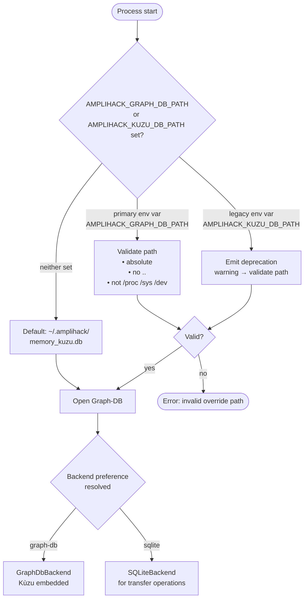
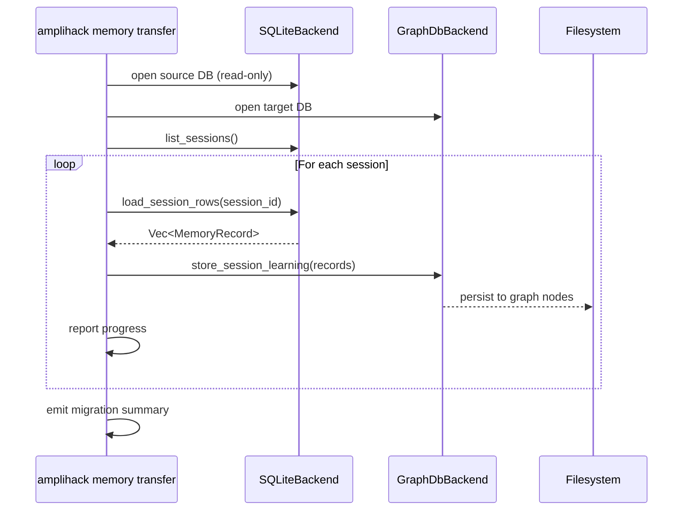

# Memory Backend Migration

Describes how `amplihack-rs` supports migrating agent memory between
SQLite and Graph-DB (Kùzu) backends, and the env-var override contract
that controls which backend is active.

## Backend Selection

## Migration Flow (SQLite → Graph-DB)

## Environment Variable Contract

| Variable | Status | Purpose |
|---|---|---|
| `AMPLIHACK_GRAPH_DB_PATH` | **Primary** (preferred) | Backend-neutral override; use this |
| `AMPLIHACK_KUZU_DB_PATH` | **Deprecated** | Legacy Kùzu-specific name; emits warning |

Both variables are validated with identical security rules before use.

## Related Concepts

- [Recipe Execution Flow](recipe-execution-flow.md)
- [Kùzu Code Graph](kuzu-code-graph.md)
- [Memory Backend Architecture](memory-backend-architecture.md)
