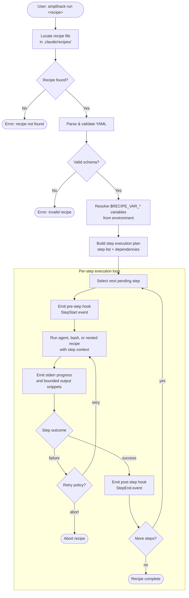

# Recipe Execution Flow

Illustrates how `amplihack-rs` loads, validates, and executes a recipe
step-by-step, including the hook dispatch lifecycle.

## Overview

A *recipe* is a YAML file describing a sequence of steps. The Rust runner
resolves the recipe, runs each agent, bash, or nested-recipe step, emits live
progress, and records the result before moving to the next step.

## Execution Flow Diagram

## Key Design Decisions

| Decision | Rationale |
|---|---|
| Steps run sequentially by default | Deterministic output; easier to reason about |
| `$RECIPE_VAR_*` resolved before execution | Fail fast on missing variables |
| Pre/post step hooks | Allow hook consumers to react without modifying the runner |
| Retry policy per step | Transient Claude failures should not abort long recipes |
| Non-interactive env injected for all shell steps | Tools like `apt`, `npm`, and git credential helpers hang without TTY; injecting `CI=true`, `NONINTERACTIVE=1`, and `DEBIAN_FRONTEND=noninteractive` prevents this |
| Agent steps receive `working_directory` in context | Without it, agents may write files in an unexpected location |
| Shell prerequisite checks | Missing required interpreters or host tools should fail at the step boundary with an actionable error |
| Progress uses stderr; final results use stdout | Humans can watch live step transitions and heartbeats while scripts safely parse the final structured output |
| Child output snippets are bounded | Failures include recent stdout/stderr context without allowing noisy subprocesses to flood logs |

## Environment Hardening

The executor applies two layers of defensive configuration before running any step:

### Shell steps

Every shell subprocess receives `HOME`, `PATH`, `NONINTERACTIVE=1`, `DEBIAN_FRONTEND=noninteractive`, and `CI=true` in its environment. These values are injected unconditionally — recipe steps are automated and must never prompt for input.

Command bodies up to 64 KiB are passed inline via `bash -c <body>`. Larger bodies are written to a tempfile and executed as `bash <path>` to avoid `Argument list too long (E2BIG)` from kernel `ARG_MAX` (~128 KiB on Linux). Both paths receive identical environment, working directory, and stdio handling; only the argv shape differs.

If a shell command depends on an interpreter or host tool, the executor should
check that prerequisite at the step boundary and abort the step immediately with
an actionable error when the tool is unavailable.

See [Recipe Executor Environment](../reference/recipe-executor-environment.md) for the full specification.

### Agent steps

The context map passed to the agent backend is augmented with `working_directory` (from the recipe's configured working dir) and `NONINTERACTIVE=1`. These entries use insert-if-absent semantics, so recipe YAML can still override them explicitly.

## Progress and logging

During the step loop, the runner emits lifecycle progress to stderr:

- recipe started/completed/failed
- step started/completed/failed/skipped
- rate-limited heartbeat lines for long-running active steps
- bounded recent stdout/stderr snippets when a child process or agent fails

The final recipe result remains on stdout in the selected `--format`. This lets
callers redirect or parse stdout without losing human-readable progress.

See [Recipe Runner Logging Reference](../reference/recipe-runner-logging.md) for
the complete event and JSON schema.

## Related Concepts

- [Memory Backend Architecture](memory-backend-architecture.md)
- [Signal Handling Lifecycle](signal-handling-lifecycle.md)
- [Fleet State Machine](fleet-state-machine.md)

## Related Reference

- [Recipe Executor Environment](../reference/recipe-executor-environment.md) — Full specification of injected variables and prerequisite checks
- [Workflow Classifier](../reference/workflow-classifier.md) — How task descriptions are routed to workflow types
