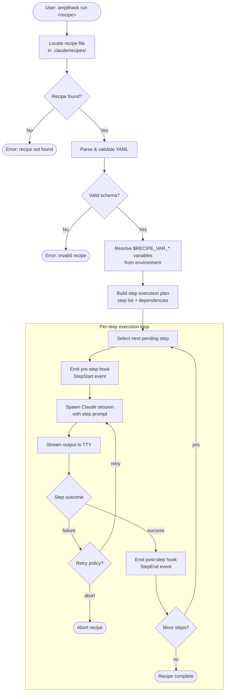

# Recipe Execution Flow

Illustrates how `amplihack-rs` loads, validates, and executes a recipe
step-by-step, including the hook dispatch lifecycle.

## Overview

A *recipe* is a YAML file describing a sequence of steps.  The Rust
runner resolves the recipe, launches a Claude session per step, streams
output, and records the result before moving to the next step.

## Execution Flow Diagram

## Key Design Decisions

| Decision | Rationale |
|---|---|
| Steps run sequentially by default | Deterministic output; easier to reason about |
| `$RECIPE_VAR_*` resolved before execution | Fail fast on missing variables |
| Pre/post step hooks | Allow Python agents to react without modifying the runner |
| Retry policy per step | Transient Claude failures should not abort long recipes |

## Related Concepts

- [Memory Backend Architecture](memory-backend-architecture.md)
- [Signal Handling Lifecycle](signal-handling-lifecycle.md)
- [Fleet State Machine](fleet-state-machine.md)
