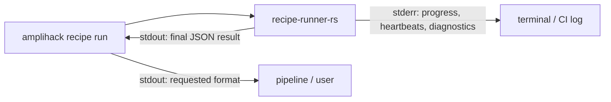

# Rust Runner Execution Architecture

How `amplihack recipe run` and `recipe-runner-rs` divide responsibility for
observable recipe execution.

**Status:** Planned finished-state architecture for recipe-runner transparency.

## Contents

- [Overview](#overview)
- [Stream ownership](#stream-ownership)
- [Progress event model](#progress-event-model)
- [Bounded output capture](#bounded-output-capture)
- [Wrapper preservation](#wrapper-preservation)
- [Related](#related)

## Overview

Recipe execution has two layers:

| Layer | Responsibility |
| --- | --- |
| `amplihack` CLI | Resolve the recipe and runner binary, pass context, forward stderr, format the final result, and propagate exit status. |
| `recipe-runner-rs` | Execute steps, know active child state, emit lifecycle progress and heartbeats, retain bounded recent output, and produce the structured result. |

The runner owns execution transparency because it is the only process that knows
which step, agent, subprocess, or nested recipe is active. The CLI must not infer
step state by parsing human-readable text.

## Stream ownership



`stderr` is for live human-visible progress. `stdout` is reserved for the final
result so commands such as this remain parseable:

```bash
amplihack recipe run default-workflow \
  -c task_description="Add input validation" \
  --format json > result.json
```

## Progress event model

The runner emits text progress lines for:

- recipe start, completion, and failure
- step start, completion, failure, and skip
- rate-limited heartbeats for long-running active steps
- failure diagnostics with recent output snippets

When `AMPLIHACK_RECIPE_LOG_JSONL` is set, the runner also writes structured
JSONL events to that file. Structured events are not interleaved into stdout.

`--progress` is not part of the wrapper contract. Progress is default; passing
`--progress` to `amplihack recipe run` should produce an explicit unsupported
flag error that points users to default stderr progress and `--verbose`.

## Bounded output capture

For each active child source and stream, the runner keeps a rolling buffer:

| Bound | Configuration |
| --- | --- |
| Maximum lines | `AMPLIHACK_RECIPE_SNIPPET_LINES` |
| Maximum bytes | `AMPLIHACK_RECIPE_SNIPPET_BYTES` |
| Heartbeat interval | `AMPLIHACK_RECIPE_HEARTBEAT_INTERVAL_SECONDS` |

The buffer is used for failure diagnostics, optional JSON result fields, and
JSONL output snippet events. It prevents noisy child processes from flooding
logs while still surfacing enough recent context to debug failures.

This feature does not add a new redaction layer. Recipes and child tools must
avoid printing secrets.

## Wrapper preservation

The runner may add optional diagnostic fields to the final JSON result:

- `duration_seconds`
- `progress_summary`
- `failure_context`
- `step_name`
- `phase`
- `child`
- `last_heartbeat_at`
- `recent_output`

The CLI must preserve these fields when it reformats runner output as JSON or
YAML. Unknown-field tolerant parsing is not enough if formatting drops the
fields before users or scripts can read them.

## Related

- [Rust Runner Execution Reference](../reference/rust-runner-execution.md)
- [Recipe Runner Logging Reference](../reference/recipe-runner-logging.md)
- [Recipe Runner Architecture](./recipe-runner-architecture.md)
