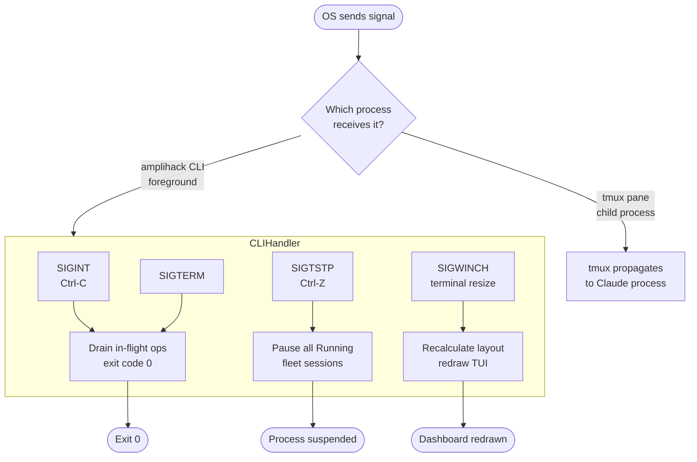
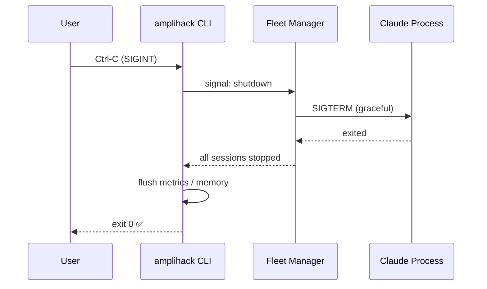
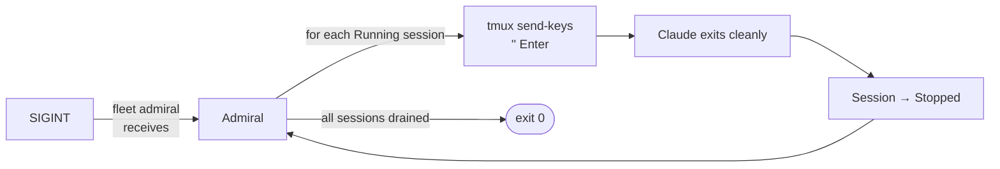
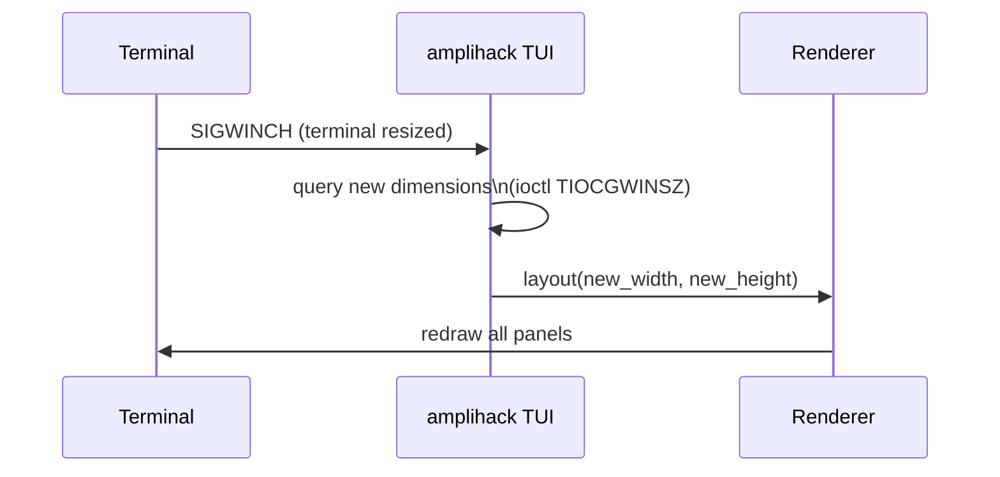

# Signal Handling Lifecycle

Documents how `amplihack-rs` handles OS signals (SIGINT, SIGTERM, SIGTSTP,
SIGWINCH) across the CLI, fleet manager, and child processes.

## Signal Dispatch Overview

## SIGINT Parity Contract

SIGINT (Ctrl-C) **must exit with code 0**, not 130.  This matches the
Python amplihack behaviour and allows shell scripts to treat user
interruption as a normal exit.

## Signal Forwarding to Child Sessions

## Terminal Resize (SIGWINCH)

## Related Concepts

- [Fleet State Machine](fleet-state-machine.md)
- [Fleet Admiral Reasoning](fleet-admiral-reasoning.md)
- [Recipe Execution Flow](recipe-execution-flow.md)
