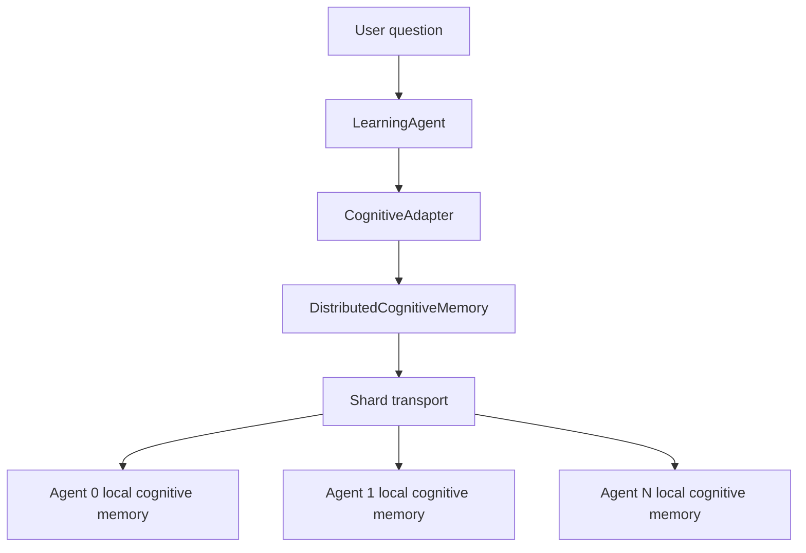

# [PLANNED] Unified Distributed Cognitive Memory

This document describes the intended behavior of amplihack's unified distributed cognitive memory architecture.

> **Status:** This is a target architecture document. The current implementation is only partially aligned with this design.

## What problem this solves

Each agent already has a real local cognitive memory model with sensory, working, episodic, semantic, procedural, and prospective memory. The missing piece is a distributed coordination layer that makes the cluster behave like one graph during retrieval instead of a set of local proxies with partial cross-agent behavior.

The target design keeps the per-agent cognitive layers intact while making distributed reads and writes explicit, deterministic, and failure-visible.

## Layer model

The architecture has four behavioral layers:

1. **Learning and reasoning layer** — `LearningAgent` chooses retrieval strategy for a question and preserves the original user question.
2. **Adapter layer** — `CognitiveAdapter` translates local backend objects into the flat fact dictionaries used by the rest of the goal-seeking stack. It is topology-unaware.
3. **Distributed coordination layer** — `DistributedCognitiveMemory` and shard transport coordinate cluster-wide reads and writes. This is the authoritative distributed read path.
4. **Local cognitive storage layer** — `CognitiveMemory` or the configured local backend stores per-agent memory state.



## Local cognitive memory types

The local storage layer remains responsible for the six cognitive memory types:

- **Sensory** — raw observations with short retention
- **Working** — bounded task-focused context
- **Episodic** — timestamped events and sequences
- **Semantic** — facts, concepts, and graph edges
- **Procedural** — reusable step sequences
- **Prospective** — future intentions with triggers

Those types remain local storage concerns. The distributed layer does not replace them. It exposes them coherently across agents.

## Current state vs target state

Today, the distributed coordination layer already handles some cluster-wide reads, but not all of the higher-level memory operations used by the learning layer.

### Current distributed behavior

- `search_facts(query, limit)` is distributed.
- `get_all_facts(limit, query)` is distributed when a non-empty query is provided.
- `search_by_concept(keywords, limit)` is distributed.
- `retrieve_by_entity(entity_name, limit)` is still effectively local-only.
- `execute_aggregation(query_type, entity_filter)` is still effectively local-only.

### Target invariants

In the planned architecture, distributed mode follows these rules:

- Every distributed retrieval touches all agents.
- Identical inputs produce identical ordered outputs regardless of which agent receives the question.
- The original user question is preserved end-to-end through retrieval.
- Distributed failures are explicit. There are no silent local-only fallbacks that pretend the hive succeeded.
- Raw shard search is not used as a hidden substitute for higher-quality local cognitive retrieval.
- Distributed mode exposes the same semantic operations that the learning layer depends on.

## Supported distributed operations

The distributed coordination layer is responsible for these cluster-wide operations.

### Current

| Operation                            | Behavior                                                            |
| ------------------------------------ | ------------------------------------------------------------------- |
| `search_facts(query, limit)`         | Fan out through the distributed coordination path and merge results |
| `get_all_facts(limit, query)`        | Use the distributed path when a non-empty query is provided         |
| `search_by_concept(keywords, limit)` | Query local and distributed sources together                        |

### Planned

The target state extends the same distributed contract to the operations that still bypass it today.

| Operation                                        | Behavior                                                                                         |
| ------------------------------------------------ | ------------------------------------------------------------------------------------------------ |
| `search_facts(query, limit)`                     | Fan out to all agents, merge deterministically, return flat fact results                         |
| `get_all_facts(limit, query)`                    | Support question-aware global retrieval for recall paths that need broad coverage                |
| `retrieve_by_entity(entity_name, limit)`         | Query every agent for entity-specific facts instead of falling back to local-only entity indices |
| `execute_aggregation(query_type, entity_filter)` | Aggregate across all agents for meta-memory questions instead of reporting local-only summaries  |

## Query handling

The system preserves the original question as the authoritative query context.

```python
# [PLANNED] - Illustrative interface shape, not yet implemented
from dataclasses import dataclass


@dataclass(frozen=True)
class RetrievalRequest:
    original_question: str
    search_text: str
    limit: int
```

The distributed layer may derive `search_text` for targeted operations, but it never discards `original_question`.

## Failure behavior

### Current gaps

The current implementation still has partial-degradation paths that this design is intended to remove:

- Startup can fall back to local-only behavior when distributed initialization fails.
- Per-shard failures can be logged and dropped while the overall query still returns partial results.
- Raw shard search can be used as a hidden substitute when higher-quality local cognitive retrieval fails.

### Planned behavior

Distributed mode is fail-fast:

- If distributed topology is requested but transport initialization fails, agent startup fails.
- If a shard times out or returns an invalid response for a distributed operation, the distributed read raises an explicit error.
- If a required distributed operation is unavailable on a shard, the request fails instead of silently downgrading to local-only behavior.

## Why this design exists

This design separates concerns cleanly:

- `LearningAgent` decides **what kind of retrieval is needed**
- `CognitiveAdapter` decides **how local backend results are shaped**
- `DistributedCognitiveMemory` decides **how cluster-wide reads and writes happen**
- Local cognitive storage decides **how memory types are persisted and linked**

That keeps the cognitive model meaningful while making the distributed behavior honest and testable.
