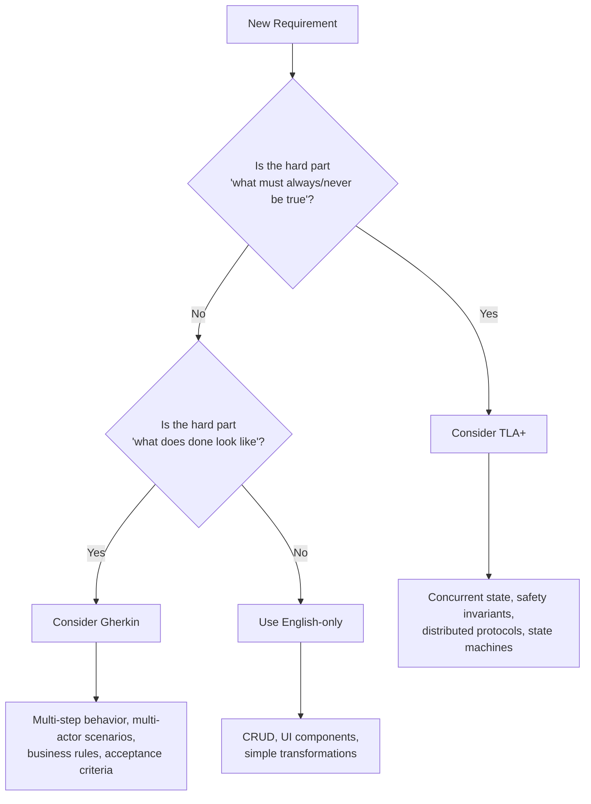

# Formal Specifications as Prompt Language

Formal specification languages — TLA+ and Gherkin — produce better AI-generated code than English alone for complex tasks. This guide covers the experiments that proved it, when to use each formalism, and how the tooling integrates into the amplihack workflow.

!!! note "Judgment call, not a rule"
English-only is the default. Formal specs earn their place when complexity warrants them. This is a design judgment — not a mandatory step.

## The Core Finding

Two independent experiments measured how prompt language affects code generation quality:

| Experiment                                                                                 | Formalism | English Baseline | Spec-Only | Improvement | Key Insight                                   |
| ------------------------------------------------------------------------------------------ | --------- | ---------------- | --------- | ----------- | --------------------------------------------- |
| [#3497](https://github.com/rysweet/amplihack-rs/issues/3497) — Distributed Retrieval Contract | TLA+      | 0.57             | **0.86**  | **+51%**    | Hybrid TLA++English _degrades_ to 0.50        |
| [#3969](https://github.com/rysweet/amplihack-rs/issues/3969) — Recipe Step Executor           | Gherkin   | 0.713            | **0.898** | **+26%**    | Hybrid Gherkin+English adds noise (widest CI) |

**Both experiments converge on the same conclusion**: spec-only prompts outperform hybrid spec+English prompts. Natural language dilutes rather than amplifies the formal signal.

## When to Use What



### Consider TLA+ when

- Concurrent components with safety invariants (mutual exclusion, ordering, liveness)
- Distributed protocols (fan-out/merge, quorum, timeout handling)
- State machines with non-obvious valid transitions
- The requirement has "must never" or "must always" constraints

### Consider Gherkin when

- Complex multi-step behavioral requirements with many edge cases
- Multi-actor scenarios with specific acceptance criteria
- Business rules with combinatorial conditions
- Stakeholder validation is needed (Gherkin is human-readable)

### Use English-only when

- CRUD endpoints, UI components, simple data transformations
- No safety invariants or complex behavioral specs exist
- The requirement is straightforward and unambiguous

## Experiment 1: TLA+ for Concurrent Systems

**Issue**: [#3497](https://github.com/rysweet/amplihack-rs/issues/3497)
**Task**: Generate a Distributed Retrieval Contract — a request-local protocol preserving question end-to-end, dispatching retrieval across agents, merging results deterministically, and surfacing shard failures explicitly.

### Methodology

- **Evaluation**: `heuristic_signal_v2` — keyword/regex scoring across 6 dimensions
- **Models**: Claude Opus 4.6, GPT-5.4
- **Prompt variants**: `english`, `tla_only`, `tla_plus_english`, `tla_plus_refinement`
- **Matrix**: 8 conditions (4 variants x 2 models), smoke run (1 repeat)
- **TLC validation**: 5,927 states explored, 2,660 distinct, 0 errors, 7 invariants hold

### Results

| Prompt Variant      | Baseline Score | Coverage Score | Notes                                                   |
| ------------------- | -------------- | -------------- | ------------------------------------------------------- |
| english             | 0.57           | 0.43           | Neither model references formal methods spontaneously   |
| **tla_only**        | **0.86**       | **0.86**       | Best across both models                                 |
| tla_plus_english    | 0.50           | 0.50           | _Worse_ than English alone — hybrid interference        |
| tla_plus_refinement | 0.71           | 0.71           | Refinement guidance helps some, but less than spec-only |

### Per-Feature Breakdown (Claude Opus 4.6)

| Feature             | english | tla_only | tla_plus_english | tla_plus_refinement |
| ------------------- | ------- | -------- | ---------------- | ------------------- |
| Baseline compliance | 0.43    | **0.86** | 0.43             | 0.86                |
| Invariant adherence | 0.50    | **0.75** | 0.50             | 0.75                |
| Proof alignment     | 0.00    | **1.00** | 1.00             | 1.00                |
| Local protocol      | 0.00    | **1.00** | 0.00             | 1.00                |
| Progress signal     | 0.00    | **1.00** | 0.00             | 1.00                |
| Spec coverage       | 0.29    | **0.86** | 0.43             | 0.86                |

Key observations:

- English-only scores 0.0 on proof alignment, local protocol, and progress signal — the model has no formal target to aim for
- The hybrid prompt (tla_plus_english) achieves proof alignment=1.0 but loses local protocol and progress signal — English guidance directs attention to the wrong priorities
- TLA+-only achieves perfect scores on 4 of 6 features

### Why Hybrid TLA++English Degrades

When both a formal spec and English description are present, the model must reconcile two representations that may subtly conflict. The model resolves ambiguity unpredictably — sometimes following the spec, sometimes the English. This produces _worse_ results than either alone.

### Caveats

- Heuristic scoring is keyword-based, not semantic
- GPT-5.4 timed out on `tla_only` and `tla_plus_refinement` conditions (infrastructure limit, not content issue)

## Experiment 2: Gherkin for Behavioral Requirements

**Issue**: [#3969](https://github.com/rysweet/amplihack-rs/issues/3969)
**Task**: Generate a Python `RecipeStepExecutor` class with 6 interacting behavioral features: conditional execution, step dependencies, retry with exponential backoff, timeout handling, output capture, and sub-recipe delegation.

### Methodology

- **Evaluation**: `agent_consensus_v1` — 3 independent LLM evaluator agents per condition
- **Models**: Claude Opus 4.6 (12/12 completed), GPT-5.4 (1/12 completed due to timeouts)
- **Prompt variants**: `english`, `gherkin_only`, `gherkin_plus_english`, `gherkin_plus_acceptance`
- **Matrix**: 24 conditions (4 variants x 2 models x 3 repeats)
- **Statistical basis**: 95% confidence intervals via t-distribution

### Agent Consensus Scoring

Unlike the TLA+ experiment's heuristic scoring, the Gherkin experiment uses _agent consensus_ — a method designed to reduce evaluator bias:

1. **Three independent evaluator agents** assess each generated implementation
2. Each agent has a distinct persona to reduce correlated errors:
   - Senior software engineer (correctness focus)
   - QA engineer (specification compliance focus)
   - Systems architect (behavioral contract focus)
3. Each agent reads the generated code against the acceptance criteria and Gherkin scenarios
4. Each votes PASS/FAIL on each of 6 behavioral features with written reasoning
5. The **consensus score per feature** = fraction of valid votes that are PASS
6. Parse-failed evaluator responses are _excluded_ (not counted as FAIL)

This method produces more reliable scores than single-evaluator or heuristic approaches because evaluator errors are independent and wash out through voting.

### Results

| Prompt Variant          | Avg Score | 95% CI       | N   |
| ----------------------- | --------- | ------------ | --- |
| **gherkin_only**        | **0.898** | **+/-0.144** | 3   |
| gherkin_plus_acceptance | 0.889     | +/-0.478     | 3   |
| gherkin_plus_english    | 0.785     | +/-0.769     | 4   |
| english                 | 0.713     | +/-0.478     | 3   |

!!! warning "Confidence intervals matter"
`gherkin_plus_english` has the widest CI (+/-0.769) — one run scored near-perfect, another scored 0.5 across all features. English adds variance, not just noise. `gherkin_only` has the _tightest_ CI (+/-0.144), meaning it's the most _reliable_ variant.

### Per-Feature Breakdown

| Feature               | english   | gherkin_only | gherkin_plus_english | gherkin_plus_acceptance |
| --------------------- | --------- | ------------ | -------------------- | ----------------------- |
| Conditional execution | 1.000     | 1.000        | 0.875                | 0.889                   |
| Dependency handling   | 0.167     | 0.778        | 0.875                | 0.889                   |
| Retry logic           | 1.000     | 0.833        | 0.625                | 0.889                   |
| **Timeout semantics** | **1.000** | **0.778**    | **0.583**            | **0.889**               |
| Output capture        | 0.222     | 1.000        | 0.875                | 0.889                   |
| Sub-recipe delegation | 0.889     | 1.000        | 0.875                | 0.889                   |

Key observations:

- **Timeout semantics is the hardest feature across all variants** — it involves a negative constraint ("timed-out steps are NOT retried") that interacts with retry logic. Models frequently miss this interaction.
- English scores perfectly on conditional execution, retry, and timeout individually, but misses dependency handling (0.167) and output capture (0.222) — it fails on _cross-feature interactions_.
- Gherkin-only achieves the best _overall_ score and the most consistent results, though it's not perfect on every individual feature.
- `gherkin_plus_acceptance` is the most _uniform_ variant (0.889 on every feature) — acceptance criteria may help balance attention across features.

### Why Gherkin Differs from TLA+

Unlike TLA+, Gherkin+English hybrids _do_ improve over English-only (0.785 > 0.713). The degradation is milder because Gherkin scenarios are written in near-English, so there's less semantic conflict between the spec and the natural language guidance. However, pure Gherkin still wins because adding English introduces variance — some runs benefit, others are thrown off.

## Workflow Integration

Formal specifications integrate into the [Default Workflow](../concepts/default-workflow.md) at two points:

### Step 05: Research and Design

The architecture design step includes this guidance:

> For components with concurrent state or multiple actors modifying shared state, express key safety invariants as formal predicates. When designing complex behavioral requirements, consider whether Gherkin scenarios or TLA+ specs would clarify the design.

At this step, the [prompt-writer](#) agent uses a **tri-path judgment** to decide the specification language:

| Path                       | When                                                | Signal                                                          |
| -------------------------- | --------------------------------------------------- | --------------------------------------------------------------- |
| **English-only** (default) | Simple CRUD, sequential logic, internal utilities   | Neither question applies                                        |
| **Gherkin**                | Complex behaviors, multi-actor, acceptance criteria | "What does done look like?" is hard to express in English       |
| **TLA+**                   | Concurrent state, safety invariants, protocols      | "What must always/never be true?" is hard to express in English |

### Step 07: TDD Write Tests First

> When the design includes Gherkin scenarios or TLA+ formal predicates, use them as the primary source for test case derivation — they define the behavioral contract more precisely than English requirements.

Gherkin scenarios map directly to test cases. TLA+ invariants map to property assertions.

## Skills and Agents

### Skills (user-invocable)

| Skill                                                      | Invocation         | Purpose                                                                              |
| ---------------------------------------------------------- | ------------------ | ------------------------------------------------------------------------------------ |
| [Gherkin Expert](#) | `/gherkin-expert`  | Write Gherkin scenarios, review existing specs, translate requirements to BDD format |
| [TLA+ Expert](#)   | `/tla-plus-expert` | Write TLA+ specs, review specs, interpret TLC output, generate invariants            |

### Agents (delegated by other agents)

| Agent                                                                    | Type        | Role                                                                              |
| ------------------------------------------------------------------------ | ----------- | --------------------------------------------------------------------------------- |
| gherkin-expert                                                           | Specialized | Writes Gherkin scenarios, applies BDD patterns, domain modeling through scenarios |
| tla-plus-expert                                                          | Specialized | Writes TLA+ specs, model checking, applies Demirbas's 7 mental models             |
| [prompt-writer](#) | Specialized | Tri-path judgment: decides when to use English, Gherkin, or TLA+                  |

## Tutorial: Gherkin Expert in Practice

Here's how the gherkin-expert skill works in a typical development flow.

### Scenario: Adding a rate limiter

You're implementing a rate limiter with sliding window, burst allowance, and per-client quotas. The behavioral requirements are complex enough that English descriptions would be ambiguous.

**Step 1**: Invoke the skill to write scenarios.

```
/gherkin-expert write rate limiter with sliding window, burst allowance, and per-client quotas
```

The gherkin-expert agent produces a `.feature` file:

```gherkin
Feature: Rate Limiter
  Sliding window rate limiting with burst allowance and per-client quotas.

  Background:
    Given the rate limiter is configured with a window of 60 seconds
    And the default quota is 100 requests per window

  Scenario: Requests within quota are allowed
    Given client "alpha" has made 50 requests in the current window
    When client "alpha" sends a request
    Then the request is allowed
    And the remaining quota for "alpha" is 49

  Scenario: Requests exceeding quota are rejected
    Given client "alpha" has made 100 requests in the current window
    When client "alpha" sends a request
    Then the request is rejected with status 429
    And the response includes a Retry-After header

  Scenario: Burst allowance permits temporary spikes
    Given client "alpha" has a burst allowance of 20
    And client "alpha" has made 100 requests in the current window
    When client "alpha" sends a request
    Then the request is allowed
    And the burst remaining for "alpha" is 19

  Scenario: Sliding window expires old requests
    Given client "alpha" made 100 requests between 0s and 30s ago
    And 31 seconds have elapsed
    When client "alpha" sends a request
    Then the request is allowed
    And the remaining quota reflects only requests within the window

  Scenario: Per-client quotas override defaults
    Given client "beta" has a custom quota of 500 requests per window
    And client "beta" has made 200 requests in the current window
    When client "beta" sends a request
    Then the request is allowed
    And the remaining quota for "beta" is 299
```

**Step 2**: Use the `.feature` file as the prompt for code generation (step 05/07 of the workflow). The builder agent receives the Gherkin scenarios as its primary specification — no English description needed.

**Step 3**: The tester agent derives test cases directly from the scenarios. Each `Scenario:` becomes one or more test functions.

### Why this works

The Gherkin scenarios are unambiguous about:

- What "within quota" means (exact numbers)
- How burst allowance interacts with the base quota
- What the sliding window expiry behavior is
- That per-client quotas _override_ (not supplement) defaults

An English description of the same requirements would likely leave at least one of these interactions ambiguous.

## Tutorial: TLA+ Expert in Practice

Here's how the tla-plus-expert skill works, using the actual hive mind distributed retrieval system as the example.

### Scenario: Distributed retrieval with shard failures

You're building a system where a question is dispatched to multiple retrieval agents (shards), results are merged, and the response must handle partial failures. The hard part isn't any single component — it's the interactions: What happens when some shards fail? Can the system complete with partial results? Is the merge deterministic regardless of response order?

These are exactly the questions that English descriptions fumble but TLA+ makes precise.

**Step 1**: Invoke the skill to write the spec.

```
/tla-plus-expert write a TLA+ spec for distributed retrieval: a question is dispatched to N agents,
each returns facts or fails, results are merged deterministically, partial failures are allowed,
total failure (no responses) is a distinct state
```

The tla-plus-expert agent produces a `.tla` specification. Here's the actual spec from the hive mind experiment (simplified for clarity):

```tla
---- MODULE DistributedRetrievalBestEffort ----
EXTENDS FiniteSets, Naturals, Sequences

CONSTANTS Agents, Questions, Facts, NullQuestion

VARIABLES
    activeAgents, originalQuestion, normalizedQuery,
    shardResults, respondedAgents, failedAgents,
    mergedResult, phase

\* Phase transitions: idle -> dispatch -> complete | failed -> idle
Init ==
    /\ activeAgents \in SUBSET Agents
    /\ activeAgents # {}
    /\ phase = "idle"

StartRequest(q, nq) ==
    /\ phase = "idle"
    /\ q \in Questions
    /\ phase' = "dispatch"

RecordShardSuccess(a, facts) ==
    /\ phase = "dispatch"
    /\ a \in activeAgents
    /\ a \notin respondedAgents        \* Each agent responds at most once
    /\ shardResults' = [shardResults EXCEPT ![a] = facts]
    /\ respondedAgents' = respondedAgents \cup {a}

RecordShardFailure(a) ==
    /\ phase = "dispatch"
    /\ a \in activeAgents
    /\ a \notin respondedAgents
    /\ failedAgents' = failedAgents \cup {a}
    /\ shardResults' = [shardResults EXCEPT ![a] = {}]  \* Failed = empty

\* Best-effort completion: allowed even with failures
CompleteRequest ==
    /\ phase = "dispatch"
    /\ activeAgents \subseteq (respondedAgents \cup failedAgents)
    /\ mergedResult' = CanonicalMerge       \* Deterministic merge
    /\ phase' = "complete"

\* Total failure: nobody responded at all
FailRequest ==
    /\ phase = "dispatch"
    /\ respondedAgents = {}
    /\ failedAgents = activeAgents
    /\ phase' = "failed"
```

**Step 2**: Define the invariants — the properties that must always hold.

This is where TLA+ earns its keep. These invariants are what English descriptions consistently miss:

```tla
\* The original question is never lost mid-request
OriginalQuestionPreserved ==
    phase \in {"dispatch", "complete", "failed"} =>
      originalQuestion # NullQuestion

\* Merged results come ONLY from actual responses, not garbage
MergedFactsComeFromResponses ==
    phase = "complete" =>
      SeqToSet(mergedResult) = UNION {shardResults[a] : a \in respondedAgents}

\* Same inputs produce same merge regardless of response order
DeterministicMerge ==
    phase = "complete" =>
      mergedResult = CanonicalizeSet(RespondedFactsSet)

\* Failed shards contribute nothing (not random data)
FailedShardsContributeNothing ==
    \A a \in failedAgents : shardResults[a] = {}

\* Total failure ONLY when nobody responded
FailOnlyWhenNoResponses ==
    phase = "failed" => respondedAgents = {}
```

**Step 3**: Model-check with TLC to verify the spec is consistent.

```bash
/tla-plus-expert verify DistributedRetrievalBestEffort.tla with 2 agents, 1 question, 2 facts
```

TLC explores all possible interleavings: agent A succeeds then B fails, B fails then A succeeds, both succeed, both fail, timeouts, etc. The actual experiment explored **5,927 states** with **0 invariant violations** across 7 invariants.

**Step 4**: Use the spec as the prompt for code generation.

Pass the `.tla` file to the builder agent as the primary specification — no English description needed. The experiment showed this produces code that scores 0.86 on contract compliance, vs 0.57 with English-only.

### Why this works

The TLA+ spec makes five things explicit that English consistently misses:

1. **"Each agent responds at most once"** — the `a \notin respondedAgents` guard. English descriptions rarely state this constraint explicitly, leading to code that doesn't deduplicate.

2. **"Failed shards contribute empty, not garbage"** — `shardResults' = [shardResults EXCEPT ![a] = {}]`. English says "handle failures" but doesn't specify what the failure contribution looks like in the data structure.

3. **"Merge is deterministic"** — `CanonicalizeSet` produces the same sequence regardless of response order. English says "merge results" but doesn't address ordering.

4. **"Total failure is distinct from partial success"** — separate `FailRequest` and `CompleteRequest` actions with different phase transitions. English descriptions often conflate these.

5. **"Completion requires all agents accounted for"** — `activeAgents \subseteq (respondedAgents \cup failedAgents)`. Without this, the system could "complete" while agents are still in flight.

An English prompt describing the same system produced code that scored 0.57 — it consistently missed the deterministic merge invariant and the distinction between total failure and partial success.

### When TLC catches bugs you wouldn't

The real power of TLA+ isn't just as a prompt language — it's that TLC can verify your spec before you generate code. In the hive mind spec, TLC verified that no interleaving of agent responses can violate the merge determinism invariant. No amount of English description review would give you that confidence.

## Reference

### External resources

- **[TLA+ Home Page](https://lamport.azurewebsites.net/tla/tla.html)** — Leslie Lamport's TLA+ resource site with learning materials, tools, and the TLA+ book
- **[TLA+ Tools (TLC, TLAPS, PlusCal)](https://github.com/tlaplus/tlaplus)** — open-source model checker, proof system, and algorithm language
- **[Learn TLA+](https://learntla.com/)** — interactive tutorial for getting started with TLA+ specifications
- **[Cucumber / Gherkin Documentation](https://cucumber.io/docs/gherkin/)** — official Gherkin language reference (Given/When/Then syntax)
- **[BDD Introduction (Cucumber)](https://cucumber.io/docs/bdd/)** — Behavior-Driven Development concepts and practices
- **[Gherkin Reference](https://cucumber.io/docs/gherkin/reference/)** — complete keyword reference for .feature files

### Project resources

- **PATTERNS.md**: The [Formal Specification as Prompt](../concepts/patterns.md) pattern contains the summary evidence table and domain guidance.
- **TLA+ experiment data**: `experiments/hive_mind/tla_prompt_language/`
- **Gherkin experiment data**: `experiments/hive_mind/gherkin_v2_recipe_executor/`
- **Evaluation code**: `src/amplihack/eval/gherkin_agent_evaluator.py` (agent consensus), `src/amplihack/eval/gherkin_prompt_experiment.py` (experiment runner)

### Research

- [Demirbas, M. "Using TLA+ as a Design Accelerator"](https://muratbuffalo.blogspot.com/2024/03/using-tla-as-design-accelerator.html) — 8 industry case studies (AWS, MongoDB, Azure)
- [SysMoBench: LLM Evaluation for Formal System Modeling](https://arxiv.org/abs/2503.03204) — LLMs violate 41.9% of liveness properties vs 8.3% of safety properties; always validate with TLC
- [Use of Formal Methods at Amazon Web Services](https://lamport.azurewebsites.net/tla/formal-methods-amazon.pdf) — how TLA+ is used in production at AWS (DynamoDB, S3, EBS)

## Potential Follow-ups

### Increase statistical power

The current Gherkin experiment uses N=3 repeats per condition. Confidence intervals overlap across all variants, meaning we can't statistically distinguish them. Running N=10 would tighten the CIs enough to determine whether `gherkin_only` is genuinely better than `english` or whether we're observing noise. The infrastructure supports this — change `full_repeats` in `manifest.json` and re-run.

### Investigate why hybrid prompts degrade

Both experiments show that adding English to a formal spec makes results worse. This is counterintuitive. Is it because the model tries to reconcile conflicting representations? Does the degradation depend on whether the English _paraphrases_ or _supplements_ the spec? A targeted experiment varying the relationship between the English and spec content could turn this from an observation into an actionable design principle for prompt engineering.

### Execute generated code against the reference test suite

Agent consensus scoring is better than regex, but the ground truth is: does the generated code actually work? The Gherkin experiment includes `reference/test_recipe_step_executor.py` with 34 passing tests. Running each generated artifact against those tests would give real pass/fail per feature — not LLM opinion. This would also calibrate whether the evaluator agents are accurate (do they agree with the tests?).

### Broader model coverage

GPT-5.4 timed out on every condition due to copilot SDK infrastructure issues. Fixing that would give cross-model data. The TLA+ experiment showed both Claude and GPT converge to 0.86 with formal specs — a stronger finding than single-model results. Testing with Sonnet (faster, cheaper) would show whether the spec-vs-english gap holds across capability levels.

### Automate the spec-to-test pipeline

`trace_to_test.py` exists for converting TLA+ model-checker traces into pytest cases, but isn't integrated into the default workflow. For Gherkin, the scenario-to-test mapping is still manual. Automating both paths — TLC traces become pytest cases, Gherkin scenarios become pytest cases — would make formal specs directly executable rather than just prompt engineering artifacts. This closes the loop: spec drives code generation _and_ test generation from the same source of truth.

### Measure evaluator inter-rater reliability

The 3 evaluator agents sometimes disagree (split votes). We don't yet know if these disagreements are random noise or systematic. Measuring inter-rater reliability (Cohen's kappa or Fleiss' kappa across agents) and calibrating against human judgment on a small sample would tell us how much to trust the consensus scores — and whether 3 agents is enough or we need 5.

### Instrument the workflow feedback loop

The prompt-writer, architect, and tester agents now have formal spec awareness, but we don't know if they actually use it or if it improves outcomes in real development tasks. Instrumenting the prompt-writer to log when it recommends TLA+ vs Gherkin vs English, and tracking whether downstream code quality improves on those tasks, would measure the production value of these experiments — not just the lab results.
