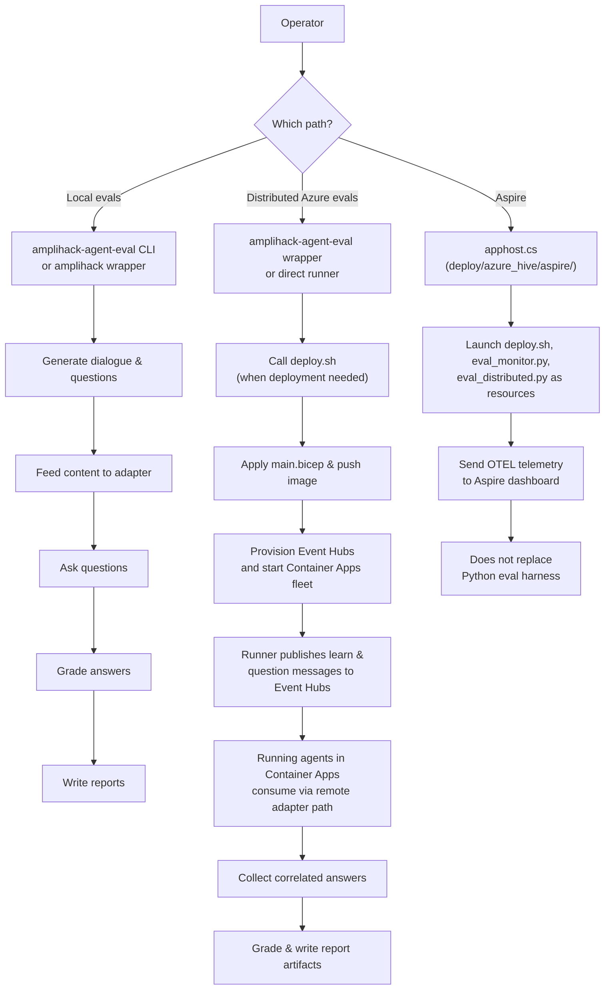

# How The Eval Stack Fits Together

This page explains the eval system in plain English.

Use it when you understand the command names already but need to know which repo owns which part, how the Azure path works, and where Aspire fits.

## The Short Version

`amplihack-agent-eval` owns the eval harness, datasets, grading, and report packaging.

`amplihack` owns the agent runtime, the Azure deployment assets, the remote adapter wiring, and the Aspire AppHost that orchestrates the scripts locally.

Azure Event Hubs carries the distributed learn and question traffic. Azure Container Apps runs the agent fleet. Aspire is an optional local dashboard and orchestration shell around the existing Python and bash entrypoints.

## The Five-Minute Walkthrough

If you need to explain the stack quickly to another engineer, use this mental model:

1. For local runtime changes, start in `amplihack` and run the thin wrappers in `src/amplihack/eval/`. Those wrappers are convenience shims over `amplihack_eval`, not a second eval framework.
2. For authoritative local eval runs, switch to `amplihack-agent-eval` and use `amplihack-eval run` or `amplihack-eval compare`. That repo owns question generation, grading, and packaged reports.
3. For distributed Azure evals, the eval repo still owns the run shape and final report, but it calls the Azure deployment assets from `amplihack`. Event Hubs carries the traffic, and the agents themselves run in Azure Container Apps.
4. For Aspire, stay in `amplihack` and run the AppHost in `deploy/azure_hive/aspire/`. Aspire is the local orchestration shell around the existing deploy, monitor, and eval scripts. It is not a replacement for the Python eval harness.

## Plain-English Component Diagram

## Who Owns What

| Surface                          | Owning repo            | Why it lives there                                                           |
| -------------------------------- | ---------------------- | ---------------------------------------------------------------------------- |
| agent runtime behavior           | `amplihack`            | That is the production runtime under test                                    |
| Azure deployment shape           | `amplihack`            | The main repo owns `deploy/azure_hive/` and `main.bicep`                     |
| thin local wrappers              | `amplihack`            | They let runtime changes call into the eval package without leaving the repo |
| datasets and question generation | `amplihack-agent-eval` | These are eval-framework concerns, not runtime concerns                      |
| grading and report packaging     | `amplihack-agent-eval` | The eval repo is the authoritative harness and reporting layer               |
| distributed Azure runner         | `amplihack-agent-eval` | It owns the top-level Event Hubs distributed eval module                     |
| Aspire AppHost                   | `amplihack`            | It orchestrates the main repo's deploy and monitoring scripts                |

## Why There Are Two Repos

The split keeps the runtime and the eval framework from turning into one inseparable package.

That separation lets you:

- change the agent runtime without rewriting the eval framework
- change datasets, grading, and report packaging without modifying the runtime repo
- reuse `amplihack-agent-eval` against adapters other than the main repo's learning agent

The cost is that some flows need both repos checked out at the same time, especially the thin wrappers and the distributed Azure runner.

## How A Local Eval Run Works

For a local wrapper run such as `python -m amplihack.eval.long_horizon_memory`:

1. you run a thin wrapper from `amplihack`
2. that wrapper imports data types and runner logic from `amplihack_eval`
3. the adapter talks to the local agent runtime
4. the eval harness generates dialogue and questions
5. the grader scores answers and writes the report

The important detail is that the local wrapper is not a second eval framework. It is a convenience layer over the standalone eval package.

## How The Authoritative Local CLI Fits

For `amplihack-eval run` or `amplihack-eval compare`:

1. you run the CLI in `amplihack-agent-eval`
2. the eval repo chooses the dataset, question slice, seed, and output location
3. the adapter talks to the runtime under test
4. grading and packaged report output stay in `amplihack-agent-eval`

That is why the thin wrappers in `amplihack` are useful for runtime iteration, while the eval repo remains the source of truth for the full local CLI surface.

## How A Distributed Azure Run Works

For `./run_distributed_eval.sh` or `python -m amplihack_eval.azure.eval_distributed`:

1. the eval repo decides the run shape: turns, questions, question set, retries, and output location
2. if deployment is needed, it calls `amplihack/deploy/azure_hive/deploy.sh`
3. `deploy.sh` applies `main.bicep`, which creates Event Hubs, Container Apps, Log Analytics, and the rest of the Azure fleet
4. the distributed runner publishes learn and question events into Event Hubs
5. agents in Container Apps consume those events, process them, and publish answers back to the response hub
6. the runner correlates answers by event ID, then grades and packages the final report

The eval harness and the report stay centralized in `amplihack-agent-eval`. The runtime and fleet deployment stay centralized in `amplihack`.

## Where Event Hubs Fits

Event Hubs is the transport layer for the distributed path.

The main Bicep template defines three hubs:

- `hive-events-<hive-name>` for learning and question input
- `hive-shards-<hive-name>` for cross-shard retrieval traffic
- `eval-responses-<hive-name>` for agent answers and eval progress events

That means the distributed runner does not talk to the agents directly. It talks to Event Hubs, and the fleet consumes and publishes through those hubs.

## Where Container Apps Fits

Container Apps is the execution layer for the distributed path.

The deploy script builds or pushes the agent image, and the Bicep template creates the container apps that run the fleet. Each app can host more than one agent depending on `agentsPerApp`.

So if the question is "where do the agents actually run," the answer is "inside Azure Container Apps, using the image built from the main repo."

## Where Aspire Fits

Aspire is optional and local to the operator workstation.

The AppHost in `deploy/azure_hive/aspire/apphost.cs` does three things:

- starts the existing deploy and eval scripts as named resources
- wires them into the Aspire dashboard and OTEL output
- gives you one place to toggle monitor, retrieval-smoke, long-horizon, and security flows with environment variables

Aspire does not replace:

- the eval dataset generator
- the grader
- the distributed runner
- the Azure deployment script

It orchestrates those pieces. That is why the AppHost is small and the heavy logic still lives in Python and bash.

## Why The Aspire AppHost Is In C&#35;

The AppHost is in C# because Aspire's application model is a .NET host built around the `DistributedApplication` builder API.

That does not mean the eval stack became a C# system. The deploy script, monitor, and eval runners are still the existing Python and bash entrypoints. The C# layer is only the orchestration shell that names those resources, wires environment variables, and publishes OTEL telemetry into the Aspire dashboard.

## How Secrets Reach The Distributed Runner

The Event Hubs connection string should move through environment variables, not command-line arguments.

The direct compatibility wrappers in `deploy/azure_hive/` read `EH_CONN`, `AMPLIHACK_EH_INPUT_HUB`, and `AMPLIHACK_EH_RESPONSE_HUB` from the environment, then reconstruct the effective upstream argument list inside the Python process only when the operator did not already provide explicit flags. The Aspire AppHost follows the same pattern for its local monitor and eval executable resources, where it sets `EH_CONN` as an environment variable instead of putting the connection string on the shell command line.

That is why the docs prefer `read -rsp ... EH_CONN` plus `export EH_CONN` over typing `--connection-string ...` in the command you launch. It keeps the secret out of the operator-visible exec-time command line and normal process-list output, even though the compatibility wrapper still rebuilds the effective arguments internally before delegating to the upstream Python entrypoint.

## What To Change When Something Breaks

| If the problem is in...                     | Start in...                                                                                                                                |
| ------------------------------------------- | ------------------------------------------------------------------------------------------------------------------------------------------ |
| question generation, grading, report output | `amplihack-agent-eval`                                                                                                                     |
| local thin wrapper behavior                 | `src/amplihack/eval/` in `amplihack`                                                                                                       |
| Azure deployment topology                   | `deploy/azure_hive/` in `amplihack`                                                                                                        |
| agent runtime behavior                      | `src/amplihack/agents/` in `amplihack`                                                                                                     |
| distributed answer transport or correlation | `deploy/azure_hive/remote_agent_adapter.py` and `agent_entrypoint.py` in `amplihack` plus the distributed runner in `amplihack-agent-eval` |
| Aspire dashboard orchestration              | `deploy/azure_hive/aspire/apphost.cs` in `amplihack`                                                                                       |

## Related Docs

- [Day-zero operator guide](./EVAL_OPERATOR_GUIDE.md)
