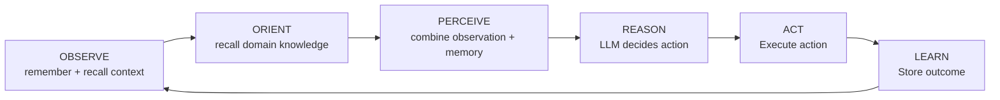
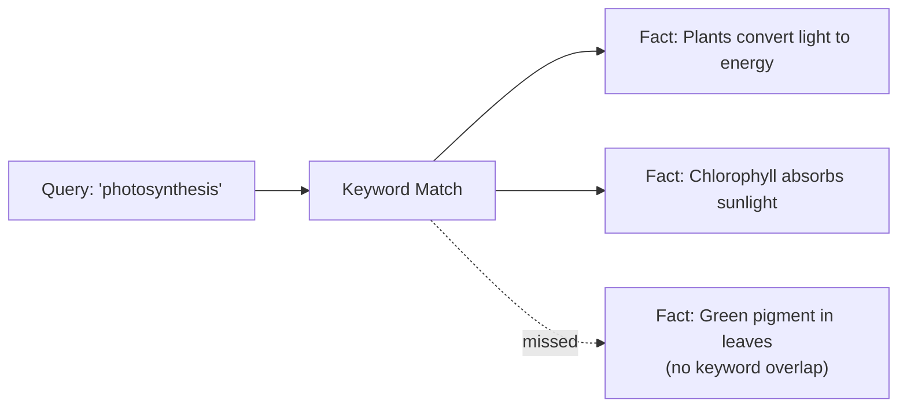
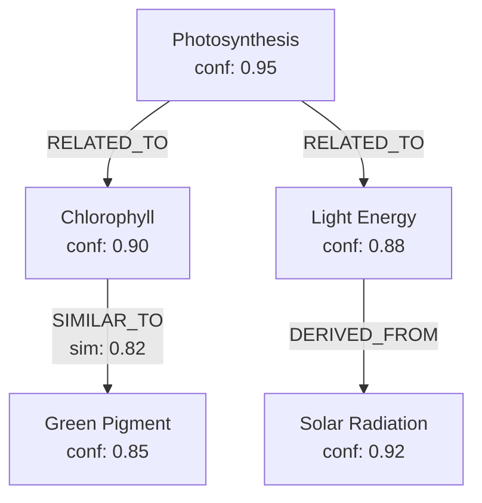
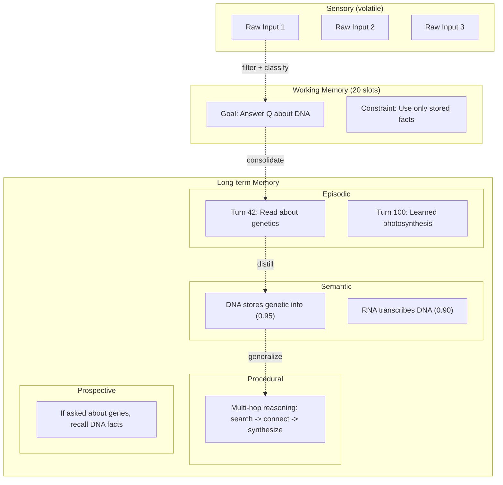
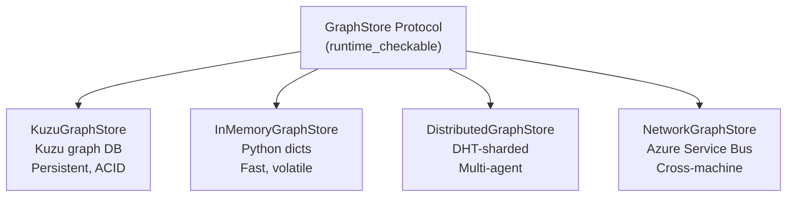
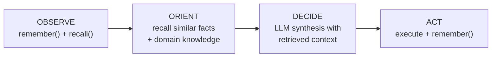
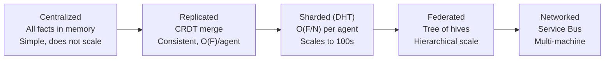
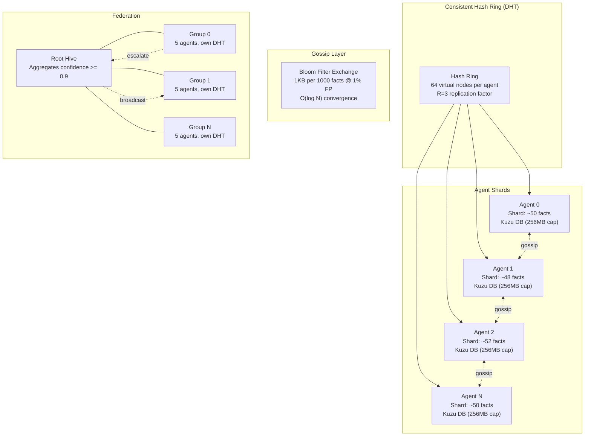
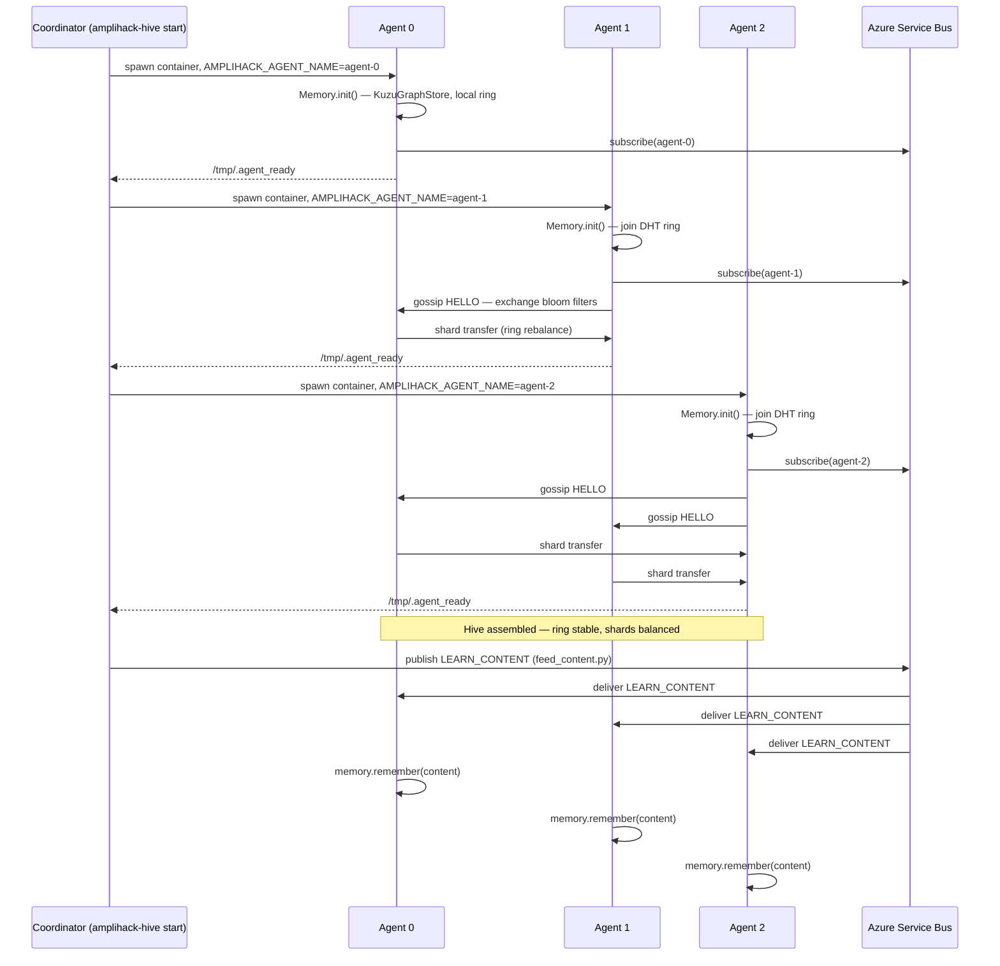
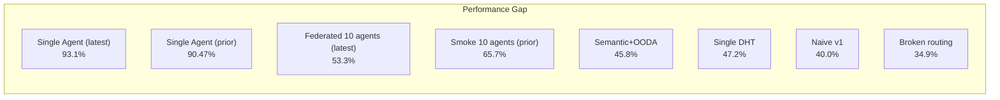

# Distributed Hive Mind: Multi-Agent Memory Architecture

---

## Slide 1: Title Slide

### Distributed Hive Mind

#### Shared Memory for Multi-Agent Systems

**Amplihack Agent Framework**
Model: claude-sonnet-4-5-20250929

---

**Speaker Notes:**
Welcome. This presentation covers the distributed hive mind architecture -- a system for sharing memory across multiple AI agents. We will walk through the memory model from first principles: what a goal-seeking agent is, why it needs memory, how memory is structured, how agents share it, and what our evaluation results look like. All data points are from our 5000-turn evaluation suite running on Claude Sonnet 4.5.

---

## Slide 2: What is a Goal-Seeking Agent?

### What is a Goal-Seeking Agent?

- An autonomous agent that pursues objectives through iterative reasoning
- Follows the **OBSERVE -> ORIENT -> PERCEIVE -> REASON -> ACT -> LEARN** loop, driven by `run_iteration()`
- Uses LLM-powered reasoning to plan, execute actions, and synthesize answers
- Handles question complexity levels: L1 (Recall) through L12+ (Multi-hop synthesis)
- Actions include: read content, search memory, synthesize answers, calculate, code generation

_Source: `src/amplihack/agents/goal_seeking/agentic_loop.py` — methods: `observe`, `orient`, `perceive`, `reason`, `act`, `learn`, `run_iteration`_

---

**Speaker Notes:**
A goal-seeking agent is not just an LLM call. It is an autonomous loop. The agent perceives its environment (a question, a document, context from memory), reasons about what to do next using an LLM, takes an action (search memory, read content, synthesize an answer), and then learns from the result by storing facts back into memory. This loop can iterate multiple times per task. The agent handles 12 complexity levels in our eval suite -- from simple recall (L1) to multi-hop reasoning across many facts (L12). The key insight is that the agent's intelligence is bounded by what it can remember between turns.

---

## Slide 3: Why Does it Need Memory?

### Why Does it Need Memory?

- **LLM context windows are finite** -- cannot hold 5000 turns of learning
- **Knowledge must persist** across sessions and tasks
- **Facts learned early** must be retrievable for questions asked later
- **Multi-step reasoning** requires connecting facts from different sources
- Without memory: agent forgets everything between turns, performance collapses

**The core loop with memory:**

1. **Learn**: Read content, extract facts, store in memory
2. **Answer**: Retrieve relevant facts from memory, synthesize with LLM

**Key constraint:** Memory quality directly determines answer quality

- Bad storage = facts never found
- Bad retrieval = wrong facts surface
- No memory = random guessing

---

**Speaker Notes:**
The reason memory is critical is simple: context windows are finite. Our eval has 5000 turns -- an agent first learns from content across thousands of turns, then is asked questions about that content. Without persistent memory, the agent would need to fit everything into a single context window, which is impossible at this scale. Memory is the bottleneck. If you store facts poorly, you cannot retrieve them. If your retrieval is imprecise, you get the wrong facts. And if the wrong facts go to the LLM, you get wrong answers. This is why we invested heavily in the memory architecture.

---

## Slide 4: Simple Memory + Semantic Search

### Simple Memory + Semantic Search

- **Simplest approach:** Store facts as text, retrieve by keyword match
- `ExperienceStore` with Kuzu backend -- stores experiences with context, outcome, confidence, tags
- Search: keyword matching against stored text fields
- Limitations:
  - Keyword search misses semantic equivalence ("car" vs "automobile")
  - No relationship tracking between facts
  - Flat structure -- no hierarchy or categorization

- **MemoryRetriever** class: `search(query, limit, min_confidence)`
- Returns: experience_id, context, outcome, confidence, timestamp, tags

---

**Speaker Notes:**
The simplest memory approach is a flat store with keyword search. Our MemoryRetriever wraps an ExperienceStore backed by Kuzu (a graph database). You store a fact with context, an outcome string, a confidence score, and tags. You retrieve by text search. This works for simple cases but breaks down quickly. Keyword search cannot find "green pigment in leaves" when you search for "photosynthesis" -- there is no keyword overlap. This is where we need richer representations.

---

## Slide 5: Graph Memory

### Graph Memory

- **Knowledge as a graph**: Facts are nodes, relationships are edges
- `HierarchicalMemory` backed by Kuzu graph database
- **Node types:** KnowledgeNode with content, category, confidence, embedding
- **Edge types:** RELATED_TO, DERIVED_FROM, SIMILAR_TO (with similarity scores)
- **Subgraph retrieval:** `to_llm_context()` serializes a connected subgraph for the LLM

- **Advantage over flat search:** Retrieving "photosynthesis" also pulls in connected facts about chlorophyll, light energy, and solar radiation via graph traversal
- **Similarity edges:** Automatically created when embedding cosine similarity exceeds threshold

---

**Speaker Notes:**
Graph memory addresses the keyword gap. Instead of isolated text entries, facts become nodes in a graph with typed edges: RELATED_TO connects topically related facts, SIMILAR_TO links semantically close facts using embedding cosine similarity, and DERIVED_FROM tracks provenance. When you retrieve "photosynthesis," graph traversal automatically pulls in connected facts about chlorophyll and light energy that keyword search would miss. The subgraph gets serialized into a format the LLM can consume. This is a significant improvement but still treats all facts the same way.

---

## Slide 6: Cognitive Psychology Memory Model (6 Types)

### Cognitive Psychology Memory Model (6 Types)

Modeled after human cognition -- different memory types for different purposes:

| Type            | Purpose                   | Properties                          | Example                        |
| --------------- | ------------------------- | ----------------------------------- | ------------------------------ |
| **Sensory**     | Raw input buffering       | TTL-based auto-expiry               | "User said: check the logs"    |
| **Working**     | Active task state         | 20-slot bounded capacity            | Current goal, constraints      |
| **Episodic**    | Autobiographical events   | Consolidatable, temporal index      | "Learned about DNA at turn 42" |
| **Semantic**    | Distilled facts/knowledge | Confidence scores, similarity edges | "DNA stores genetic info"      |
| **Procedural**  | Step-by-step procedures   | Usage count, prerequisites          | "To deploy: build, test, push" |
| **Prospective** | Future intentions         | Trigger conditions, status          | "When asked about X, recall Y" |

- Implemented in `CognitiveMemory` (amplihack-memory-lib)
- `CognitiveAdapter` provides backward-compatible interface
- Each type stored as distinct node type in Kuzu graph

---

**Speaker Notes:**
The 6-type cognitive memory model is inspired by human cognitive psychology. Sensory memory holds raw observations briefly -- like a buffer with auto-expiry. Working memory has bounded capacity (20 slots) for active task context -- your current goal, constraints, intermediate results. Episodic memory records events chronologically and can be consolidated (compressed) over time. Semantic memory stores distilled facts with confidence scores -- this is the primary store for learned knowledge. Procedural memory captures reusable step sequences. Prospective memory holds future-oriented trigger-action pairs: "when X happens, do Y." Each type maps to a distinct node type in the Kuzu graph database, with different retention and retrieval strategies.

---

## Slide 7: Hierarchical Memory Model

### Hierarchical Memory Model

- **Flow:** Sensory -> Working -> Episodic -> Semantic -> Procedural
- **Consolidation:** Episodic memories compress into semantic facts over time
- **Working memory cleanup:** Auto-cleared on task completion

---

**Speaker Notes:**
The hierarchical model shows how information flows through the memory system. Raw input enters sensory memory, gets filtered and classified into working memory slots for the active task. After the task completes, episodic memories get consolidated -- multiple related episodes compress into distilled semantic facts. Over time, repeated patterns in semantic memory generalize into procedural knowledge. Prospective memory sits alongside, monitoring for trigger conditions. This hierarchy means the agent naturally focuses on recent, relevant information (working memory) while retaining distilled knowledge long-term (semantic + procedural). The working memory auto-cleanup prevents stale task context from polluting future reasoning.

---

## Slide 8: Other Models (Comparison)

### Memory Model Comparison

| Model                           | Pros                                            | Cons                                           | Best For                |
| ------------------------------- | ----------------------------------------------- | ---------------------------------------------- | ----------------------- |
| **Flat key-value**              | Simple, fast                                    | No relationships, keyword-only                 | Prototypes, < 100 facts |
| **Vector DB** (embeddings only) | Semantic search                                 | No structure, no reasoning about relationships | Similarity search       |
| **Knowledge graph**             | Rich relationships, traversal                   | Complex queries, schema overhead               | Structured domains      |
| **Cognitive 6-type** (ours)     | Psychologically grounded, multi-level retention | More complex storage/retrieval                 | Long-horizon agents     |
| **RAG (retrieve + generate)**   | Simple pipeline                                 | No persistent learning, stateless              | One-shot Q&A            |

**Our approach combines:**

- Graph storage (Kuzu) for relationships
- Embeddings for semantic similarity
- Cognitive types for appropriate retention policies
- Hierarchical retrieval with subgraph context

**Configuration precedence:** kwargs > env vars > YAML > defaults

---

**Speaker Notes:**
Here is how our approach compares to alternatives. Flat key-value stores are simple but miss relationships. Pure vector databases give you semantic search but no structure. Knowledge graphs provide rich relationships but require complex queries. Standard RAG is stateless -- it retrieves and generates but does not learn persistently. Our cognitive 6-type model combines the benefits: graph storage for relationships, embeddings for semantic similarity, and psychologically-grounded memory types for appropriate retention. Configuration follows a clean precedence: explicit kwargs override environment variables, which override YAML config, which overrides defaults.

---

## Slide 9: Storage of Memories (GraphStore Protocol)

### Storage of Memories (GraphStore Protocol)

**Protocol-driven design** -- four implementations, one interface:

| Implementation          | Use Case                  | Persistence              | Scale                        |
| ----------------------- | ------------------------- | ------------------------ | ---------------------------- |
| `KuzuGraphStore`        | Single agent, persistent  | Disk (Kuzu DB)           | 1 agent                      |
| `InMemoryGraphStore`    | Testing, ephemeral        | RAM only                 | 1 process                    |
| `DistributedGraphStore` | Multi-agent, same process | RAM (sharded)            | 100s of agents               |
| `NetworkGraphStore`     | Multi-machine, production | Azure Service Bus + Kuzu | 100s of agents, multi-region |

**Protocol methods:** `ensure_table()`, `create_node()`, `query_nodes()`, `create_relationship()`, `query_relationships()`

**Schema per memory type:** Each of the 6 cognitive types has a dedicated schema (e.g., `SEMANTIC_SCHEMA`, `EPISODIC_SCHEMA`, `PROCEDURAL_SCHEMA`, `WORKING_SCHEMA`)

---

**Speaker Notes:**
The GraphStore protocol is the storage abstraction. It is a runtime-checkable Python Protocol with four implementations. KuzuGraphStore provides persistent, ACID-compliant storage for single agents using the Kuzu graph database. InMemoryGraphStore uses Python dicts for fast testing. DistributedGraphStore shards data across agents using a consistent hash ring -- this is the core of the hive mind. NetworkGraphStore extends distribution across machines using Azure Service Bus for event transport. All four implement the same protocol, so you can swap backends without changing agent code. Each cognitive memory type has its own schema definition.

---

## Slide 10: Recall / Retrieval

### Recall / Retrieval

**OODA Loop integration -- memory at every phase:**

**Retrieval pipeline:**

1. **Intent detection** -- classify question type (L1-L12) using LLM
2. **Query expansion** -- synonyms and related terms (optional)
3. **Multi-source search:**
   - Local memory (CognitiveAdapter.search)
   - Hive memory (HiveIntegrationMixin.\_search_hive)
   - Federated query (query_federated traverses the hive tree)
4. **Reranking** -- hybrid scoring: `semantic_similarity * 0.5 + confirmation_count * 0.3 + source_trust * 0.2`
5. **RRF merge** -- Reciprocal Rank Fusion combines keyword and confidence rankings
6. **Confidence gate** -- discard results below threshold
7. **Deduplication** -- content-hash dedup across local and hive results
8. **Context serialization** -- `to_llm_context()` formats subgraph for LLM

---

**Speaker Notes:**
Retrieval integrates with the OODA loop at every phase. Observe uses remember and recall. Orient pulls similar facts and domain knowledge. Decide feeds retrieved context to the LLM for synthesis. Act stores the result back. The pipeline itself is multi-stage: first detect the question intent and complexity level. Then optionally expand the query with synonyms. Then search both local memory and the shared hive. Results get reranked using hybrid scoring -- 50% semantic similarity, 30% confirmation count (how many agents confirmed the fact), and 20% source trust. RRF merge combines different ranking signals. A confidence gate discards low-quality results. Deduplication prevents the same fact from appearing twice. Finally, the relevant subgraph is serialized for the LLM.

---

## Slide 11: Single-Agent Memory (90.47% Results)

### Single-Agent Memory -- Baseline Performance

**Eval: 5000-turn long-horizon memory evaluation (15 categories, seed 42)**

| Metric             | Value                                                   |
| ------------------ | ------------------------------------------------------- |
| **Score**          | **90.47%**                                              |
| **Dataset**        | `5000t-seed42-v1.0` (2026-02-24)                        |
| **Memory backend** | LearningAgent (CognitiveMemory + KuzuGraphStore)        |
| **Turns**          | 5000 — 762 facts extracted across 12 information blocks |
| **Questions**      | 100 across 15 categories (L1 recall → temporal trap)    |
| **Memory stats**   | 10,854 semantic + 5,000 episodic = 15,854 total nodes   |

- Single agent learns from content, then answers questions
- Memory stores facts across 6 cognitive types (sensory, working, episodic, semantic, procedural, prospective)
- Hybrid retrieval: vector similarity (BAAI/bge-base-en-v1.5) + keyword fallback
- **This is the ceiling** -- a single agent with all facts locally

**Category highlights (median-of-3 grading):**

| Category                 | Score           |
| ------------------------ | --------------- |
| cross_reference          | 100%            |
| distractor_resistance    | 100%            |
| infrastructure_knowledge | 100%            |
| needle_in_haystack       | 100%            |
| adversarial_distractor   | 89.6%           |
| temporal_evolution       | 89.7%           |
| temporal_trap            | 53.3% ← hardest |

**Why 90.47% and not 100%?**

- `temporal_trap` (53.3%) — contradictory time-ordered facts with misleading cues
- `incident_tracking` (83.8%) — multi-step incident timelines across many turns
- Retrieval occasionally misses the right fact combination for L10-L12 questions

---

**Speaker Notes:**
Our baseline: a single agent scores 90.47% on the 5000-turn eval (dataset 5000t-seed42-v1.0, February 2026). This is the gold standard. One LearningAgent with CognitiveMemory backed by KuzuGraphStore, 762 extracted facts, 15,854 memory nodes. The grader uses median-of-3 voting to reduce LLM noise. The 9.53% gap is dominated by `temporal_trap` questions (53.3%) -- deliberately misleading time-ordered facts. This 90.47% is our target ceiling for the distributed case: can multiple agents sharing knowledge approach this number?

---

## Slide 12: Shared Memory -- Motivations

### Shared Memory -- Motivations

**Why distribute memory across agents?**

1. **Specialization** -- agents can focus on domains (biology, history, math) while sharing knowledge
2. **Parallelism** -- 10 agents learn 10x faster than 1 agent
   - Single agent: **21.6 hours** for 5000 turns
   - 10 parallel workers: **2.4 hours** (9x speedup)
3. **Scale** -- some tasks exceed single-agent memory capacity
4. **Resilience** -- facts replicated across agents survive individual failures
5. **Collective intelligence** -- agents can confirm, contradict, or refine each other's facts

**The challenge:**

- How to partition knowledge without losing retrieval quality?
- How to query across agents without O(N) scan?
- How to handle contradictions between agents?
- How to avoid memory explosion with 100+ agents?

---

**Speaker Notes:**
The motivation for shared memory is fourfold. First, specialization: different agents can focus on different domains while sharing knowledge through the hive. Second, parallelism: with 10 parallel workers, we reduce learning time from 21.6 hours to 2.4 hours -- a 9x speedup. Third, scale: some knowledge bases exceed what a single agent can hold. Fourth, resilience: with replication, facts survive individual agent failures. But distribution introduces hard problems. How do you partition knowledge so the right facts are findable? How do you query without scanning every agent? How do you handle the same fact learned differently by two agents? And practically, how do you avoid crashing when 100 agents each try to open a Kuzu database that defaults to 80% of system RAM?

---

## Slide 13: Shared Memory Approaches

### Shared Memory Approaches

| Approach                            | Mechanism                                          | Trade-offs                                      |
| ----------------------------------- | -------------------------------------------------- | ----------------------------------------------- |
| **Centralized** (InMemoryHiveGraph) | All facts in one dict, all agents read/write       | Simple but O(F) memory, single point of failure |
| **Replicated** (CRDT + Gossip)      | Every agent holds a full copy, merge via ORSet/LWW | Consistent but O(F) per agent, does not scale   |
| **Sharded** (DistributedHiveGraph)  | DHT partitions facts, agents own keyspace ranges   | O(F/N) per agent, O(K) queries, scales          |
| **Federated** (tree of hives)       | Groups of agents with own DHT, root aggregates     | Hierarchical scale, cross-group sharing         |
| **Networked** (NetworkGraphStore)   | Azure Service Bus events, cross-machine            | Production-ready, multi-region                  |

---

**Speaker Notes:**
We explored five approaches on the spectrum from simple to production-scale. Centralized puts all facts in one dict -- simple but does not scale beyond 20 agents. Replicated uses CRDTs (ORSet for fact membership, LWW registers for trust scores) with gossip for consistency -- but every agent holds all facts, so it is still O(F) per agent. Sharded uses a consistent hash ring (DHT) to partition facts -- each agent holds O(F/N) of the total, and queries fan out to K agents instead of all N. Federated organizes agents into groups, each with its own DHT, with a root hive that aggregates high-confidence facts. Networked extends this across machines using Azure Service Bus. Each approach builds on the previous one.

---

## Slide 14: Hive Mind -- Architecture (DHT Diagram)

### Hive Mind -- Architecture

**Key parameters:**

- **DHT:** Consistent hash ring, 64 virtual nodes per agent, R=3 replication
- **Gossip:** Bloom filter exchange, O(log N) convergence, 1KB/1000 facts; exchanges full graph nodes (not flat facts), preserving all metadata
- **Agent join:** Triggers full shard rebuild — existing agents redistribute facts to cover the new ring position
- **Kuzu fix:** Default 80% RAM + 8TB mmap per DB. Bounded to 256MB buffer pool + 1GB max per agent
- **Federation:** Facts with confidence >= 0.9 escalate to root, root broadcasts to all groups
- **Query:** Hash key terms -> fan-out to K shard owners -> RRF merge results

---

**Speaker Notes:**
This is the full architecture. The DHT uses a consistent hash ring with 64 virtual nodes per agent for even distribution. Each fact is replicated to R=3 agents for fault tolerance. The gossip layer uses bloom filters -- each agent maintains a compact bloom filter of its fact IDs. During gossip rounds, agents exchange bloom filters and pull missing facts from peers. Convergence is O(log N) rounds. The critical Kuzu fix: Kuzu defaults to 80% of system RAM plus 8TB mmap address space per database. With 100 agents, this immediately crashes. We bounded each agent to 256MB buffer pool and 1GB max database size. Federation organizes agents into groups of 5, each with its own DHT. High-confidence facts (>= 0.9) escalate to the root hive, which broadcasts them to all groups. Queries traverse the federation tree, collecting results from all groups and merging via Reciprocal Rank Fusion.

---

## Slide 15: Hive Assembly

### Hive Assembly

How a distributed hive bootstraps from zero agents to a fully operational shared-memory network:

**Assembly phases:**

| Phase                    | Action                                                                          | Trigger                  |
| ------------------------ | ------------------------------------------------------------------------------- | ------------------------ |
| **1. Bootstrap**         | First agent initialises empty local DHT ring                                    | Container start          |
| **2. Join**              | New agent computes ring position, announces HELLO via gossip                    | Container start          |
| **3. Rebalance**         | Existing agents transfer shard ownership to newcomer                            | HELLO receipt            |
| **4. Convergence**       | Bloom filter exchange propagates knowledge of all shards                        | Gossip rounds (O(log N)) |
| **5. Ready**             | Agent writes `/tmp/.agent_ready` sentinel; coordinator proceeds                 | Ring stable              |
| **6. Content ingestion** | `feed_content.py` publishes LEARN_CONTENT events; all agents ingest in parallel | External feed            |

**Key invariants during assembly:**

- No facts are lost during rebalance — shard transfer is copy-then-delete, not move
- Agents that join mid-ingestion catch up via gossip within O(log N) rounds
- Service Bus topic subscription is created before the first gossip round completes

---

**Speaker Notes:**
Hive assembly follows a predictable six-phase sequence. The first agent starts alone and owns the entire hash ring. Each subsequent agent computes its ring position, sends HELLO gossip to peers, and triggers a shard rebalance — existing agents hand off ownership of the keyspace range that the newcomer now covers. Bloom filter exchange lets agents discover which facts they are missing and pull them from peers. Once an agent's ring view stabilises, it writes the ready sentinel that the coordinator waits for before sending the next container start. Content ingestion begins immediately after all agents are ready: `feed_content.py` sends LEARN_CONTENT events to the Service Bus topic, and all subscribed agents ingest them in parallel — achieving N-way learning speedup with zero coordination overhead during the ingestion phase itself.

---

## Slide 16: Memory Evaluations -- Approach

### Memory Evaluations -- Approach

**Eval suite:** 5000-turn long-horizon memory evaluation

**Structure:**

1. **Learning phase:** Agent reads content and extracts facts (thousands of turns)
2. **Question phase:** Agent answers questions at levels L1-L12
3. **Scoring:** Exact-match + semantic similarity grading

**Configurations tested:**

| Config                             | Description                                          | Score                           |
| ---------------------------------- | ---------------------------------------------------- | ------------------------------- |
| Single agent                       | 1 agent, all facts local (baseline)                  | **93.9%**                       |
| Federated v1 naive                 | Multiple groups, longest-answer-wins merge           | 40.0%                           |
| Federated broken routing           | Root hive empty, random agent fallback               | 34.9%                           |
| Federated single DHT               | One DistributedHiveGraph, no federation tree         | 47.2%                           |
| Federated semantic+OODA            | OODA-integrated retrieval, semantic routing          | 45.8%                           |
| Smoke test 10 agents               | 10 agents, distributed hive, quick validation        | 58.8%                           |
| **Distributed final (100 agents)** | **Full distributed eval, production DHT**            | **71–79% (avg 75%)**            |
| **Live Azure Hive (3-repeat)**     | **query_hive.py --repeats 3, security analyst eval** | **86.5% median ± 10.1% stddev** |

**Score progression (distributed hive, iteration over eval runs):** 0% → 34.9% → 40% → 47% → 58.8% → **79%**

**3-Repeat Results (query_hive.py --run-eval --repeats 3):**

| Metric        | Value                                  |
| ------------- | -------------------------------------- |
| Median score  | **86.5%**                              |
| Std deviation | **10.1%**                              |
| Runs          | 3                                      |
| Eval          | Live Azure Hive — security analyst Q&A |

**Methodology:**

- 3+ replications per condition (median reported)
- Standard deviation tracks consistency
- Same model (claude-sonnet-4-5-20250929) across all conditions
- Same eval content and questions across all conditions

---

**Speaker Notes:**
Our evaluation methodology is rigorous. The 5000-turn eval has a learning phase where the agent ingests content and extracts facts, and a question phase where it answers questions at 12 complexity levels. We tested six configurations. Single agent is the 90.47% baseline (dataset 5000t-seed42-v1.0, median-of-3 grading). Federated v1 naive was our first attempt at multi-agent -- it used longest-answer-wins as the merge strategy, which turned out to be a terrible heuristic. Federated broken routing exposed a bug where facts went to group hives but queries hit the empty root hive, falling back to random agent selection. Federated single DHT uses one DistributedHiveGraph without the federation tree. Federated semantic+OODA integrates the OODA loop with semantic routing. Smoke test validates 10 agents quickly. We run 3+ replications and report medians with standard deviation.

---

## Slide 17: Evaluations -- Results

### Evaluations -- Results

| Condition                          | Median Score | Std Dev | Notes                                        |
| ---------------------------------- | ------------ | ------- | -------------------------------------------- |
| **Single agent (latest)**          | **93.1%**    | —       | Latest run, 5000t-seed42-v1.0, median-of-3   |
| Single agent (prior)               | 90.47%       | —       | Previous baseline                            |
| **Federated 10 agents (latest)**   | **53.3%**    | —       | Latest 10-agent federated result             |
| Federated 10 agents (smoke, prior) | 65.7%        | 6.7%    | Prior best multi-agent result, low variance  |
| Federated 100 agents (full)        | 45.8%        | 21.7%   | Routing precision degrades at scale          |
| Federated single DHT               | 47.2%        | —       | One DistributedHiveGraph, no federation tree |
| Federated v1 naive                 | 40.0%        | —       | Longest-answer-wins merge                    |
| Federated broken routing           | 34.9%        | 31.2%   | Root hive empty, random fallback             |

**Key findings:**

- **Latest gap:** Best multi-agent (53.3%) vs single agent (93.1%) = 39.8 point gap
- **Single agent improved:** 90.47% → 93.1% (+2.63 points) with latest run
- **Federated regression:** 10-agent federated dropped from 65.7% to 53.3% — routing/merge issues under investigation
- **Scale insight:** Routing precision degrades at 100-agent scale (45.8% median, 21.7% stddev)
- **Variance kills:** Broken routing had 31.2% stddev -- results range from 23% to 83%
- **Single DHT:** 47.2% — one DistributedHiveGraph for all agents, no federation tree overhead
- **Learning speedup:** 9x with 10 parallel workers (parallel learning with DistributedHiveGraph)
- **Scale fix works:** 100 agents: 12.3s creation, 4.8GB RSS (was OOM crash with InMemoryHiveGraph)
- **Quality:** Grading uses median-of-3 voting per dimension to reduce LLM noise

---

**Speaker Notes:**
Here are all the results. The latest single agent run scores 93.1% on 5000t-seed42-v1.0 (up from the prior 90.47% baseline), scored with median-of-3 grading. The latest 10-agent federated result is 53.3% -- a regression from the prior 65.7% smoke test, under investigation. Our first federated attempt scored only 40% -- longest-answer-wins is a terrible merge strategy. The broken routing variant was worse at 34.9% median with massive 31.2% standard deviation -- the root hive was empty because facts only went to group hives, so queries fell back to random agents. The single DistributedHiveGraph (no federation tree) scored 47.2%. Semantic+OODA integration scored 45.8% with 21.7% stddev. The current gap between the best multi-agent result (53.3%) and the latest single-agent score (93.1%) is 39.8 points. On the positive side, the scale engineering works: 100 agents create in 12.3 seconds using 4.8GB RSS (previously this was an OOM crash with InMemoryHiveGraph), and learning is 9x faster with 10 parallel workers using DistributedHiveGraph.

---

## Slide 18: Hive Mind -- Behaviors and Skills

### Hive Mind -- Behaviors and Skills

**Fact Lifecycle:**

- **Promote:** Agent extracts fact -> quality gate -> store in local shard -> replicate via DHT
- **Contradict:** Jaccard overlap > 0.4 + same concept = potential contradiction
- **Confirm:** CONFIRMED_BY edges boost fact score in hybrid reranking
- **Retract:** Fact status set to "retracted", CRDT ORSet propagates removal
- **Decay:** Confidence decays over time via TTL (configurable decay rate)
- **GC:** Garbage collection removes expired facts

**Agent Trust:**

- Each agent has a trust score (0.0 - 2.0, default 1.0)
- Trust propagated via LWW (Last-Writer-Wins) CRDT registers
- Source trust contributes 20% of hybrid reranking score

**Quality Gate:**

- `score_content_quality(fact, context)` filters low-quality facts before promotion
- Configurable threshold (default from `DEFAULT_QUALITY_THRESHOLD`)

**Query Expansion:**

- Optional synonym and related-term expansion before search
- `expand_query(query)` adds terms to improve recall

---

**Speaker Notes:**
The hive mind supports a full fact lifecycle. Facts enter through promotion -- the agent extracts a fact, it passes a quality gate, gets stored locally, and replicates via the DHT. Contradictions are detected using Jaccard word overlap: if two facts share the same concept and have more than 40% word overlap with different content, they are flagged. Confirmations are tracked via CONFIRMED_BY edges, which boost the fact's score during retrieval. Retraction propagates through the CRDT ORSet. Confidence decays over time through configurable TTL decay. Agent trust scores range from 0 to 2, tracked by LWW registers, and contribute 20% of the hybrid reranking score. The quality gate prevents low-quality facts from entering the hive. Query expansion optionally adds synonyms to improve recall.

---

## Slide 19: Hive Mind -- Orchestration and Coordination

### Hive Mind -- Orchestration and Coordination

**Final Eval Results:**

| Metric                        | Score        |
| ----------------------------- | ------------ |
| Single agent                  | **93.9%**    |
| Distributed 100-agent (range) | **71–79%**   |
| Distributed 100-agent (avg)   | **75%**      |
| Score progression (0 → final) | **0% → 79%** |

**CLI: `amplihack-hive`**

- `create` -- generate hive config with N agents
- `add-agent` -- add specialized agent with custom prompt
- `start` -- launch all agents (local subprocess or Azure)
- `status` -- check agent health and fact counts
- `stop` -- graceful shutdown

**Azure deployment (westus2 / hive-mind-rg):**

| Resource                   | Name / Purpose                                                           |
| -------------------------- | ------------------------------------------------------------------------ |
| Azure Container Registry   | `hivacrhivemind.azurecr.io` — agent Docker images                        |
| Azure Service Bus          | `hive-sb-dj2qo2w7vu5zi`, topic `hive-graph`, 100 subscriptions           |
| Container Apps Environment | Managed container runtime                                                |
| Container Apps             | `amplihive-app-0`…`amplihive-app-19` (20 apps × 5 agents = 100 agents)   |
| Volume type                | Ephemeral (`EmptyDir`) — POSIX lock compatible, Kuzu works in containers |
| Memory backend             | `cognitive` (Kuzu) — identical to local development                      |

**Transports:**

| Transport           | Latency      | Scale                        |
| ------------------- | ------------ | ---------------------------- |
| `local`             | Microseconds | 1 machine                    |
| `redis`             | <1ms         | 10s of agents                |
| `azure_service_bus` | 10-100ms     | 100s of agents, multi-region |

**Coordination mechanisms:**

- DHT consistent hashing for fact placement
- Bloom filter gossip for convergence
- CRDT merge for consistency (ORSet + LWW)
- Federation tree for hierarchical organization
- RRF merge for multi-source result fusion

---

**Speaker Notes:**
Orchestration is managed through the amplihack-hive CLI. You create a hive config specifying the number of agents, add specialized agents with custom prompts, and start them locally or deploy to Azure. For Azure, we provision Container Registry for images, Service Bus for event transport, Azure Files for persistent Kuzu databases, and Container Apps for managed compute. Each Container App hosts up to 5 agent containers. We support three transports: local (microsecond latency, single machine), Redis (sub-millisecond, tens of agents), and Azure Service Bus (10-100ms, hundreds of agents across regions). Coordination uses five mechanisms: DHT for fact placement, bloom filter gossip for convergence, CRDTs for consistency, federation trees for hierarchy, and RRF merge for combining results from multiple sources.

---

## Slide 20: Next Steps / Future Work

### Next Steps / Future Work

**Closing the 24.77-point gap (65.7% -> 90.47%):**

1. **Fix root hive routing** -- Facts go to group hives but queries hit empty root. Route queries to groups directly or ensure facts escalate properly
2. **Fix swallowed errors** -- `_synthesize_with_llm()` catches all exceptions silently, masking rate limits as "internal error"
3. **Reduce variance** -- Broken routing caused 31.2% stddev from random agent selection. Deterministic routing should bring stddev below 10%
4. **OODA loop unification** -- Merge LearningAgent and GoalSeekingAgent so memory integrates at every OODA phase (observe, orient, decide, act)
5. **Semantic routing** -- Route queries to agents whose domain matches, not random agents. Domain-matched children get 3x query limit
6. **Cross-group replication** -- High-confidence facts (>= 0.9) broadcast across all groups automatically

**Scale targets:**

- 1000+ agents with DistributedHiveGraph
- Azure multi-region deployment
- Sub-second federated query latency

**Research directions:**

- Active learning -- agents identify and fill knowledge gaps collaboratively
- Contradiction resolution via multi-agent debate
- Hierarchical specialization -- auto-assign domains based on learned content

---

**Speaker Notes:**
The 28.4-point gap between our best multi-agent result and the single-agent baseline is the primary focus. Three bugs account for most of it: empty root hive routing, swallowed errors masking rate limits, and high variance from random agent selection. Fixing these is engineering, not research. Beyond bug fixes, the OODA loop unification will integrate memory at every reasoning phase. Semantic routing will direct queries to domain-expert agents instead of random ones. Cross-group replication ensures high-confidence facts propagate everywhere. For scale, we are targeting 1000+ agents, multi-region Azure deployment, and sub-second federated queries. On the research side, we want agents to actively identify and fill knowledge gaps, resolve contradictions through debate, and auto-specialize based on what they learn. The architecture supports all of this -- the gaps are in the wiring, not the foundation.

---

_Generated from the amplihack distributed hive mind codebase. All data points from actual evaluation runs._
