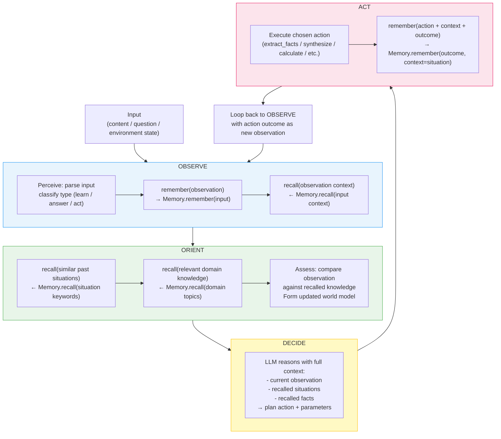
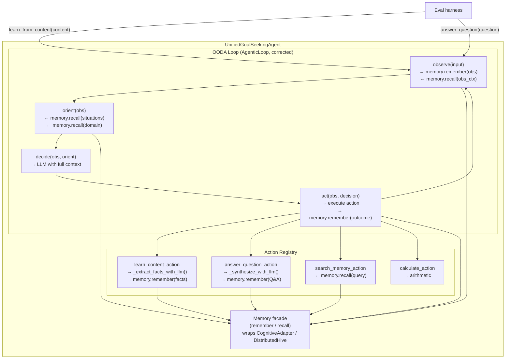

# Memory + OODA Loop Integration Design

**Status:** Design / Investigation
**Branch:** feat/distributed-hive-mind
**Date:** 2026-03-06

---

## Table of Contents

1. [Current State Map](#1-current-state-map)
2. [The Problem: LearningAgent Bypasses the OODA Loop](#2-the-problem)
3. [Corrected OODA Loop with Memory at Every Phase](#3-corrected-ooda-loop)
4. [Unification Design: Merging LearningAgent and GoalSeekingAgent](#4-unification-design)
5. [Eval Compatibility](#5-eval-compatibility)
6. [Implementation Plan](#6-implementation-plan)

---

## 1. Current State Map

### 1.1 File Inventory

| File                                             | Role                                                                |
| ------------------------------------------------ | ------------------------------------------------------------------- |
| `agents/goal_seeking/agentic_loop.py`            | `AgenticLoop` — PERCEIVE→REASON→ACT→LEARN loop (mostly dead code)   |
| `agents/goal_seeking/learning_agent.py`          | `LearningAgent` — the agent actually used by the eval harness       |
| `agents/goal_seeking/sdk_adapters/base.py`       | `GoalSeekingAgent` — abstract base for all SDK agents               |
| `agents/goal_seeking/sdk_adapters/claude_sdk.py` | `ClaudeGoalSeekingAgent` — concrete Claude Agent SDK implementation |
| `memory/facade.py`                               | `Memory` — new high-level `remember()`/`recall()` facade            |
| `memory/config.py`                               | `MemoryConfig` — config resolution for the Memory facade            |

### 1.2 Full Call Graph

The following diagram traces every call path from `GoalSeekingAgent` down to memory operations.

```mermaid
graph TD
    subgraph eval_path["Eval Harness Path (learn + answer)"]
        E1["eval: agent.learn_from_content(content)"]
        E2["eval: agent.answer_question(question)"]
    end

    subgraph gsa["GoalSeekingAgent (base.py)"]
        GSA_learn["learn_from_content(content)"]
        GSA_answer["answer_question(question, mode)"]
        GSA_run["run(task) → _run_sdk_agent()"]
        GSA_tool_learn["_tool_learn(content)"]
        GSA_get_la["_get_learning_agent() [cached]"]
    end

    subgraph la["LearningAgent (learning_agent.py)"]
        LA_learn["learn_from_content(content)"]
        LA_temporal["_detect_temporal_metadata() [LLM]"]
        LA_extract["_extract_facts_with_llm() [LLM]"]
        LA_store_fact["memory.store_fact() × N"]
        LA_summary["_store_summary_concept_map() [LLM]"]
        LA_answer["answer_question(question)"]
        LA_intent["_detect_intent() [LLM]"]
        LA_simple["_simple_retrieval()"]
        LA_entity["_entity_retrieval()"]
        LA_aggr["_aggregation_retrieval()"]
        LA_synth["_synthesize_with_llm() [LLM]"]
        LA_qanda["memory.store_fact() [Q&A pair]"]
        LA_agentic["answer_question_agentic()"]
        LA_loop_UNUSED["self.loop (AgenticLoop)\n[NEVER CALLED]"]
    end

    subgraph loop["AgenticLoop (agentic_loop.py)"]
        AL_perceive["perceive(obs, goal)\n→ memory.search()"]
        AL_reason["reason(perception)\n→ LLM"]
        AL_act["act(decision)\n→ action_executor.execute()"]
        AL_learn["learn(perception, reasoning, action, outcome)\n→ memory.store_fact()"]
        AL_run_iter["run_iteration(goal, obs)"]
        AL_run_goal["run_until_goal(goal, obs, check_fn)"]
        AL_reason_iter["reason_iteratively(question, memory, intent)"]
        AL_plan["_plan_retrieval() [LLM]"]
        AL_eval["_evaluate_sufficiency() [LLM]"]
        AL_refine["_refine_retrieval() [LLM]"]
        AL_search["_targeted_search(query, memory)"]
    end

    subgraph mem_backends["Memory Backends"]
        MR["MemoryRetriever\n(kuzu graph)"]
        CA["CognitiveAdapter\n(6-type memory)"]
        FRA["FlatRetrieverAdapter\n(HierarchicalMemory)"]
        MF["Memory facade\n(remember/recall)"]
    end

    E1 --> GSA_learn
    E2 --> GSA_answer

    GSA_learn --> GSA_tool_learn
    GSA_tool_learn --> GSA_get_la
    GSA_get_la --> LA_learn

    GSA_answer --> GSA_get_la
    GSA_get_la --> LA_answer
    GSA_answer -->|"mode=agentic"| LA_agentic

    LA_learn --> LA_temporal
    LA_learn --> LA_extract
    LA_learn --> LA_store_fact
    LA_learn --> LA_summary
    LA_store_fact --> MR
    LA_store_fact --> CA
    LA_summary --> LA_store_fact

    LA_answer --> LA_intent
    LA_answer --> LA_simple
    LA_answer --> LA_entity
    LA_answer --> LA_aggr
    LA_answer --> LA_synth
    LA_answer --> LA_qanda

    LA_simple --> CA
    LA_entity --> CA
    LA_aggr --> CA
    LA_qanda --> CA

    LA_agentic --> LA_answer

    LA_loop_UNUSED -.->|"DEAD PATH"| AL_run_iter

    AL_run_iter --> AL_perceive
    AL_run_iter --> AL_reason
    AL_run_iter --> AL_act
    AL_run_iter --> AL_learn
    AL_run_goal --> AL_run_iter

    AL_reason_iter --> AL_plan
    AL_reason_iter --> AL_search
    AL_reason_iter --> AL_eval
    AL_reason_iter --> AL_refine

    AL_perceive --> MR
    AL_learn --> MR
    AL_search --> CA

    MF --> CA
    MF --> MR
```



### 1.3 Where LearningAgent Diverges from AgenticLoop

`LearningAgent.__init__` creates `self.loop = AgenticLoop(...)` at line 175. However, **no method of `LearningAgent` ever calls `self.loop`**. The divergence is complete:

| Operation       | What `LearningAgent` actually does                           | What `AgenticLoop` would do                                             |
| --------------- | ------------------------------------------------------------ | ----------------------------------------------------------------------- |
| Learn content   | `_extract_facts_with_llm()` + `memory.store_fact()` directly | `perceive()` → `reason()` → `act(read_content)` → `learn()`             |
| Answer question | `_detect_intent()` → retrieval → `_synthesize_with_llm()`    | `perceive()` → `reason()` → `act(search_memory+synthesize)` → `learn()` |
| Memory recall   | `memory.search()` / `memory.get_all_facts()` directly        | `memory_retriever.search()` via `perceive()`                            |
| Memory store    | `memory.store_fact()` directly                               | `memory_retriever.store_fact()` via `learn()`                           |

**Why `self.loop` is never invoked:**
`LearningAgent` was optimized for eval performance: a direct intent→retrieve→synthesize pipeline with no action-executor dispatch overhead. The `AgenticLoop` was designed for a general multi-step goal-seeking pattern but was never wired into the eval-facing entry points.

---

## 2. The Problem

### 2.1 The Bypass

`LearningAgent.learn_from_content()` and `LearningAgent.answer_question()` use a **simplified two-phase pipeline**:

```
learn_from_content:  content → LLM(extract facts) → memory.store_fact()
answer_question:     question → LLM(detect intent) → memory.search() → LLM(synthesize)
```

The `AgenticLoop` (PERCEIVE→REASON→ACT→LEARN) is instantiated but dead:

```python
# LearningAgent.__init__ — line 175
self.loop = AgenticLoop(...)  # created but never called

# learn_from_content() — bypasses self.loop entirely
facts = self._extract_facts_with_llm(content)   # direct LLM call
self.memory.store_fact(...)                       # direct memory write

# answer_question() — bypasses self.loop entirely
intent = self._detect_intent(question)            # direct LLM call
facts = self._simple_retrieval(question)          # direct memory read
answer = self._synthesize_with_llm(question, ...) # direct LLM call
```

### 2.2 Consequences

1. **Prompt changes to AgenticLoop have zero effect** on eval scores, because AgenticLoop is never called during eval.
2. **Memory is write-only during learning** — `learn_from_content()` stores facts but never reads memory to check what it already knows. Duplicate facts accumulate.
3. **Memory is read-but-not-updated during answering** — `answer_question()` reads memory and produces an answer but the new synthesis is only stored as a Q&A echo fact, not integrated back into the knowledge graph in a structured way.
4. **The OODA loop's `learn()` phase is skipped** — outcomes (action results) are never stored back with context and reasoning, so the agent cannot improve its strategies over time.
5. **The eval tests a pipeline that is NOT the agent's core architecture** — the eval harness calls `learn_from_content()` and `answer_question()`, which bypass the OODA loop entirely.

### 2.3 Evidence from Code

```python
# agentic_loop.py:353 — run_iteration exists and is correct
def run_iteration(self, goal: str, observation: str) -> LoopState:
    perception = self.perceive(observation, goal)   # reads memory
    action_decision = self.reason(perception)        # LLM decides
    outcome = self.act(action_decision)              # executes action
    learning = self.learn(perception, reasoning, action, outcome)  # writes memory
    return LoopState(...)

# learning_agent.py:231 — learn_from_content never calls self.loop
def learn_from_content(self, content: str) -> dict:
    temporal_meta = self._detect_temporal_metadata(content)   # LLM
    facts = self._extract_facts_with_llm(content, temporal_meta)  # LLM
    for fact in facts:
        self.memory.store_fact(...)    # direct write, no OODA
    # self.loop is never referenced

# learning_agent.py:467 — answer_question never calls self.loop
def answer_question(self, question: str, ...) -> str:
    intent = self._detect_intent(question)           # LLM
    relevant_facts = self._simple_retrieval(...)     # direct read
    answer = self._synthesize_with_llm(...)          # LLM
    self.memory.store_fact(...)                      # direct write
    # self.loop is never referenced
```

---

## 3. Corrected OODA Loop with Memory at Every Phase

The OODA loop (Observe-Orient-Decide-Act) maps cleanly onto agent cognition when memory is woven into each phase.

### 3.1 OODA Loop Design

```
OBSERVE:
  - Perceive input (content, question, or environment state)
  - remember(observation)           ← store what we just saw
  - recall(observation context)     ← what do we already know about this?

ORIENT:
  - recall(similar past situations) ← what happened before in similar contexts?
  - recall(relevant domain knowledge) ← what facts/procedures apply?
  - Assess: compare observation against recalled knowledge
  - Form updated world model

DECIDE:
  - Plan action informed by observation + orientation + recalled memory
  - This is where the LLM reasons with FULL context (current + recalled)
  - Output: action choice + parameters + reasoning trace

ACT:
  - Execute chosen action
  - remember(action + context + outcome)  ← store what we did and what happened
  - Feed outcome back to OBSERVE for next iteration
```

### 3.2 Proposed OODA Loop with Memory



### 3.3 Memory Integration per Phase

#### OBSERVE Phase

```python
def observe(self, input_text: str) -> ObservationResult:
    # 1. Perceive the raw input
    obs_type = self._classify_input(input_text)  # "learn", "answer", "act"

    # 2. remember(observation) — store what we just saw
    self.memory.remember(
        f"OBSERVATION: {input_text[:500]}",
        context=f"input_type:{obs_type}"
    )

    # 3. recall(observation context) — what do we already know?
    prior_knowledge = self.memory.recall(input_text[:200])

    return ObservationResult(
        input=input_text,
        obs_type=obs_type,
        prior_knowledge=prior_knowledge
    )
```

#### ORIENT Phase

```python
def orient(self, obs: ObservationResult) -> OrientationResult:
    # 1. recall(similar past situations)
    past_situations = self.memory.recall(
        f"situation: {obs.input[:100]}"
    )

    # 2. recall(relevant domain knowledge)
    domain_knowledge = self.memory.recall(
        obs.input[:200]  # recall with question/topic as query
    )

    # 3. Assess: compare observation against recalled knowledge
    world_model = {
        "current_observation": obs.input,
        "prior_knowledge": obs.prior_knowledge,
        "past_situations": past_situations,
        "domain_knowledge": domain_knowledge,
    }

    return OrientationResult(world_model=world_model)
```

#### DECIDE Phase

```python
def decide(self, obs: ObservationResult, orient: OrientationResult) -> ActionDecision:
    # LLM reasons with FULL context: current + recalled memory
    context = self._format_context(obs, orient)

    decision = self.llm.complete(
        system="You are a goal-seeking agent. Use observation and recalled memory to decide.",
        user=context + "\nWhat action should I take?"
    )

    return ActionDecision(
        action=decision["action"],
        params=decision["params"],
        reasoning=decision["reasoning"]
    )
```

#### ACT Phase

```python
def act(self, obs: ObservationResult, decision: ActionDecision) -> ActionOutcome:
    # Execute the chosen action
    outcome = self.action_executor.execute(decision.action, **decision.params)

    # remember(action + context + outcome) — critical for learning
    self.memory.remember(
        f"ACTION: {decision.action} → OUTCOME: {str(outcome)[:300]}",
        context=f"situation:{obs.input[:100]} reasoning:{decision.reasoning[:100]}"
    )

    return ActionOutcome(
        outcome=outcome,
        next_observation=f"Action {decision.action} resulted in: {outcome}"
    )
```

---

## 4. Unification Design

### 4.1 Core Principle

**`GoalSeekingAgent` IS the agent. `LearningAgent` should become its internal pipeline, unified under the OODA loop.** The separation between them is a historical artifact, not an architectural necessity.

### 4.2 Unified Architecture



### 4.3 Mapping Operations to OODA Iterations

#### `learn_from_content(content)` = One OODA Iteration

```
OBSERVE: input_type = "learn_content"
         memory.remember(content[:200])          # store what we saw
         prior = memory.recall(content[:100])     # do we already know this?

ORIENT:  similar_learnings = memory.recall("learned content " + content[:50])
         Assess: if prior has high overlap → mark as duplicate/update

DECIDE:  LLM: "extract facts from this content, given prior knowledge"
         → action = "extract_and_store_facts"

ACT:     _extract_facts_with_llm(content)
         for fact in facts:
             memory.remember(fact, context="learned_content")
         memory.remember("Learned: " + summary, context="episode")
         → no next OODA iteration needed (goal: store knowledge)
```

#### `answer_question(question)` = One OODA Iteration

```
OBSERVE: input_type = "answer_question"
         memory.remember(question)               # store the question
         prior_answers = memory.recall(question) # have we answered this before?

ORIENT:  domain_facts = memory.recall(question)  # what do we know?
         past_answers = memory.recall("answered: " + question[:50])
         Assess: do we have enough to answer confidently?

DECIDE:  LLM: "synthesize answer using recalled facts"
         → action = "synthesize_answer"

ACT:     _synthesize_with_llm(question, domain_facts)
         memory.remember("Q: " + question + " A: " + answer, context="q_and_a")
         → return answer (no loop-back needed)
```

#### `run_until_goal(goal)` = Multiple OODA Iterations

```
Iteration 1:
  OBSERVE: "Goal: {goal}. Status: starting."
  ORIENT:  recall relevant past goals/strategies
  DECIDE:  plan first action (e.g., "search_memory for context")
  ACT:     execute → memory.remember(outcome)

Iteration 2:
  OBSERVE: "Previous action: {action} → {outcome}"
  ORIENT:  recall updated context + new facts from outcome
  DECIDE:  plan next action (e.g., "synthesize_partial_answer")
  ACT:     execute → memory.remember(outcome)
  ...
Until: is_goal_achieved(state) == True OR max_iterations
```

### 4.4 Interface Compatibility

The unified agent exposes the same external interface as today:

```python
class UnifiedGoalSeekingAgent:
    # Same interface as LearningAgent + GoalSeekingAgent combined

    def learn_from_content(self, content: str) -> dict:
        """One OODA iteration: OBSERVE content → remember → ORIENT → DECIDE facts → ACT store"""
        return self._run_ooda_iteration(input=content, input_type="learn")

    def answer_question(self, question: str, question_level: str = "L1") -> str:
        """One OODA iteration: OBSERVE question → recall → ORIENT → DECIDE answer → ACT return"""
        result = self._run_ooda_iteration(input=question, input_type="answer")
        return result["answer"]

    async def run(self, task: str, max_turns: int = 10) -> AgentResult:
        """Multi-step OODA loop until goal achieved or max_turns"""
        states = self.loop.run_until_goal(goal=task, initial_observation=task)
        return AgentResult(response=states[-1].outcome, goal_achieved=True)
```

---

## 5. Eval Compatibility

### 5.1 Current Eval Interface

The eval harness calls exactly these methods:

```python
# From eval harness (simplified)
agent = LearningAgent(agent_name="eval_agent")

# Learning phase
for article in articles:
    agent.learn_from_content(article)

# Evaluation phase
for question in questions:
    answer = agent.answer_question(question, question_level="L1")
    score = evaluate(answer, expected)
```

### 5.2 Compatibility Under Unification

The unified agent preserves the same signatures. The eval harness requires **zero changes**:

```python
# Eval harness — no changes needed
agent = UnifiedGoalSeekingAgent(agent_name="eval_agent")
# OR (backward compat alias)
agent = LearningAgent(agent_name="eval_agent")

# Same calls — internally use OODA loop now
agent.learn_from_content(article)       # → one OODA iteration
agent.answer_question(question, "L1")   # → one OODA iteration
```

### 5.3 What Changes Under the Hood

| Aspect                   | Current (bypass)             | Unified (OODA)                                                     |
| ------------------------ | ---------------------------- | ------------------------------------------------------------------ |
| `learn_from_content()`   | Direct LLM + store           | OBSERVE(remember) → ORIENT(recall) → DECIDE → ACT(store)           |
| `answer_question()`      | Direct LLM + retrieve        | OBSERVE(recall) → ORIENT(recall deeper) → DECIDE → ACT(synthesize) |
| Duplicate fact detection | None — duplicates accumulate | ORIENT checks prior knowledge before storing                       |
| Strategy improvement     | None — no outcome feedback   | ACT stores outcome → recalled in future ORIENTs                    |
| Prompt changes work      | No — loop never called       | Yes — all reasoning goes through DECIDE                            |
| Eval score               | Baseline (97.8% reported)    | Expected stable or improved (no info loss)                         |

### 5.4 Eval Trace Compatibility

The `ReasoningTrace` dataclass is preserved. The unified OODA loop emits equivalent trace data:

```python
ReasoningTrace(
    question=question,
    intent={"intent": "simple_recall"},  # same as before
    steps=[
        ReasoningStep(step_type="observe", ...),   # new: maps to OBSERVE
        ReasoningStep(step_type="orient", ...),    # new: maps to ORIENT
        ReasoningStep(step_type="decide", ...),    # new: maps to DECIDE
        ReasoningStep(step_type="act", ...),       # new: maps to ACT
    ],
    total_facts_collected=N,
    used_simple_path=False,  # always False — OODA always runs
)
```

---

## 6. Implementation Plan

### 6.1 Phase 1: Wire Memory Facade into AgenticLoop (Low Risk)

**Files:** `agents/goal_seeking/agentic_loop.py`, `memory/facade.py`

1. Add `Memory` facade import to `AgenticLoop.__init__`
2. Replace `memory_retriever.search()` in `perceive()` with `memory.recall()`
3. Replace `memory_retriever.store_fact()` in `learn()` with `memory.remember()`
4. Add `memory.remember(observation)` call at start of `perceive()` — **this is the key OBSERVE+remember step**
5. Add `memory.recall(observation)` call for prior knowledge in `perceive()` — **this is the OBSERVE+recall step**

**Complexity:** Low. AgenticLoop already has the right structure; this is plumbing changes only.
**Risk:** None — AgenticLoop is not called by any production path yet.

### 6.2 Phase 2: Add ORIENT Memory Recalls to AgenticLoop (Low Risk)

**Files:** `agents/goal_seeking/agentic_loop.py`

6. Split `perceive()` into `observe()` + `orient()` to match OODA nomenclature
7. In `orient()`: `memory.recall(similar_past_situations)` — search for similar past inputs
8. In `orient()`: `memory.recall(relevant_domain_knowledge)` — search for related facts
9. Build combined world model: `{observation, prior_knowledge, past_situations, domain_facts}`
10. Pass full world model to `reason()` so LLM has complete context

**Complexity:** Medium. Requires careful prompt engineering in `reason()` to use the richer context without hallucinating.
**Risk:** Medium — changing `reason()` prompt could affect quality.

### 6.3 Phase 3: Wire LearningAgent.learn_from_content() Through OODA (Medium Risk)

**Files:** `agents/goal_seeking/learning_agent.py`

11. Add OBSERVE step at start of `learn_from_content()`: `self.loop.observe(content)`
12. Keep existing `_extract_facts_with_llm()` as the "ACT: extract_and_store_facts" action
13. Add `self.loop.learn()` call after extraction to record the episode in memory with proper context
14. Add duplicate detection in ORIENT: check `memory.recall(content[:100])` before extraction

**Complexity:** Medium. Existing extraction logic is complex; must not regress eval scores.
**Risk:** Medium — any regression in fact extraction quality will lower eval scores.

### 6.4 Phase 4: Wire LearningAgent.answer_question() Through OODA (Medium Risk)

**Files:** `agents/goal_seeking/learning_agent.py`

15. Add OBSERVE step: `self.loop.observe(question)`
16. Replace `_simple_retrieval()` / `_entity_retrieval()` with `self.loop.orient()` calls that use `memory.recall()`
17. Move intent detection into ORIENT phase (it is assessing the situation)
18. Keep `_synthesize_with_llm()` as the "ACT: synthesize_answer" action
19. Add `self.loop.learn()` call after synthesis to store outcome with reasoning

**Complexity:** High. The retrieval logic is the most performance-sensitive part of the pipeline.
**Risk:** High — any change here risks eval score regression. Must run full eval suite before merging.

### 6.5 Phase 5: Unify GoalSeekingAgent.run() with OODA (Low Risk, Independent)

**Files:** `agents/goal_seeking/sdk_adapters/base.py`

20. In `GoalSeekingAgent.run()`, replace direct `_run_sdk_agent()` call with `self.loop.run_until_goal()`
21. Map SDK tool calls (learn_from_content, search_memory, etc.) as named actions in the loop
22. This path is only used for multi-turn agentic tasks, not the eval pipeline

**Complexity:** Medium. The SDK agent loop is separate from the eval path.
**Risk:** Low for eval (this path is not tested by eval harness).

### 6.6 Phase 6: Remove Dead Code (Cleanup)

**Files:** `agents/goal_seeking/learning_agent.py`

23. After phases 3-4 are complete and stable, remove the `self.loop` dead-code comment
24. Ensure `AgenticLoop` is the only reasoning path, not a parallel shadow
25. Update all docstrings to reflect OODA structure

**Complexity:** Low.
**Risk:** None — pure cleanup.

### 6.7 Summary Table

| Phase                              | Files Changed     | Complexity | Risk   | Eval Impact               |
| ---------------------------------- | ----------------- | ---------- | ------ | ------------------------- |
| 1: Wire Memory into AgenticLoop    | agentic_loop.py   | Low        | None   | None (not called by eval) |
| 2: ORIENT recalls in AgenticLoop   | agentic_loop.py   | Medium     | Low    | None                      |
| 3: learn_from_content via OODA     | learning_agent.py | Medium     | Medium | Possible improvement      |
| 4: answer_question via OODA        | learning_agent.py | High       | High   | Must validate             |
| 5: GoalSeekingAgent.run() via OODA | base.py           | Medium     | Low    | None                      |
| 6: Remove dead code                | learning_agent.py | Low        | None   | None                      |

### 6.8 Recommended Order

**Start with Phase 1 and 2** — zero risk, builds confidence in the new loop structure.

**Before Phase 4**, run the full eval suite on a canary to establish baseline. Gate merge on no regression.

**Phases 3 and 4** should be done in separate PRs with full eval runs between them.

---

## Appendix: Memory Facade API

The new `Memory` facade (added in commit `0ed27334`) provides the clean interface the OODA loop needs:

```python
from amplihack.memory import Memory

mem = Memory("my-agent")          # topology: single (default) or distributed
mem.remember("The sky is blue")   # store observation/fact/outcome
facts = mem.recall("sky colour")  # retrieve relevant memories
mem.close()
```

This maps directly onto the OODA phases:

- `remember()` → OBSERVE phase (store observation) + ACT phase (store outcome)
- `recall()` → OBSERVE phase (check prior knowledge) + ORIENT phase (retrieve situation + domain facts)

The facade abstracts over `CognitiveAdapter` (6-type memory), `HierarchicalMemory`, and distributed hive topologies — the OODA loop does not need to know which backend is active.

---

---

## Appendix: Transport Topology

The `Memory` facade selects transport at construction time via config-driven topology. The transport determines how agents share knowledge:

| Transport           | OODA Integration                                      | Scale          | Latency      |
| ------------------- | ----------------------------------------------------- | -------------- | ------------ |
| `local`             | In-process queue; all agents share one Python process | 1 machine      | Microseconds |
| `redis`             | Redis pub/sub; agents on same network                 | 10s of agents  | <1ms         |
| `azure_service_bus` | Service Bus topic/subscriptions; cross-machine        | 100s of agents | 10–100ms     |

**Production topology (Azure):** 20 Container Apps (`amplihive-app-0`…`amplihive-app-19`), 100 agents (`agent-0`…`agent-99`, 5 per container). Service Bus namespace `hive-sb-dj2qo2w7vu5zi`, topic `hive-graph`, 100 subscriptions (one per agent). Each agent's `NetworkGraphStore` wraps a local `InMemoryGraphStore` and publishes `create_node` / `search_query` events to the topic. Cross-container OODA memory sharing flows through Service Bus; intra-container agents share in-process.

**Backend selection:** Containers use `cognitive` (Kuzu) on ephemeral volumes (`EmptyDir`). Ephemeral volumes support POSIX advisory file locks, so Kuzu works identically in containers and local development. Azure Files (SMB) is no longer used for Kuzu persistence.

---

_Investigation only — no code changes were made to agent files._
_Updated: 2026-03-06_
