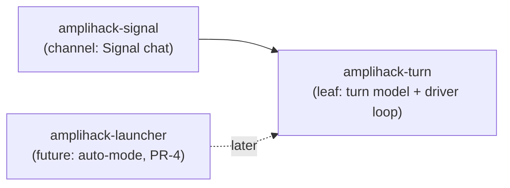

# `amplihack-turn` — Agent-Generic Turn Driver Reference

> [Home](../index.md) > [Reference](../index.md#-reference--resources) > amplihack-turn API

The **`amplihack-turn`** crate is the workspace's agent-generic turn-driver
abstraction. It defines *what a turn is* — a single, resumable prompt→response
exchange with an agent session — and provides one reusable driver loop that
pumps prompts from a channel through that session. It contains nothing specific
to Signal, to auto-mode, or to any particular transport: it is a genuine shared
**leaf** crate, depended on by higher-level channels (today `amplihack-signal`,
and in a later step `amplihack-launcher`) without depending on any of them.

The crate is built around one non-negotiable behavioural contract that the rest
of amplihack already relies on:

- **A turn runs to natural completion.** A turn ends when the agent goes idle /
  the underlying process exits — **never** on a wall-clock timer. There are no
  per-turn deadlines and no arbitrary fixed resource caps anywhere in this
  crate. Any bound (for example a channel's queue depth) is an
  **operator-configurable policy** owned by the channel, not a hard-coded cap.
- **The same underlying agent session is resumed across turns.** `session_id()`
  is stable for the life of a driver; every turn resumes that one session, so
  full prior context is preserved.
- **No silent fallbacks.** Every I/O, parse, or execution failure is surfaced
  explicitly through typed errors and propagated. The loop never swallows an
  error or silently degrades.

## Contents

- [When to use it](#when-to-use-it)
- [Crate layout and dependency direction](#crate-layout-and-dependency-direction)
- [The turn model](#the-turn-model)
- [API reference](#api-reference)
  - [`AgentSession`](#agentsession)
  - [`Channel`](#channel)
  - [`NextPrompt`](#nextprompt)
  - [`TurnOutput`](#turnoutput)
  - [`ChannelId`](#channelid)
  - [Error types: `TurnError` / `ChannelError`](#error-types-turnerror--channelerror)
  - [`run_session_loop`](#run_session_loop)
  - [Relocated turn primitives](#relocated-turn-primitives)
    - [`build_turn_argv`](#build_turn_argv)
    - [`TurnRunner`](#turnrunner)
    - [`SerialTurnDriver`](#serialturndriver)
    - [`CopilotTurnRunner` and `PreemptSlot`](#copilotturnrunner-and-preemptslot)
    - [`ToolAllowlist`](#toolallowlist)
- [The driver loop contract](#the-driver-loop-contract)
- [Quick start: driving a mock session](#quick-start-driving-a-mock-session)
- [Configuration](#configuration)
  - [Cargo features and the tokio net gate](#cargo-features-and-the-tokio-net-gate)
- [How `amplihack-signal` consumes it](#how-amplihack-signal-consumes-it)
- [Testing](#testing)
- [Security notes](#security-notes)
- [FAQ](#faq)

---

## When to use it

Reach for `amplihack-turn` whenever you need to drive an agent one turn at a
time and want the turn semantics (resume-the-same-session, run-to-completion,
no wall-clock cap, explicit errors) enforced for you.

- If you are **implementing a new channel** (a chat surface, an inbox, a queue),
  implement the [`Channel`](#channel) trait and hand it to
  [`run_session_loop`](#run_session_loop) together with an
  [`AgentSession`](#agentsession).
- If you are **adapting an agent runner** (Copilot, Claude, a test double),
  implement [`AgentSession`](#agentsession) — or reuse the relocated
  [`SerialTurnDriver`](#serialturndriver) over a
  [`TurnRunner`](#turnrunner).

You do **not** need this crate to send a single one-shot prompt; it earns its
keep only when there is a *loop* of prompts sharing one resumed session.

---

## Crate layout and dependency direction

```
crates/amplihack-turn/
├── Cargo.toml
├── src/
│   ├── lib.rs         # AgentSession, Channel, NextPrompt, TurnOutput,
│   │                  # ChannelId, TurnError/ChannelError, run_session_loop
│   ├── turn.rs        # build_turn_argv, TurnRunner, SerialTurnDriver,
│   │                  # CopilotTurnRunner, PreemptSlot  (relocated)
│   └── allowlist.rs   # ToolAllowlist                    (relocated)
└── tests/
    └── driver_loop_it.rs   # hermetic mock-session / mock-channel loop tests
```

The dependency edge points **only one way**:



`amplihack-turn` depends on **no other amplihack crate**. `amplihack-signal`
depends on `amplihack-turn`; nothing in `amplihack-turn` depends back on
`amplihack-signal`. There is no cycle.

---

## The turn model

A **turn** is one prompt→response exchange:

1. A [`Channel`](#channel) yields the next prompt (`NextPrompt::Ready`).
2. The [`AgentSession`](#agentsession) runs exactly that one prompt to natural
   completion, resuming its pinned session, and returns a [`TurnOutput`](#turnoutput).
3. The channel publishes the output (`publish_output`, a no-op by default — see
   the *replay* note below).
4. Back to step 1.

Two seams, two directions:

- **LISTEN** — `Channel::next_prompt` is how the outside world feeds prompts in.
- **REPLAY** — `Channel::publish_output` is how a turn's output is echoed back
  out. It has a **default no-op implementation**: channels that only *drive* an
  agent (and don't need to reflect output anywhere) get correct behaviour for
  free and only override it when they actually have somewhere to publish.

---

## API reference

All traits are async. `AgentSession` uses native `async fn` in traits (edition
2024). `Channel` uses `#[async_trait]` so it stays object-safe for dynamic
dispatch.

> **Send-ness note.** Native `async fn` in a trait (`AgentSession`) yields
> futures that are **not** `Send` by default. This is fine for the generic
> `run_session_loop`, which is monomorphised over concrete `S: AgentSession`
> and drives the future in place. It matters only if a future consumer needs a
> `dyn AgentSession` object or spawns `run_turn` across an `.await` on a
> multi-threaded executor; such a consumer would add its own `Send` bound (or
> switch that trait to `#[async_trait]`). No consumer in this PR needs it.

### `AgentSession`

```rust
pub trait AgentSession {
    /// Run ONE turn with `prompt`, resuming the same underlying agent session.
    ///
    /// Runs to natural completion (idle / process liveness) — NEVER a
    /// wall-clock cap. Returns the turn's output, or a `TurnError` on failure
    /// (propagated, never swallowed).
    async fn run_turn(&mut self, prompt: &str) -> TurnResult<TurnOutput>;

    /// The stable id of the resumed session. Constant for the driver's life.
    fn session_id(&self) -> &str;
}
```

Contract:

- `run_turn` MUST resume the same session identified by `session_id()` on every
  call — turns are not independent invocations.
- `run_turn` MUST NOT impose a wall-clock deadline. Completion is defined by the
  agent going idle or its process exiting.
- Errors MUST be returned as `Err(TurnError…)`, never hidden behind an empty or
  synthesised "success" output.

### `Channel`

```rust
#[async_trait]
pub trait Channel {
    /// A stable identifier for this channel (for logging / correlation).
    fn id(&self) -> ChannelId;

    /// REPLAY (default no-op): publish a completed turn's output.
    /// Channels that don't echo output inherit the no-op and stay correct.
    async fn publish_output(&mut self, out: &TurnOutput) -> ChannelResult<()> {
        let _ = out;
        Ok(())
    }

    /// LISTEN: yield the next prompt, or signal idle / closed.
    async fn next_prompt(&mut self) -> ChannelResult<NextPrompt>;
}
```

Contract:

- `next_prompt` returns [`NextPrompt`](#nextprompt). It MUST return
  `Idle` (not spin, not error) when there is simply nothing to do yet, and
  `Closed` exactly once the channel is permanently done.
- `publish_output` failures are surfaced as `Err(ChannelError…)` and abort the
  loop — a publish that silently drops output would violate the no-silent-
  fallback rule.

### `NextPrompt`

```rust
pub enum NextPrompt {
    /// A prompt is ready to run this turn.
    Ready(String),
    /// Nothing to run yet; the loop should wait for liveness/inbound, not spin.
    Idle,
    /// The channel is permanently closed; the loop should break.
    Closed,
}
```

### `TurnOutput`

The result of running one turn. It carries the agent's response text captured
verbatim (ANSI-free, exactly as the agent produced it). It derives `Debug` and
`Clone` and exposes the response body plus enough metadata for a channel to
publish it.

```rust
pub struct TurnOutput { /* fields via accessors */ }

impl TurnOutput {
    /// Wrap a response body as a turn output. Used by `AgentSession`
    /// implementations (and tests) to construct the result of a turn.
    pub fn from_text(text: impl Into<String>) -> Self;

    /// The agent's response for this turn, captured verbatim.
    pub fn text(&self) -> &str;
}
```

> **Behaviour-preserving note.** In this step the production path still moves
> raw response strings; `TurnOutput` wraps that string without transforming it,
> so no existing consumer sees a changed byte.

### `ChannelId`

An opaque, cheap-to-clone identifier for a channel, used for logging and
correlation. It is `Debug + Clone + PartialEq + Eq` and renders to a stable
string via `Display`. Construct one from any string-like value via
`From<&str>` / `From<String>` (i.e. `ChannelId::from("mock")`).

```rust
pub struct ChannelId(/* opaque */);

impl From<&str> for ChannelId { /* ... */ }
impl From<String> for ChannelId { /* ... */ }
impl std::fmt::Display for ChannelId { /* stable string form */ }
```

### Error types: `TurnError` / `ChannelError`

Both are `thiserror` enums, consistent with the rest of the workspace, and both
have matching `Result` aliases:

```rust
pub type TurnResult<T>    = Result<T, TurnError>;
pub type ChannelResult<T> = Result<T, ChannelError>;

#[derive(Debug, thiserror::Error)]
pub enum TurnError {
    /// The agent process failed to spawn or exited non-zero.
    #[error("agent turn failed: {0}")]
    Exec(String),
    /// An I/O error while running or capturing the turn.
    #[error("turn I/O error: {0}")]
    Io(#[from] std::io::Error),
    /// The in-flight turn was pre-empted by an out-of-band stop.
    #[error("turn pre-empted")]
    Preempted,
}

#[derive(Debug, thiserror::Error)]
pub enum ChannelError {
    /// Failed to read the next prompt.
    #[error("channel receive error: {0}")]
    Recv(String),
    /// Failed to publish a turn's output.
    #[error("channel publish error: {0}")]
    Publish(String),
    /// An underlying I/O error.
    #[error("channel I/O error: {0}")]
    Io(#[from] std::io::Error),
}
```

Design rule: **errors are explicit**. There is no variant that means "we hit a
problem and pretended it was fine." Error messages MUST NOT embed secrets or
raw credentials (see [Security notes](#security-notes)).

### `run_session_loop`

The single, reusable driver loop. This is the one place the turn contract is
implemented; every channel gets identical, correct pump semantics.

```rust
/// Drive `session` from `channel` until the channel closes.
///
/// * `Ready(p)` → run one turn (`session.run_turn(&p)`), then publish its
///   output (`channel.publish_output(&out)`).
/// * `Idle`     → wait for liveness / inbound activity (NO wall-clock timeout),
///   then poll again.
/// * `Closed`   → break and return `Ok(())`.
///
/// Any `TurnError` or `ChannelError` propagates out of the loop unchanged.
pub async fn run_session_loop<S, C>(session: &mut S, channel: &mut C) -> ChannelResult<()>
where
    S: AgentSession,
    C: Channel + ?Sized;
```

Reference implementation shape:

```rust
loop {
    match channel.next_prompt().await? {
        NextPrompt::Ready(prompt) => {
            let out = session.run_turn(&prompt).await?;   // run to completion
            channel.publish_output(&out).await?;          // replay (default no-op)
        }
        NextPrompt::Idle   => wait_for_liveness_or_inbound().await, // no timeout
        NextPrompt::Closed => break,
    }
}
Ok(())
```

Guarantees:

- **Ordering.** Prompts are run in the exact order the channel yields them; a
  turn fully completes (run + publish) before the next prompt is requested.
- **Session reuse.** The same `session` (hence the same `session_id()`) is used
  for every turn.
- **No spin on idle.** `Idle` awaits liveness/inbound rather than busy-looping.
- **No timeout.** There is no wall-clock bound on any turn or on the idle wait.
- **Fail-fast.** The first `TurnError`/`ChannelError` propagates and ends the
  loop; nothing is swallowed.

### Relocated turn primitives

These items were previously defined inside `amplihack-signal`
(`crates/amplihack-signal/src/chat/turn.rs` and `.../chat/allowlist.rs`). They
were already agent-generic (nothing Signal-specific), so they now live in
`amplihack-turn` **behaviour-identical** — a pure relocation with only
path/visibility edits. `amplihack-signal` re-exports them at their original
paths (`amplihack_signal::chat::turn::*`, `amplihack_signal::chat::allowlist::*`)
so existing callers and the PR-1 characterization tests compile and pass
unchanged.

#### `build_turn_argv`

```rust
pub fn build_turn_argv(session_id: &str, prompt: &str, allowlist: &ToolAllowlist) -> Vec<String>;
```

Builds the Copilot resume argv for one turn:
`--session-id <SID> --no-color -s -p <PROMPT> <allowlist…>`.

- `--session-id <SID>` pins turn continuity (resume the same session).
- `--no-color` guarantees ANSI-free stdout before redaction/chunking.
- `-s` (silent) captures the response only.
- `-p <PROMPT>` passes the (attacker-influenced) prompt as **exactly one** argv
  element, verbatim — never concatenated into a shell string — so shell
  metacharacters cannot inject a command.

The returned vector is the *argument* list; the program (`copilot`) is supplied
by the runner.

#### `TurnRunner`

```rust
pub trait TurnRunner: Send + Sync {
    /// Run `copilot` with `argv` and resolve to its captured stdout.
    fn run_argv(&self, argv: Vec<String>)
        -> Pin<Box<dyn Future<Output = std::io::Result<String>> + Send>>;
}
```

An injectable executor of one turn given its argv. Implemented for real by
[`CopilotTurnRunner`](#copilotturnrunner-and-preemptslot) and by mocks in tests.

#### `SerialTurnDriver`

```rust
pub struct SerialTurnDriver<R: TurnRunner> { /* … */ }

impl<R: TurnRunner> SerialTurnDriver<R> {
    pub fn new(runner: R, session_id: &str, allowlist: ToolAllowlist) -> Self;
    pub fn session_id(&self) -> &str;
    pub async fn run_turn(&self, prompt: &str) -> std::io::Result<String>;
}
```

Serializes turns for one pinned session so **at most one turn runs at a time**.
Turn continuity requires that two `copilot --session-id <same>` processes are
never in flight concurrently (they would race the same session state); an async
mutex enforces one-at-a-time execution even when `run_turn` is called from
multiple tasks. `SerialTurnDriver` is the concrete adapter that satisfies the
[`AgentSession`](#agentsession) semantics for Copilot today.

#### `CopilotTurnRunner` and `PreemptSlot`

```rust
pub type PreemptSlot = Arc<Mutex<Option<tokio::sync::oneshot::Sender<()>>>>;

pub struct CopilotTurnRunner { /* … */ }
impl CopilotTurnRunner {
    pub fn new(program: impl Into<String>, preempt: PreemptSlot) -> Self;
}
```

The production `TurnRunner`: spawns the real `copilot` binary, publishes a
**child-bound** pre-empt trigger into a shared `PreemptSlot`, drains stdout and
stderr concurrently (so a full pipe can't deadlock `wait()`), and captures clean
stdout. An out-of-band `stop`/`kill` fires the trigger; the runner reacts by
killing its **owned** `tokio::process::Child` via `start_kill`, so the kill is
bound to the exact process and is immune to PID reuse (no TOCTOU window). A
pre-empted turn surfaces as `io::ErrorKind::Interrupted`; a non-zero exit
surfaces the combined stderr/stdout as an error so the caller can report the
failure and keep going (the next turn resumes the same session, context intact).

#### `ToolAllowlist`

```rust
pub struct ToolAllowlist { /* … */ }

impl ToolAllowlist {
    pub fn read_only_default() -> Self;                       // view, grep, glob
    pub fn from_flags(flags: &[String], dangerous: bool) -> Self;
    pub fn is_dangerous(&self) -> bool;
    pub fn to_copilot_args(&self) -> Vec<String>;
    pub fn describe(&self) -> String;
}
```

The scoped Copilot tool allowlist for the driven agent. It relocates alongside
`turn.rs` because `build_turn_argv` and `SerialTurnDriver` take it by value/ref;
moving only the driver would have split a tightly coupled pair. Its
least-privilege policy is preserved exactly:

- No explicit `--allow-tool` ⇒ read-only investigation tools
  (`view`, `grep`, `glob`) via `read_only_default`.
- Operator-listed tools ⇒ exactly those, in order.
- Blanket access requires the explicit dangerous opt-in and maps to Copilot's
  tools-only `--allow-all-tools` — **never** the wider `--allow-all` (which
  would also grant unrestricted paths/URLs).

---

## The driver loop contract

| Channel yields | Loop action | Notes |
| --- | --- | --- |
| `NextPrompt::Ready(p)` | `run_turn(&p)` → `publish_output(&out)` | Turn runs to natural completion; output published (default no-op). |
| `NextPrompt::Idle` | await liveness / inbound, then re-poll | **No** wall-clock timeout. Never busy-spins. |
| `NextPrompt::Closed` | `break` → `Ok(())` | Clean, once-only termination. |
| `Err(TurnError)` from a turn | propagate out of loop | Not swallowed. |
| `Err(ChannelError)` from receive/publish | propagate out of loop | Not swallowed. |

There are **no** other exits. In particular, there is no timer that ends a turn,
no maximum-turn counter, and no hidden retry that could mask a failure.

---

## Quick start: driving a mock session

The crate is designed to be exercised hermetically — no network, no real
`copilot` binary. A minimal mock channel that feeds two prompts and then closes,
driven against a mock session:

```rust
use amplihack_turn::{
    AgentSession, Channel, ChannelId, ChannelResult, NextPrompt, TurnOutput, TurnResult,
    run_session_loop,
};
use async_trait::async_trait;

struct MockSession { id: String, seen: Vec<String> }

impl AgentSession for MockSession {
    async fn run_turn(&mut self, prompt: &str) -> TurnResult<TurnOutput> {
        self.seen.push(prompt.to_string());          // records ordering + reuse
        Ok(TurnOutput::from_text(format!("echo: {prompt}")))
    }
    fn session_id(&self) -> &str { &self.id }
}

struct MockChannel { queue: Vec<&'static str>, published: Vec<String> }

#[async_trait]
impl Channel for MockChannel {
    fn id(&self) -> ChannelId { ChannelId::from("mock") }

    async fn publish_output(&mut self, out: &TurnOutput) -> ChannelResult<()> {
        self.published.push(out.text().to_string());  // override REPLAY to observe it
        Ok(())
    }

    async fn next_prompt(&mut self) -> ChannelResult<NextPrompt> {
        Ok(match self.queue.is_empty() {
            true  => NextPrompt::Closed,
            false => NextPrompt::Ready(self.queue.remove(0).to_string()),
        })
    }
}

# async fn demo() {
let mut session = MockSession { id: "s-1".into(), seen: vec![] };
let mut channel = MockChannel { queue: vec!["hello", "world"], published: vec![] };

run_session_loop(&mut session, &mut channel).await.unwrap();

assert_eq!(session.seen, ["hello", "world"]);               // ordering preserved
assert_eq!(session.session_id(), "s-1");                    // one session reused
assert_eq!(channel.published, ["echo: hello", "echo: world"]); // run_turn → publish
# }
```

What this demonstrates — and what the crate's tests assert:

- On `Ready`, the loop calls `run_turn` **then** `publish_output`, in that order.
- Prompt **ordering** is preserved.
- The **same session id** is reused across every turn.
- On `Closed`, the loop breaks cleanly with `Ok(())`.
- An `Idle` return causes the loop to wait rather than spin (asserted with an
  instrumented mock that yields `Idle` before `Ready`).

---

## Configuration

`amplihack-turn` has no runtime configuration of its own — no environment
variables, no config files. Policy (which tools are allowed, how deep a queue
is, what the session id is) is supplied by the caller. This is deliberate: the
crate is a mechanism, not a policy owner.

### Cargo features and the tokio net gate

`amplihack-turn` is **always compiled** (it is not behind a feature the way
`amplihack-signal`'s chat is). Because the relocated `SerialTurnDriver` /
`CopilotTurnRunner` need tokio for process spawning, the crate enables **only**
the minimal tokio features and **never** the net stack:

```toml
# crates/amplihack-turn/Cargo.toml
[dependencies]
tokio = { version = "1", default-features = false, features = [
    "process", "rt", "macros", "time", "sync", "io-util",
] }         # NOTE: no "net"
async-trait = { workspace = true }
thiserror   = { workspace = true }
tracing     = { workspace = true }
```

**Critical invariant (crusty condition #4):** relocating always-compiled turn
code MUST NOT drag the tokio net stack into non-signal builds. The tokio net
stack stays gated inside `amplihack-signal`'s transport
(`crates/amplihack-signal/src/.../transport.rs`), behind the `signal` feature —
it is *not* pulled in by the driver.

Verify it holds:

```bash
# amplihack-turn must NOT enable tokio's "net" feature transitively.
cargo tree -p amplihack-turn -e features -i tokio | grep -i net && \
  echo "FAIL: net leaked" || echo "OK: no tokio net in amplihack-turn"

# A default (non-signal) workspace build stays net-free.
cargo tree -e features -i tokio | grep -i '\bnet\b' \
  || echo "OK: default build has no tokio net"
```

---

## How `amplihack-signal` consumes it

`amplihack-signal` gains a dependency on `amplihack-turn` **under the `signal`
feature** (matching how the rest of the chat is feature-gated), so default /
non-signal builds neither compile the driver into signal nor pull tokio net:

```toml
# crates/amplihack-signal/Cargo.toml
[features]
signal = ["dep:tokio", "dep:tokio-stream", "dep:regex", "dep:amplihack-turn"]

[dependencies]
amplihack-turn = { workspace = true, optional = true }
```

The former `chat/turn.rs` and `chat/allowlist.rs` become thin **re-export
shims** so every existing path keeps resolving:

```rust
// crates/amplihack-signal/src/chat/turn.rs  (shim)
pub use amplihack_turn::{
    build_turn_argv, CopilotTurnRunner, PreemptSlot, SerialTurnDriver, TurnRunner,
};

// crates/amplihack-signal/src/chat/allowlist.rs  (shim)
pub use amplihack_turn::ToolAllowlist;
```

Nothing in `amplihack-signal`'s runtime behaviour changes. `run_chat_async` and
auto-mode are **not** rewired to `run_session_loop` in this step — that
rewiring is deferred (PR-3 for signal chat, PR-4 for the launcher). This step
adds the abstraction and moves the already-generic primitives into it; it does
not change any call site's behaviour.

---

## Testing

- **Unit / loop tests** live in `crates/amplihack-turn/tests/driver_loop_it.rs`
  and use mock `AgentSession` / `Channel` implementations. They are fully
  hermetic (no network, no real `copilot`). They assert: `Ready` ⇒ `run_turn`
  then `publish_output`; `Idle` ⇒ wait (no spin); `Closed` ⇒ break; prompt
  ordering preserved; session id reused.
- **No-net assertion.** A `cargo tree` check (see
  [Cargo features and the tokio net gate](#cargo-features-and-the-tokio-net-gate))
  proves `amplihack-turn` compiles without tokio's net feature; the result is
  recorded in the PR description.
- **PR-1 characterization tests still pass unchanged.** The relocated
  `SerialTurnDriver` keeps `amplihack-signal`'s existing behaviour, so:

  ```bash
  cargo test -p amplihack-turn        # new loop + mock tests
  cargo test -p amplihack-signal      # PR-1 characterization tests, unchanged
  cargo test -p amplihack-launcher    # auto-mode gate: prompt_delivery.rs + auto_mode_exec tests
  ```

- **Repo test convention.** Integration tests are registered as explicit
  `[[test]]` targets in the owning crate's `Cargo.toml`; binaries are resolved
  via `env!("CARGO_BIN_EXE_<bin>")`. In-crate unit tests live under
  `#[cfg(test)]`. Any test-only doubles are gated so they never ship in release
  builds.

Whole-workspace gates that must be green:

```bash
cargo fmt --all --check
cargo clippy --all-targets --all-features -- -D warnings
cargo build --workspace
```

---

## Security notes

- **SR-1 — authorization preserved.** `ToolAllowlist` moves verbatim; the
  least-privilege default (read-only `view`/`grep`/`glob`) and the dangerous
  opt-in mapping to `--allow-all-tools` (never `--allow-all`) are unchanged.
- **SR-2 — no shell injection.** `build_turn_argv` passes the prompt as exactly
  one argv element; runners spawn via argv (`Command::args`), never a shell
  string.
- **SR-3 — no tokio net.** The crate never enables tokio's net feature; the net
  stack stays gated in `amplihack-signal`'s transport.
- **SR-4 — no secret leakage.** `TurnError` / `ChannelError` messages carry
  diagnostic context only; they MUST NOT embed credentials, tokens, or raw
  secret material.
- **SR-5 — fail closed.** Every failure is surfaced as a typed error and
  propagated; there is no silent fallback or degraded "pretend success" path.
- **SR-6 — safe pre-emption.** `CopilotTurnRunner` kills its owned `Child`
  handle (not a raw PID), preserving the PID-reuse-immune stop path, and
  `SerialTurnDriver` preserves one-turn-at-a-time serialization.
- **SR-7 — test doubles gated.** Mock sessions/channels are `#[cfg(test)]` /
  test-target only and never compile into shipped artifacts.

---

## FAQ

**Why not put a timeout on a turn?** Because an agentic turn's runtime is
genuinely unbounded — it finishes when the agent is done, not when a timer
fires. A wall-clock cap would cut off legitimate long turns and is exactly the
behaviour the PR-1 characterization tests lock *out*. Liveness/idle detection,
not the clock, ends a turn.

**Why is `publish_output` a default no-op?** Many channels only *drive* an agent
and have nowhere to echo output. Making REPLAY opt-in keeps those channels
correct and minimal, while channels that do reflect output (like a chat group)
override it.

**Why did `ToolAllowlist` move too, not just the driver?** `build_turn_argv` and
`SerialTurnDriver` take `ToolAllowlist` by reference/value. It is Copilot-generic
(no Signal imports), so moving the pair together avoids a cross-crate cycle and
keeps the authorization logic next to the argv builder that uses it.

**Does this change any behaviour in signal or auto-mode?** No. This step adds
the crate and relocates already-generic primitives behind re-export shims.
`run_chat_async`, auto-mode, and the launcher are untouched and are rewired to
`run_session_loop` only in later steps.

**Why is `amplihack-turn` always compiled while `amplihack-signal` is
feature-gated?** The turn model and driver loop are cheap, net-free, and shared
by more than one consumer, so they carry no feature gate. The *net transport*
that talks to Signal remains gated in `amplihack-signal` — the thing we keep off
by default is the net stack, which `amplihack-turn` never enables.
