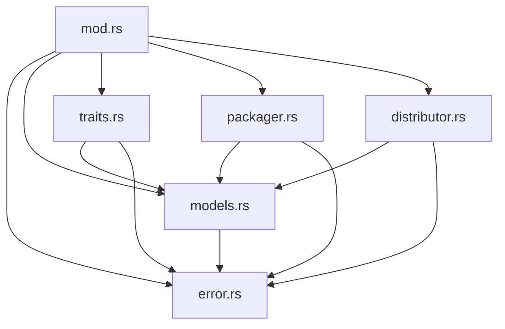

# Bundle Generator Module Reference

Technical documentation for the `bundle_generator` module (`amplihack-utils` crate),
which provides the types, error handling, pipeline traits, packaging, and
distribution API for generating AI agent bundles from natural language
descriptions.

> **Scope note.** This reference documents the **internal organization** of the
> module. The refactor that split the former single-file `bundle_generator.rs`
> into a directory module is **behavior-preserving**: every public path, type,
> and function is unchanged. If you only *consume* the API, see
> [Usage](#usage) — nothing about your imports or call sites changes.

## Overview

`bundle_generator` implements a six-stage pipeline that turns a natural language
prompt into a distributable agent bundle:

1. **Parsing** — analyse prompts ([`PromptParser`])
2. **Extraction** — extract intent and requirements ([`IntentExtractor`])
3. **Generation** — create agent content ([`AgentGenerator`])
4. **Building** — assemble bundles ([`BundleBuilder`])
5. **Packaging** — produce distributable packages ([`FilesystemPackager`])
6. **Distribution** — publish to GitHub ([`GitHubDistributor`])

The module is exposed from the crate root as `amplihack_utils::bundle_generator`
(declared by `pub mod bundle_generator;` in `crates/amplihack-utils/src/lib.rs`).

## Module Layout

The module is a **directory module**. `mod.rs` is the only public surface: it
declares the private submodules and re-exports their items so that every public
symbol remains reachable at the flat `bundle_generator::<Item>` path.

```
crates/amplihack-utils/src/bundle_generator/
├── mod.rs          # Module docs + private `mod` decls + `pub use` re-exports
├── error.rs        # BundleGeneratorError and recovery guidance
├── models.rs       # Serde data models (DTOs), enums, metrics
├── traits.rs       # Pipeline trait definitions
├── packager.rs     # FilesystemPackager + output-path safety guard
└── distributor.rs  # GitHubDistributor (gh CLI) + helpers
```

### Dependency direction

Submodules form a strict, acyclic layering. Lower layers never depend on
higher layers:



### Submodule responsibilities

| Submodule       | Responsibility | Key public items |
| --------------- | -------------- | ---------------- |
| `error.rs`      | Error hierarchy and human-readable recovery hints. Foundation layer with no intra-module dependencies. | [`BundleGeneratorError`], `BundleGeneratorError::recovery_suggestion` |
| `models.rs`     | All serde-serializable data-transfer types, their enums, validation methods, `Default` impls, and run metrics. Depends only on `error`. | [`ParsedPrompt`], [`AgentRequirement`], [`ExtractedIntent`], [`GeneratedAgent`], [`AgentBundle`], [`PackagedBundle`], [`DistributionResult`], [`TestResult`], [`GenerationMetrics`], and the enums [`BundleAction`], [`Complexity`], [`AgentType`], [`BundleStatus`], [`PackageFormat`], [`DistributionPlatform`], [`TestType`] |
| `traits.rs`     | The four pipeline stage traits, each `Send + Sync`. Depends on `models` + `error`. | [`PromptParser`], [`IntentExtractor`], [`AgentGenerator`], [`BundleBuilder`] |
| `packager.rs`   | Filesystem packaging and the output-directory safety guard. | [`FilesystemPackager`]; private `validate_output_dir`, `UNSAFE_PATHS` |
| `distributor.rs`| GitHub distribution via the `gh` CLI. | [`GitHubDistributor`]; private `truncate_to_char_boundary`, `GitHubDistributor::get_file_sha` |
| `mod.rs`        | Module-level docs and the re-export barrel. | (re-exports only) |

Private items (`validate_output_dir`, `UNSAFE_PATHS`, `truncate_to_char_boundary`,
and the `GitHubDistributor::get_file_sha` method) stay co-located with the code they
support and with their tests. They are **not** re-exported and are not part of the
public API.

## Public API

All items below are re-exported from `mod.rs` and remain available at their
original paths. No signatures changed in the refactor.

### Errors — `error.rs`

```rust
pub enum BundleGeneratorError { /* Parsing, Extraction, Generation,
                                   Validation, Packaging, Distribution, ... */ }

impl BundleGeneratorError {
    /// Human-readable, actionable recovery guidance for this error.
    pub fn recovery_suggestion(&self) -> &str;
}
```

### Data models — `models.rs`

Data types (all `#[derive(Serialize, Deserialize)]`) with their validation and
convenience methods:

```rust
pub struct ParsedPrompt { /* ... */ }
impl ParsedPrompt { pub fn validate(&self) -> Result<(), BundleGeneratorError>; }

pub struct AgentRequirement { pub constraints: Vec<String>, /* ... */ }
impl AgentRequirement { pub fn validate(&self) -> Result<(), BundleGeneratorError>; }

pub struct ExtractedIntent { pub constraints: Vec<String>, /* ... */ }
impl ExtractedIntent { pub fn validate(&self) -> Result<(), BundleGeneratorError>; }

pub struct GeneratedAgent { /* ... */ }
impl GeneratedAgent { pub fn file_size_kb(&self) -> f64; }

pub struct AgentBundle { /* ... */ }
impl AgentBundle {
    pub fn validate(&self) -> Result<(), BundleGeneratorError>;
    pub fn agent_count(&self) -> usize;
    pub fn total_size_kb(&self) -> f64;
}

pub struct PackagedBundle { /* ... */ }

pub struct DistributionResult { /* ... */ }
impl DistributionResult {
    pub fn has_errors(&self) -> bool;
    pub fn has_warnings(&self) -> bool;
}

pub struct TestResult { /* ... */ }
impl TestResult { pub fn success_rate(&self) -> f64; }

pub struct GenerationMetrics { /* ... */ }
impl GenerationMetrics { pub fn average_agent_time(&self) -> f64; }

pub enum BundleAction { /* ... */ }
pub enum Complexity { /* ... */ }
pub enum AgentType { /* ... */ }
pub enum BundleStatus { /* ... */ }
pub enum PackageFormat { /* ... */ }
pub enum DistributionPlatform { /* ... */ }
pub enum TestType { /* ... */ }
```

### Pipeline traits — `traits.rs`

```rust
pub trait PromptParser: Send + Sync {
    fn parse(&self, prompt: &str) -> Result<ParsedPrompt, BundleGeneratorError>;
}

pub trait IntentExtractor: Send + Sync {
    fn extract(&self, parsed: &ParsedPrompt) -> Result<ExtractedIntent, BundleGeneratorError>;
}

pub trait AgentGenerator: Send + Sync {
    fn generate(
        &self,
        requirement: &AgentRequirement,
        context: &ExtractedIntent,
    ) -> Result<GeneratedAgent, BundleGeneratorError>;
}

pub trait BundleBuilder: Send + Sync {
    fn build(
        &self,
        name: &str,
        agents: Vec<GeneratedAgent>,
        intent: &ExtractedIntent,
    ) -> Result<AgentBundle, BundleGeneratorError>;
}
```

### Packaging — `packager.rs`

```rust
pub struct FilesystemPackager { /* ... */ }

impl FilesystemPackager {
    /// Create a packager targeting `output_dir`.
    ///
    /// Rejects system directories (e.g. `/`, `/etc`, `/usr`, `/bin`) via the
    /// output-path safety guard.
    pub fn new(output_dir: impl Into<PathBuf>) -> Result<Self, BundleGeneratorError>;

    /// Write a complete package (agents/, tests/, docs/, config/,
    /// manifest.json, README.md) and return its path.
    pub fn create_package(
        &self,
        bundle: &AgentBundle,
        options: Option<&HashMap<String, serde_json::Value>>,
    ) -> Result<PathBuf, BundleGeneratorError>;
}
```

### Distribution — `distributor.rs`

```rust
pub struct GitHubDistributor { /* token is PRIVATE */ }

impl GitHubDistributor {
    pub fn new(token: impl Into<String>) -> Self;

    pub fn create_repository(
        &self, name: &str, description: &str, public: bool,
    ) -> Result<String, BundleGeneratorError>;

    pub fn push_bundle(
        &self, repo: &str, path: &str, content: &[u8], message: &str,
    ) -> Result<(), BundleGeneratorError>;

    /// Create the repository and upload the packaged bundle (public repo).
    pub fn distribute(
        &self, bundle: &PackagedBundle, repo_name: &str,
    ) -> Result<DistributionResult, BundleGeneratorError>;

    /// Distribute with explicit visibility control.
    pub fn distribute_with_options(
        &self, bundle: &PackagedBundle, repo_name: &str, public: bool,
    ) -> Result<DistributionResult, BundleGeneratorError>;
}
```

## Usage

Import paths are **identical** to before the refactor. The directory module is a
drop-in replacement for the former single file.

### Packaging a bundle

```rust
use amplihack_utils::bundle_generator::{AgentBundle, FilesystemPackager};

let packager = FilesystemPackager::new("/home/user/out")?;
let path = packager.create_package(&bundle, None)?;
println!("Package written to {}", path.display());
```

### Distributing to GitHub

```rust
use amplihack_utils::bundle_generator::{GitHubDistributor, PackagedBundle};

let distributor = GitHubDistributor::new(std::env::var("GH_TOKEN")?);
let result = distributor.distribute(&packaged, "owner/my-agent-bundle")?;
assert!(!result.has_errors());
```

### Implementing a pipeline stage

```rust
use amplihack_utils::bundle_generator::{
    BundleGeneratorError, ParsedPrompt, PromptParser,
};

struct MyParser;

impl PromptParser for MyParser {
    fn parse(&self, prompt: &str) -> Result<ParsedPrompt, BundleGeneratorError> {
        // ...
        todo!()
    }
}
```

## Maintenance Guide

Use this table to decide where a change belongs:

| You want to… | Edit |
| ------------ | ---- |
| Add or change an error variant / recovery hint | `error.rs` |
| Add a data field, DTO, enum, or metric | `models.rs` |
| Add or change a pipeline stage contract | `traits.rs` |
| Change how packages are written to disk, or the path-safety blocklist | `packager.rs` |
| Change GitHub distribution behaviour or `gh` invocation | `distributor.rs` |
| Expose a new public item | Add the definition to the right submodule **and** add a `pub use` line in `mod.rs` |

Guidelines:

- **Keep the barrel authoritative.** Anything meant to be public must appear in
  a `pub use` in `mod.rs`. If it's not re-exported there, it's not public.
- **Respect the dependency direction.** `error` depends on nothing in the module;
  `models` may use `error`; everything else may use `models` + `error`. Do not
  introduce upward or cyclic dependencies.
- **Keep tests co-located.** Each submodule owns its `#[cfg(test)]` tests,
  including tests that exercise private helpers. Do not widen visibility (e.g.
  `pub(crate)`) solely to relocate a test.

## Invariants Preserved by the Refactor

The split maintains all pre-existing behavioral and security guarantees:

- **Public API is byte-compatible.** All public items keep the same
  `bundle_generator::<Item>` paths and signatures; consumers need no changes.
- **`GitHubDistributor.token` stays private.** The token is never re-exported,
  never placed on a command line/argv, and never interpolated into logs, error
  messages, or written files. It is supplied to `gh` through the process
  environment only.
- **`gh` is always invoked via argument vectors** (`Command::args`/`arg`), never
  by constructing a shell string — no shell-injection surface.
- **Output-path safety guard is unchanged.** `FilesystemPackager::new` still
  rejects system directories via `validate_output_dir` and the `UNSAFE_PATHS`
  blocklist.
- **UTF-8 boundary safety is unchanged.** `truncate_to_char_boundary` still
  truncates descriptions without splitting a multi-byte character.
- **Test suite is fully preserved** (27 tests total) and continues to pass with
  no regressions. Tests move with the code they exercise: `models.rs` (15),
  `distributor.rs` (10), `error.rs` (1), and `packager.rs` (1); `traits.rs` and
  `mod.rs` carry no unit tests today.

## See Also

- [Agent Bundle Generator — User Guide](../agent-bundle-generator-guide.md)
- [Agent Bundle Generator — Design Document](../agent-bundle-generator-design.md)
- [Agent Bundle Generator — Requirements](../agent-bundle-generator-requirements.md)
- [Git Utilities API Reference](../git-utils-api.md)

[`BundleGeneratorError`]: #errors--errorrs
[`ParsedPrompt`]: #data-models--modelsrs
[`AgentRequirement`]: #data-models--modelsrs
[`ExtractedIntent`]: #data-models--modelsrs
[`GeneratedAgent`]: #data-models--modelsrs
[`AgentBundle`]: #data-models--modelsrs
[`PackagedBundle`]: #data-models--modelsrs
[`DistributionResult`]: #data-models--modelsrs
[`TestResult`]: #data-models--modelsrs
[`GenerationMetrics`]: #data-models--modelsrs
[`BundleAction`]: #data-models--modelsrs
[`Complexity`]: #data-models--modelsrs
[`AgentType`]: #data-models--modelsrs
[`BundleStatus`]: #data-models--modelsrs
[`PackageFormat`]: #data-models--modelsrs
[`DistributionPlatform`]: #data-models--modelsrs
[`TestType`]: #data-models--modelsrs
[`PromptParser`]: #pipeline-traits--traitsrs
[`IntentExtractor`]: #pipeline-traits--traitsrs
[`AgentGenerator`]: #pipeline-traits--traitsrs
[`BundleBuilder`]: #pipeline-traits--traitsrs
[`FilesystemPackager`]: #packaging--packagerrs
[`GitHubDistributor`]: #distribution--distributorrs
