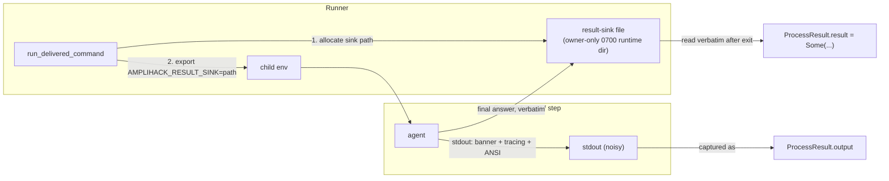

# Clean Result Channel — Reference

The **clean result channel** is a dedicated, opt-in output path that carries an
agent or recipe step's *semantic answer* on a channel that is **separate from
stdout**. Stdout keeps carrying tracing, banners, progress heartbeats, and ANSI
colour — the "firehose" a human reads. The clean channel carries only what the
child chose to write as its result, captured **verbatim**.

It exists to end a recurring antipattern: downstream consumers (Simard
distillation, merge-verdict evaluation, and the in-repo orchestration patterns)
having to strip ANSI, brace-scan, and `serde`-parse a stream of interleaved logs
just to recover one agent's answer. When one agent's output feeds another, the
handoff should be semantic and clean.

Structured output is **not** required. The channel carries free text. The only
guarantee is fidelity: what the child writes is what the consumer reads, byte
for byte.

## Contents

- [The problem it replaces](#the-problem-it-replaces)
- [How it works](#how-it-works)
- [Quick start](#quick-start)
- [API reference](#api-reference)
  - [`RunOptions.result_sink`](#runoptionsresult_sink)
  - [`ProcessResult.result`](#processresultresult)
  - [`result_sink` module](#result_sink-module)
- [Configuration](#configuration)
  - [`AMPLIHACK_RESULT_SINK`](#amplihack_result_sink)
- [The invocation contract](#the-invocation-contract)
- [Verbatim guarantee](#verbatim-guarantee)
- [Fallback and back-compatibility](#fallback-and-back-compatibility)
- [Migration example: dropping stdout scraping](#migration-example-dropping-stdout-scraping)
- [Implementation notes](#implementation-notes)
- [Security notes](#security-notes)
- [FAQ](#faq)

---

## The problem it replaces

Today an agent's answer is embedded in `ProcessResult.output` — the child's full
stdout. To recover the answer, consumers reach for helpers like `extract_json`
(`crates/amplihack-cli/src/commands/orch.rs`): try ```` ```json ```` fences,
then untagged fences, then a left-to-right balanced-brace scan with `serde_json`.
Pattern consumers (`patterns/debate.rs`, `patterns/n_version.rs`,
`patterns/expert_panel/`) similarly read `result.output` and post-process it.

This is brittle for well-known reasons:

- **ANSI noise.** Colour escapes land in the middle of the payload.
- **Banner / tracing bleed.** Startup banners and `tracing` lines interleave
  with the answer and can themselves contain `{` / `}`.
- **Ambiguous braces.** A brace-scanner can lock onto a log line's JSON-looking
  fragment instead of the real answer.
- **Lossy.** Any answer that is *not* JSON (plain prose, a verdict word, a diff)
  has no reliable anchor to scrape at all.

The clean result channel removes the guessing: the child writes its answer to a
runner-provided path, and the runner hands that file's exact contents to the
consumer.

---

## How it works



1. A caller opts in by setting `RunOptions.result_sink = Some(path)` (or by
   letting the runner allocate one — see [`allocate_sink_path`](#result_sink-module)).
2. Before spawning, the runner exports `AMPLIHACK_RESULT_SINK=<path>` into the
   child's environment. When the path came from `allocate_sink_path`, its parent
   directory already exists with owner-only permissions; a caller that supplies
   its own path via `with_result_sink` owns that directory and its permissions.
3. The child runs. It writes human/log output to stdout as always, and writes
   its *final answer* to the file named by `AMPLIHACK_RESULT_SINK`.
4. After the child exits, the runner reads that file **verbatim** into
   `ProcessResult.result`.
5. If the child never wrote the file (opted out, older agent, crash before
   write), `result` is `None` and consumers fall back to `output`. The sink is
   read only on the normal-exit path: when the runner returns early (spawn
   failure, prompt-write failure, or timeout) it emits a `ProcessResult::err`
   with `result == None` and never reads the sink.

stdout capture is completely unchanged. `output` and `stderr` mean exactly what
they meant before this feature existed.

---

## Quick start

Opt in from a Rust caller that drives `ProcessRunner`:

```rust
use amplihack_orchestration::claude_process::{RunOptions, TokioProcessRunner, ProcessRunner};
use amplihack_orchestration::result_sink;

let runner = TokioProcessRunner::new();

// Allocate a runner-owned sink under the run's runtime directory.
let sink_path = result_sink::allocate_sink_path(&runtime_dir)?;

let opts = RunOptions::new(prompt, process_id)
    .with_result_sink(sink_path);

let result = runner.run(opts).await;

// The clean answer — no stdout scraping, no strip_ansi, no brace scan.
let answer = result.result.as_deref().unwrap_or(&result.output);
```

From the child side (any agent honouring the contract), writing the answer is
one line of shell:

```sh
# The runner sets this when the caller opts in. Empty/unset => legacy behavior.
if [ -n "${AMPLIHACK_RESULT_SINK:-}" ]; then
  printf '%s' "$FINAL_ANSWER" > "$AMPLIHACK_RESULT_SINK"
fi
```

---

## API reference

The public surface lives in the `amplihack-orchestration` crate.

### `RunOptions.result_sink`

`RunOptions` gains one optional, additive field:

| Field         | Type               | Default | Meaning                                                        |
| ------------- | ------------------ | ------- | -------------------------------------------------------------- |
| `result_sink` | `Option<PathBuf>`  | `None`  | When `Some(path)`, enable the clean channel for this run.      |

- `RunOptions::new(prompt, process_id)` sets `result_sink: None`. **Existing
  callers are unchanged** — the field defaults off.
- `RunOptions::with_result_sink(path)` is a builder method that returns the
  options with the sink enabled:

  ```rust
  let opts = RunOptions::new(prompt, id).with_result_sink(sink_path);
  ```

All previously existing fields (`prompt`, `process_id`, `timeout`, `model`,
`working_dir`) keep their exact prior semantics.

### `ProcessResult.result`

`ProcessResult` gains one optional, additive field:

| Field       | Type              | Default | Meaning                                                          |
| ----------- | ----------------- | ------- | ---------------------------------------------------------------- |
| `result`    | `Option<String>`  | `None`  | The clean channel contents, read verbatim. `None` = not written. |

Semantics:

- `Some(s)` — the child wrote the sink; `s` is the file's exact contents.
- `None` — the caller did not opt in, **or** the child did not write the sink,
  **or** the contents were not valid UTF-8 (see [Verbatim guarantee](#verbatim-guarantee)).

All existing fields (`exit_code`, `output`, `stderr`, `duration`, `process_id`)
are unchanged. The constructors `ProcessResult::ok(...)` and
`ProcessResult::err(...)` both initialise `result` to `None`, so callers that go
through those constructors compile without changes. Code that builds a
`ProcessResult` via a **struct literal** (e.g. the runner's own success arm)
adds `result` explicitly — see [Implementation notes](#implementation-notes).

### `result_sink` module

`amplihack_orchestration::result_sink` is the consumer-facing helper module.

| Item                                    | Kind  | Description                                                                                              |
| --------------------------------------- | ----- | ------------------------------------------------------------------------------------------------------- |
| `RESULT_SINK_ENV`                       | const | The env-var name the runner exports to the child. Value: `"AMPLIHACK_RESULT_SINK"`.                     |
| `allocate_sink_path(runtime_dir)`       | fn    | Allocate a fresh, unique, runner-owned sink path under `runtime_dir`. Creates the dir `0700` if needed. |
| `inject_sink_env(cmd, path)`            | fn    | Export `AMPLIHACK_RESULT_SINK=<path>` onto a `Command`'s environment.                                    |
| `read_sink_verbatim(path)`              | fn    | Read the sink file's bytes and return `Some(String)` verbatim, or `None` (unwritten / oversize / non-UTF-8). |

```rust
/// The environment variable name the runner exports to the child process.
pub const RESULT_SINK_ENV: &str = "AMPLIHACK_RESULT_SINK";

/// Allocate a unique, runner-owned result-sink path under `runtime_dir`.
/// The directory is created with owner-only permissions if it does not exist.
pub fn allocate_sink_path(runtime_dir: &Path) -> io::Result<PathBuf>;

/// Export `AMPLIHACK_RESULT_SINK=<path>` onto the environment of the command
/// that is about to be spawned (call before spawn).
pub fn inject_sink_env(cmd: &mut Command, path: &Path);

/// Read the sink verbatim. Returns:
///   - `Some(contents)` when the file exists and is valid UTF-8 within the cap,
///   - `None` when the file is absent, empty-unwritten, oversize, or not UTF-8.
/// Performs NO ANSI stripping, trimming, newline normalization, or JSON parsing.
pub fn read_sink_verbatim(path: &Path) -> Option<String>;
```

Consumers that only need to read a captured result never call these directly —
they read `ProcessResult.result`. The module is exposed for callers that
allocate sinks themselves or that build child commands manually.

> **Concurrency.** One sink serves exactly one run. Patterns that fan out many
> `ProcessRunner::run` calls in parallel (`debate`, `n_version`, `expert_panel`)
> must allocate a distinct sink per spawn — reusing one path across concurrent
> children races their writes. `allocate_sink_path` returns a unique path on each
> call for this reason.

---

## Configuration

### `AMPLIHACK_RESULT_SINK`

**Type:** absolute path
**Set by:** the runner (`run_delivered_command`) when the caller opts in via
`RunOptions.result_sink`
**Read by:** the spawned agent / recipe step

When present and non-empty, the child should write its final answer to this
path. When absent or empty, the child behaves exactly as before (answer on
stdout only). The runner captures the file's contents verbatim into
`ProcessResult.result` after the child exits.

Important runner behaviours:

- **Opt-in only.** The variable is exported *only* when
  `RunOptions.result_sink` is `Some`.
- **No stale inheritance.** When `RunOptions.result_sink` is `None`, the runner
  actively `env_remove`s `AMPLIHACK_RESULT_SINK` from the child so an inherited
  value from an ancestor process can never silently redirect capture.
- **Runner-owned path.** The path is chosen by the runner, not derived from
  untrusted context, and lives under the run's runtime directory (see
  [Security notes](#security-notes)).

See also [Environment Variables — Reference](./environment-variables.md#amplihack_result_sink).

---

## The invocation contract

The clean channel is defined as a small, stable contract so that consumers
outside this crate — the external `recipe-runner-rs` binary and Simard — can
honour it without linking against `amplihack-orchestration`:

1. **Runner side.** If a step requests the clean channel, the runner:
   - allocates a private path it owns,
   - exports `AMPLIHACK_RESULT_SINK=<path>` into the child environment,
   - after the child exits, reads that path verbatim and exposes it as the
     step's `result`.
   If a step does **not** request the channel, `AMPLIHACK_RESULT_SINK` is not
   present in the child env (and any inherited value is removed).

2. **Agent / step side.** A conforming agent:
   - checks whether `AMPLIHACK_RESULT_SINK` is set and non-empty,
   - if so, writes its final semantic answer (free text) to that path,
   - continues to emit human/log output to stdout as usual.
   If the variable is unset, the agent does nothing special — its answer remains
   on stdout for legacy capture.

3. **Consumer side.** A consumer reads the step's `result`. If `result` is
   present it is authoritative and requires **no** post-processing. If `result`
   is absent, the consumer falls back to scraping `output` exactly as it does
   today.

The contract is intentionally minimal: one env var, one file, verbatim capture.
There is no schema, no framing, no handshake, and no dependency direction from
the child to this crate.

---

## Verbatim guarantee

`ProcessResult.result` is the sink file's contents **byte for byte**. The runner
performs **none** of the following:

- ANSI escape stripping
- leading/trailing whitespace trimming
- newline normalization (CRLF/LF)
- JSON or any other parsing / validation
- truncation of legitimately-sized content

This is the whole point: an answer that *contains* braces, JSON, ANSI-looking
bytes, banners, or the literal text of a log line is returned unchanged. Nothing
in the answer can be mistaken for framing, because there is no framing.

Two bounded exceptions, both of which yield `None` rather than a corrupted
string:

- **Size cap.** Reads are bounded. A sink larger than the cap yields `None`
  (consumers fall back to `output`). This prevents a hostile or runaway child
  from forcing an unbounded allocation.
- **UTF-8.** `result` is a `String`; non-UTF-8 sink bytes yield `None` rather
  than a lossy replacement. (Answers are text; binary payloads are out of
  scope for v1.)

Empty file vs. unwritten file: an existing zero-length sink is treated as "not a
meaningful answer" and reported as `None`, so a child that opts out by simply not
writing behaves identically to one that never touches the file. Consequently a
consumer never observes `Some("")` — an empty answer and an unwritten answer are
deliberately the same signal, and no consumer needs to distinguish them.

---

## Fallback and back-compatibility

The feature is strictly additive and opt-in. The compatibility matrix:

| Caller opts in? | Child writes sink? | `result`        | `output`        | Consumer behaviour                     |
| --------------- | ------------------ | --------------- | --------------- | -------------------------------------- |
| No              | —                  | `None`          | stdout (as before) | Legacy: scrape `output`.            |
| Yes             | No                 | `None`          | stdout          | Falls back to scraping `output`.       |
| Yes             | Yes                | `Some(answer)`  | stdout          | Reads `result`; no scraping needed.    |

Guarantees:

- Existing recipes and steps that read stdout keep working unchanged.
- Existing `ProcessResult` / `RunOptions` constructors compile unchanged
  (`result` and `result_sink` default off).
- The `extract_json` / brace-scan helpers are **not** removed or deprecated;
  they remain the fallback path for the "no clean channel" case.

The recommended consumer idiom always degrades safely:

```rust
// Prefer the clean channel; fall back to stdout only if the child didn't write it.
let answer = result.result.as_deref().unwrap_or(&result.output);
```

---

## Migration example: dropping stdout scraping

This is the concrete before/after a consumer follows to stop scraping. It is
also exercised as an in-repo test proving the answer is recovered verbatim even
when stdout is saturated with ANSI, tracing, and banner noise.

**Before — scrape a noisy stdout:**

```rust
// Answer is buried in `output` alongside banners, tracing, and ANSI colour.
// Must guess where the JSON is and strip escapes — brittle and lossy.
let raw = result.output;
let cleaned = strip_ansi(&raw);
let verdict = extract_json(&cleaned)          // balanced-brace scan
    .and_then(|v| v.get("verdict").cloned())
    .and_then(|v| v.as_str().map(str::to_owned))
    .unwrap_or_default();                     // silently empty on a bad scrape
```

**After — read the clean channel:**

```rust
// The step wrote its verdict to the sink. Read it verbatim. Done.
let verdict = result
    .result
    .clone()
    .expect("step opted into the clean result channel");
// No strip_ansi. No extract_json. No brace scan. No serde. No guessing.
```

**The proving test** (shape, in `amplihack-orchestration`): a fake child emits a
storm of ANSI SGR sequences, `tracing`-style log lines, and a startup banner to
**stdout**, while writing an answer that itself contains `{ "verdict": "MERGE" }`
plus stray ANSI-looking bytes to `AMPLIHACK_RESULT_SINK`. The test asserts:

- `result == Some(exact_answer_string)` — byte-for-byte, including the braces
  and ANSI-looking bytes, with **zero** bleed from stdout;
- the assertion is reached **without** calling `strip_ansi`, `extract_json`, or
  any `serde` helper;
- `output` still contains the full noisy stdout (stdout capture unaffected);
- the no-opt-in case yields `result == None` with `output` unchanged.

---

## Implementation notes

The plumbing lives in `crates/amplihack-orchestration/src/claude_process.rs`.
Every execution path funnels through one shared executor,
`run_delivered_command`, which receives the opted-in sink alongside the
delivered command:

```rust
async fn run_delivered_command(
    delivered: DeliveredProcessCommand,
    timeout: Option<Duration>,
    result_sink: Option<PathBuf>,
    process_id: String,
    start: Instant,
) -> ProcessResult
```

- **Inject before spawn.** When a sink is requested, the executor calls
  `result_sink::inject_sink_env` on the `std::process::Command` before it is
  converted via `TokioCommand::from(command)` and spawned. When none is
  requested it `env_remove`s `RESULT_SINK_ENV` so an inherited ancestor value
  cannot leak to the child (SEC-10).
- **Read on the normal-exit path only.** The sink is read verbatim exactly where
  the success `ProcessResult` is built. Every early return (spawn, stdin-write,
  or timeout failure) uses `ProcessResult::err`, which leaves `result = None`, so
  a failed run never touches the sink — matching the
  [error-path semantics](#how-it-works) above.
- **Additive fields.** `ProcessResult.result` and `RunOptions.result_sink` both
  default to `None` in `ProcessResult::ok` / `ProcessResult::err` and
  `RunOptions::new`, so existing constructors and call sites compile and behave
  unchanged.
- **Concurrency falls out naturally.** The sink is per invocation of
  `run_delivered_command`, so each parallel `run()` in `debate` / `n_version` /
  `expert_panel` gets its own channel as long as callers allocate a distinct
  path per run (see the concurrency note under
  [`result_sink` module](#result_sink-module)).

---

## Security notes

The clean channel is designed so that opting in never widens the trust boundary.

| ID     | Control                                                                                                    |
| ------ | ---------------------------------------------------------------------------------------------------------- |
| SEC-1  | The sink path is **runner-owned** — allocated by `allocate_sink_path`, never taken from untrusted recipe context. Recipe-context injection drops `AMPLIHACK_`-prefixed keys, so a recipe cannot set the sink path itself. |
| SEC-3  | Reads are **bounded** by a size cap; an oversize sink yields `None`, never an unbounded allocation.         |
| SEC-5  | `result` is treated as **untrusted** child output — same trust level as `output`. Consumers must not `eval`/execute it. |
| SEC-6  | The runner creates the run's runtime directory owner-only (`0700` on Unix), keeping every sink inside it private to the owner. The child writes the sink file itself; the runner sets no mode on the file, relying on the owner-only directory to keep it private. |
| SEC-10 | When the caller does not opt in, the runner `env_remove`s any inherited `AMPLIHACK_RESULT_SINK` so a stale ancestor value can never redirect capture. |
| SEC-12 | The capability is additive and opt-in; the default path (no sink) is byte-identical to prior behaviour.     |

The sink carries a *free-text answer*, not code or a command. It is data, and
consumers must handle it as data.

---

## FAQ

**Does my answer have to be JSON?**
No. The channel is free text. JSON, a single verdict word, prose, or a diff are
all fine — whatever the child writes is returned verbatim.

**What if the child crashes before writing the sink?**
`result` is `None` and the consumer falls back to `output`. No regression versus
today.

**Can I use a file descriptor instead of a path?**
Not in v1. FDs are cross-platform-fragile and cannot be consumed by a pinned-git
library dependency. A runner-allocated file path is the contract; FD transport is
explicitly out of scope.

**Does this change the recipe schema?**
No. v1 requires no recipe-schema change. If a per-step opt-in flag is added
later it will be `#[serde(default)]` and remain back-compatible.

**Where does the sink file live?**
Under the run's runtime directory (see
[`AMPLIHACK_RUNTIME_ROOT`](./environment-variables.md#amplihack_runtime_root)),
allocated by the runner with owner-only permissions.

**Downstream consumers.** After this ships, pinned consumers (Simard
distillation, merge-verdict evaluation) can bump their `amplihack-rs` dependency
and read `ProcessResult.result` / the `AMPLIHACK_RESULT_SINK` contract instead of
scraping stdout. See the PR body for the exact pinned-rev bump.

---

## See also

- [Environment Variables — Reference](./environment-variables.md#amplihack_result_sink)
- [RecipeResult Reference](./recipe-result.md)
- [Rust Runner Execution](./rust-runner-execution.md)
- [Recipe Runner Logging](./recipe-runner-logging.md)
