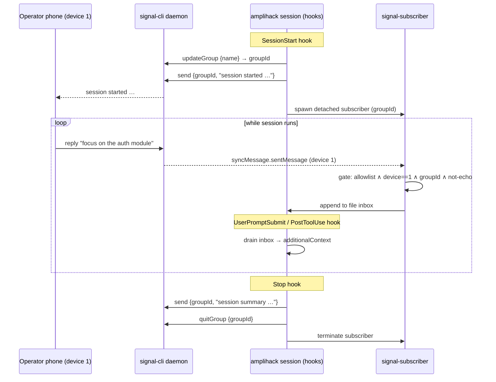

# Signal Channel

The **Signal channel** gives every amplihack session a private, two-way bridge to
the operator's Signal account. When enabled, each session opens a fresh Signal
group containing only the operator's own linked account, posts meaningful session
updates to that group, and watches the group for replies from the operator's
primary phone. Accepted replies are injected into the running session as
additional agent context.

This lets you supervise and steer a long-running amplihack session from your
phone: read what the agent is doing and reply with a nudge, correction, or new
instruction — all without touching the terminal.

!!! info "Feature-gated, off by default"
    The Signal channel is compiled only when the `signal` cargo feature is
    enabled. Default builds pull **zero** additional runtime dependencies and
    behave exactly as before. See [Enabling the feature](#enabling-the-feature).

---

## At a glance

| Property | Value |
| --- | --- |
| Cargo feature | `signal` (default **off**) |
| Transport | signal-cli JSON-RPC 2.0 over newline-delimited TCP |
| Group membership | Operator's own Signal account only (self-group) |
| Inbound trust model | Fail-closed allowlist **AND** primary-device (`sourceDevice == 1`) **AND** group-id match **AND** echo suppression |
| Injection seam | `hookSpecificOutput.additionalContext` on `UserPromptSubmit` / `PostToolUse` |
| Posting cadence | Meaningful transitions only (start, checkpoints, key results, stop) |
| Group lifecycle | Created on `SessionStart`, left (`quitGroup`) on `Stop` — or a single rolling group |

---

## How it works



1. **Session start.** If the `signal` feature is built and configuration
   resolves, the `SessionStart` hook creates a per-session Signal group, persists
   the group id to session state, posts a short "session started" announcement,
   and spawns a long-lived `signal-subscriber` process.
2. **Inbound monitoring.** The subscriber holds one JSON-RPC connection open,
   filters messages to this session's group, applies the trust gate, and appends
   accepted messages to a crash-safe file inbox in session state. Because the
   group holds only the operator's own account, replies arrive as
   `syncMessage.sentMessage` envelopes; the parser tolerantly accepts both that
   shape and the ordinary `dataMessage` shape, treats irrelevant frames as a
   no-op, and rejects malformed frames without panicking.
3. **Injection.** On each `UserPromptSubmit` (and opportunistically on
   `PostToolUse`), the hook drains the inbox and emits the queued operator
   instructions through `hookSpecificOutput.additionalContext`, clearly labeled
   as untrusted operator input. The prompt itself is never mutated.
4. **Session stop.** The `Stop` hook posts a session summary, leaves the group
   (`quitGroup`), and terminates the subscriber so groups do not pile up on the
   operator's phone.

---

## Prerequisites

- A working [`signal-cli`](https://github.com/AsamK/signal-cli) installation,
  registered and linked to the operator's Signal account, running in
  **JSON-RPC daemon mode** over TCP. For example:

  ```bash
  signal-cli -a "+15551234567" daemon --tcp 127.0.0.1:7583
  ```

- The operator's **primary phone** (the registered number, `device 1`) available
  to send and receive messages in the session group.

!!! warning "amplihack owns its own account"
    Do **not** point amplihack at a signal-cli daemon/account that another
    service is already consuming. A second receive-consumer on the same account
    races and double-processes inbound messages. Give amplihack a dedicated
    account (or at minimum a dedicated daemon that nothing else reads).

---

## Enabling the feature

Build (or install) amplihack with the `signal` feature:

```bash
# Build the hooks binary with Signal support
cargo build --release --features signal -p amplihack-hooks

# Or run tests across the feature
cargo test --features signal
```

Default builds omit the feature entirely:

```bash
cargo build            # no signal-cli, no tokio net, no behavior change
cargo test             # default gate still passes
```

The feature must be present **and** configuration must resolve for the channel to
activate. If the feature is built but configuration is incomplete, the session
proceeds normally and records a warning — the Signal channel is always
**fail-open** with respect to session availability.

---

## Configuration

Configuration is resolved **env → file → explicit error**. Environment variables
always win. A missing *required* value is a hard, explicit error (never a silent
default). An empty allowlist is a valid configuration that means **nobody** —
fail-closed.

### Environment variables

| Variable | Required | Default | Description |
| --- | --- | --- | --- |
| `AMPLIHACK_SIGNAL_ENDPOINT` | Yes | — | signal-cli daemon address, `host:port` (e.g. `127.0.0.1:7583`). |
| `AMPLIHACK_SIGNAL_ACCOUNT` | Yes | — | Operator's registered account in E.164 form (e.g. `+15551234567`). |
| `AMPLIHACK_SIGNAL_ALLOWLIST` | Yes | — | Comma-separated E.164 numbers allowed to inject. **Empty = fail-closed (nobody).** |
| `AMPLIHACK_SIGNAL_GROUP_MODE` | No | `per-session` | `per-session` (new group each session, left on stop) or `rolling` (reuse one group). |
| `AMPLIHACK_SIGNAL_ROLLING_GROUP_ID` | Only if `rolling` | — | Existing group id to reuse. Required, with explicit error, when mode is `rolling`. |
| `AMPLIHACK_SIGNAL_ECHO_TTL_SECS` | No | `30` | TTL (seconds) for the echo-suppression window that prevents re-ingesting the bot's own messages. |
| `AMPLIHACK_SIGNAL_OWN_DEVICE_ID` | No | — | Defence-in-depth: the bot's own linked device id (`>= 2`). Used as an extra loop guard. |
| `AMPLIHACK_SIGNAL_MAX_FRAME_BYTES` | No | `1048576` | Hard cap on a single inbound JSON-RPC frame. Frames larger than this are rejected without buffering, bounding subscriber memory against a hostile or runaway daemon. |
| `AMPLIHACK_SIGNAL_CONFIG` | No | platform default | Path to an optional TOML config file (see below). |

### Config file

When present, a TOML config file provides a lower-priority layer beneath the
environment. Its path comes from `AMPLIHACK_SIGNAL_CONFIG`, or a platform default
under the amplihack project directories. Any value set in the environment
overrides the file; required values absent from *both* layers produce an
explicit error.

```toml
# examples/signal-config.toml
endpoint = "127.0.0.1:7583"
account  = "+15551234567"

# Comma is not needed in TOML; use a real array.
# An empty array means fail-closed (nobody may inject).
allowlist = ["+15551234567"]

group_mode = "per-session"        # or "rolling"
# rolling_group_id = "group.abc123=="   # required only when group_mode = "rolling"

echo_ttl_secs = 30
# own_device_id = 2               # optional loop-guard, must be >= 2
# max_frame_bytes = 1048576       # reject inbound frames larger than this (1 MiB default)
```

!!! note "E.164 format"
    All phone numbers — `account` and every allowlist entry — must be valid
    E.164 (leading `+`, country code, digits only). Invalid numbers are rejected
    at config load time with an explicit error.

### Group modes

- **`per-session`** (default): each session creates its own group named with the
  session id and a timestamp, and leaves it on `Stop`. Cleanest supervision, but
  produces one (auto-left) group per session.
- **`rolling`**: all sessions post to a single pre-existing group
  (`AMPLIHACK_SIGNAL_ROLLING_GROUP_ID`). The group is neither created nor left by
  amplihack. Use this to avoid group churn on the operator's phone.

!!! tip "Signal cannot delete groups for everyone"
    Signal has no delete-for-everyone for groups. `per-session` mode
    auto-**leaves** each group on stop (it still lingers in your group list until
    you clear it manually). If group litter bothers you, prefer `rolling` mode.

---

## The trust boundary

Inbound Signal text becomes agent context, so the gate is deliberately strict and
**fail-closed**. A message is accepted **only** when *all* of the following hold:

1. **Allowlist** — the sender's E.164 number is in `AMPLIHACK_SIGNAL_ALLOWLIST`.
   An empty allowlist rejects everything.
2. **Primary device** — the message originates from `sourceDevice == 1` (the
   operator's registered primary phone), not a linked device or the bot itself.
3. **Group match** — the message's group id equals this session's group id.
4. **Not an echo** — the message body does not match a recently-sent outbound
   body within the TTL window (prevents the bot re-ingesting its own
   synced-back messages and looping).

The gate is infallible: it returns an accept/reject decision, never an error.
Injected content is length-capped and explicitly labeled as untrusted operator
input. **Injection is context-only** — operator text never bypasses amplihack's
existing approval gates and never auto-executes a mutating action.

---

## Usage tutorial

This walkthrough assumes signal-cli is registered to `+15551234567` and running
as a TCP daemon on `127.0.0.1:7583`.

### 1. Start the daemon

```bash
signal-cli -a "+15551234567" daemon --tcp 127.0.0.1:7583
```

### 2. Configure amplihack

```bash
export AMPLIHACK_SIGNAL_ENDPOINT="127.0.0.1:7583"
export AMPLIHACK_SIGNAL_ACCOUNT="+15551234567"
export AMPLIHACK_SIGNAL_ALLOWLIST="+15551234567"   # only your own phone
```

### 3. Run a session with the feature enabled

Use an amplihack build that includes the `signal` feature. On session start you
will receive a Signal message like:

```
amplihack session started
session: 91988bcc • 2026-07-15T02:44Z
task: Implement the feature-gated Signal channel
```

### 4. Steer from your phone

Reply in the group from your primary phone:

```
please add a unit test for the empty-allowlist case
```

On the next prompt boundary, the agent sees an additional context block:

```
[untrusted operator input via Signal]
please add a unit test for the empty-allowlist case
```

The agent treats it as guidance, subject to the usual approval gates.

### 5. End the session

On `Stop` you receive a summary and the group is left:

```
amplihack session complete
session: 91988bcc
result: PR opened, 12 files changed, tests green
```

---

## Session state layout

The channel stores runtime state under the amplihack project directories, keyed
by a sanitized session id (only `[A-Za-z0-9_-]`, everything else mapped to `_`):

| File | Purpose |
| --- | --- |
| `signal/<session-id>/state.json` | Resolved group id and mode for the session. |
| `signal/<session-id>/inbox.json` | Crash-safe append log of gate-accepted operator messages awaiting injection. |
| `signal/<session-id>/subscriber.json` | Subscriber PID, so `Stop` can terminate it. |

State files are written via the crash-safe, locked `AtomicJsonFile`. On shared
hosts the signal state directory is created `0o700` and files `0o600`; message
bodies are **never** logged, and phone numbers are redacted in warnings.

---

## The `signal-subscriber` process

The persistent subscriber is a subcommand on the hooks binary:

```bash
amplihack-hooks signal-subscriber --session-id <session-id>
```

It is spawned detached by `SessionStart` and should not normally be run by hand.
It maintains one long-lived JSON-RPC connection, retries with backoff if the
daemon is unavailable, and appends only gate-accepted messages to the inbox. It
exists as a separate long-lived process because hooks are short-lived CLI
invocations and would otherwise drop inbound messages between runs.

Reads are bounded by `AMPLIHACK_SIGNAL_MAX_FRAME_BYTES` (default 1 MiB): a frame
that exceeds the cap is rejected and the read buffer reset rather than grown
without limit, so a hostile or malfunctioning daemon cannot exhaust subscriber
memory. Oversized and malformed frames are dropped as no-ops; the connection is
retained.

---

## Troubleshooting

| Symptom | Likely cause | Fix |
| --- | --- | --- |
| No "session started" message | Feature not built, or config unresolved | Build with `--features signal`; check required env vars; look for `warnings[]` in hook output. |
| Replies never reach the agent | Number not in allowlist, or sent from a linked device (not device 1) | Add the number to `AMPLIHACK_SIGNAL_ALLOWLIST`; send from the primary registered phone. |
| Duplicate/looping messages | Two consumers on one account | Give amplihack a dedicated account/daemon. |
| Groups piling up | `per-session` mode | Switch to `AMPLIHACK_SIGNAL_GROUP_MODE=rolling`. |
| `config error: AMPLIHACK_SIGNAL_ACCOUNT is required` | Missing required var | Set it in the environment or config file — there is no silent default. |

---

## Scope and limitations (v1)

**In scope:** per-session group create + post; env-first config with file layer;
feature flag; fail-closed allowlist + device-1 gate + echo suppression; file
inbox with hook-driven `additionalContext` injection; `SessionStart` /
`UserPromptSubmit` / `PostToolUse` / `Stop` wiring.

**Out of scope (v1):**

- Mid-turn interruption of a running agent turn (injection happens at prompt
  boundaries only).
- Multi-operator groups (the group holds only the operator's own account).
- amplihack installing or managing its own signal-cli daemon.

---

## See also

- [Hooks Configuration](HOOK_CONFIGURATION_GUIDE.md)
- [Trust & Anti-Sycophancy](claude/context/TRUST.md)
- Example config: [`examples/signal-config.toml`](https://github.com/rysweet/amplihack-rs/blob/main/examples/signal-config.toml)
